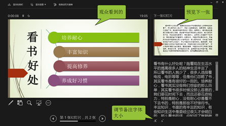

# 1.2  演示成功的准备

**你要知道你要做什么！**

作为时下最受欢迎的演示的工具，PowerPoint发展出来的使用方向多种多样，适用于各大行业要求，而且随着软件的不断更新，用途也在不断被延伸。根据PPT的核心观点——逻辑顺序，一般可以把PowerPoint分成四个类型。

① **工作汇报**

核心思想——回顾总结——打算规划——希望承诺

② **企业宣传**

企业概况——愿景理念——发展历程——产品介绍——成功案例——未来规划

③ **项目宣讲**

项目情况——问题诊断——解决方案——实施措施

④ **求职演说**

求职简介——自我介绍——职位认识——目标承诺

**你要知道你的观众需要什么！**

一个高手被人承认，绝不是简简单单靠着自我沉醉，而是有着让人不得不佩服，叹为观止的绝技。所以，别再独自囿于一角，你需要了解你的观众。

演示者是轻松了，却把辛苦让观众买单。想一想，大量的文字一下放出来的感觉，一团乱麻。人们听这样的演示，看这样的PPT，效果是显而易见的。

可以这样说，删繁就简，浓缩才是精华。我们只需要一点点小的改变，就可以改变这种情况。

我们只做了些什么？加了个office自带主题、smartart图形还有一条横线，还有着一项最重要的修改就是对内容进行了提炼。近乎偷懒的方法，却可以让画面焕然一新。

对待文字页，最重要的是提炼文字，规避长篇大论，这样可以让观众迅速记住核心内容，而不至于陷入文字间，抓不住演讲主题。（在本书后文中会更为详细的讲解到有关于文字的内容）

其他多余的内容则可以放入备注中，在演示的时候打开演示者视图，方便演示者进行演示，而观众只看得到演示界面。

**你要知道你的场地允许你做什么！**

**电脑演示**

电脑演示一般指通过电脑屏幕小范围的演示，一般观众较少。

囿于电脑屏幕的大小，PPT背景一般以简洁为主，辅以重要的信息，内容宜少，文字宜小。演示时若需要将文件转移至其他电脑上，应需要将相关的文件一并打包转发。

**屏幕投影演示**

屏幕投影演示一般是指通过投影仪、大型显示器等较大型的显示设备进行演示。

因为屏幕较大，色彩不宜强烈刺眼，白色也不宜选用，否则，容易引起观众视觉疲劳。

使用到了投影，场地一般比较宽阔，所以字体最好采用16号以上，内容要尽可能精简，字体则有更大的空间放大。

演示文稿设计最核心的要素既是：以人为本。让观众满意是最重要，那是你的受众，你为更好的演示给他们看而制作PPT，所以，观众喜欢的，就是你要改变的。

文稿里文字太少，领导不喜欢 ；文字太多，观众受不了。这就需要你切合实际去使用PPT里面的功能了，你要相信，如今2013绝对能助你克服各种为难的处境。

