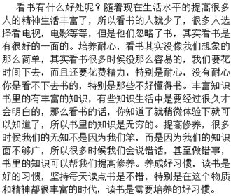
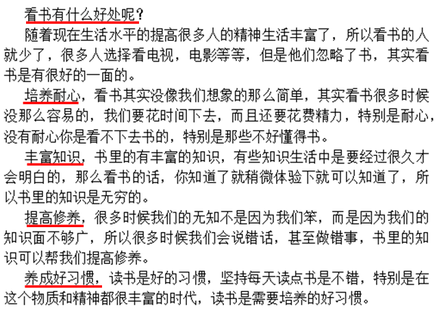
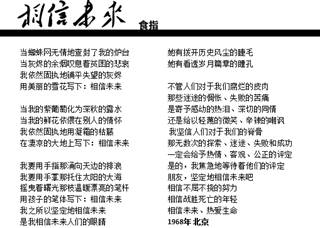
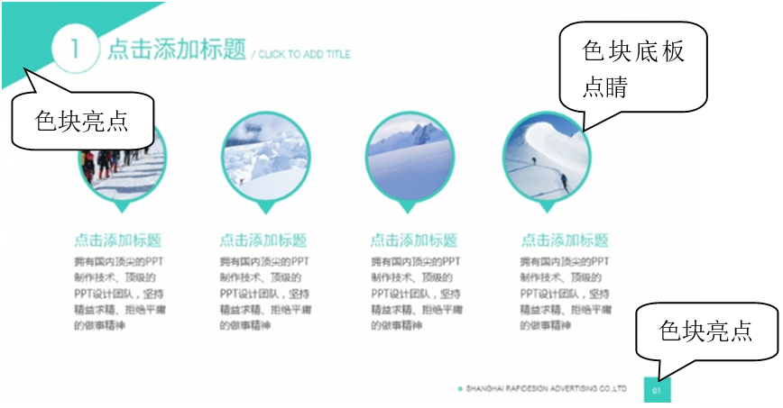
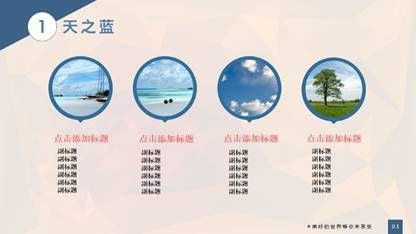
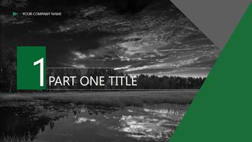
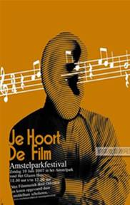
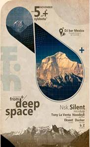

# 1.3  演示文稿的设计

在制作PPT时，有人喜欢拿到要求，直接开始动手；而有人则喜欢先花一些时间理顺自己的思路，确定好设计大纲，然后再进行制作。而本书更多推荐的是后者，对于一般初学者来说，是无法做到一开始就抓住自己想表达的逻辑顺序的，所以需要的是辅助制作，以清晰自己的思路。以下是我一般的制作思路，仅供参考。

**风格分析——素材准备——设计思路——封面设计——内页设计——尾页呼应**

前面有提到常用PPT类型的四个制作流程，它有助于帮助我们梳理逻辑顺序。

而接下来我们要做的是整理、分析内容和设计，留下我们想要让观众知道的，设计出观众喜欢的。

实际上，你讲的越少，人们能接受的越多，你的演示越成功。大胆一些吧，删。

**下面，我们介绍几种常见的精简内容方法：**

## **1**、化段为句

在演示中，最让人头疼的就是一大段文字的展示，这不仅让画面显得很冗余，结果一般是演示者照着幻灯片逐字逐句念。

而关于提炼文字，有人又会觉得这是不是又会对语文水平要求比较高了，难道还得另外去整理内容么。这显然与我们能在PPT上做出来，就尽量不去使用其他工具的理念相违背，而我们也有一个偷懒的方法。

大家都知道文本中，一个完整的句子表达一个完整的意思。那我们不妨试试将文本拆成短句，以句号为界，拆分整段。然后再将句子与句子比较，确定重要级别，将与演示关系不紧密的句子删除或做弱化显示的处理，对重要文字加以突出和保留。

我们拿上面例子中的内容为例。

按照方法来，我们会发现什么？

接下来你要做的就是确定内容间的主从关系，找到逻辑脉络，对主要内容重点突出，正文信息分清条理。

逻辑一下子就变清晰了，而其他内容的取舍则就看个人需要了，此方法一般可以应对大多数情况下的文本内容。

一段一拆分，一段一核心，剩下来的就是你要表达的观点了。

为了演示的效果，而在制作环节中，多出这样一个小步骤是完全值得的。

## **2**、自我理解

除了从文章逻辑结构下手的文章，还有一些就是光从表面，你是无法真正了解文章隐藏的含义的，就比如诗词歌赋，散文，政治讽刺文等等。

例如食指的《相信未来》

在这首诗里，我们能看到什么。当然你会说怎么又扯上语文了，但别忘记了，这你完全是可以百度的，而我们并不只是单纯的想表达这首诗本身所包含的意思，我们想表达的是想让观众知道的，所以这需要我们的自我理解，根据原来的意思衍生或者生生创造出一种属于我们的意境。

某一知名作家便以“**她有拨开历史风尘的睫毛，她有看透岁月篇章的瞳孔**”这句话来表达自己对历史的博大深远，不可逆转的痴迷，而这句话被作者赋以其他意义却与原句一点也不冲突，反而会衬托出一种意境。

这就是通过自我来达意，不需要把自己困于原来的圈子中，我们是设计师，设计师需要的是创造。

## 3、**设计**

在制作PPT时，我们应该将自己视为设计师，至少你该是业余设计师，这是本书一直不断强调的一个事实。从制作流程中我们可以看到，我们做的就是设计工作。以设计师的眼光去看待你的制作，这样你的PPT才会体现出你的思想，而不是一堆文字与图形的混合。一下子拔高我们的层次，总会有些为难，但迟早你会怡然自得。

在如今，低端凑合的东西已经不再能轻易满足大家的胃口了，只有精致，用心制作，才会让人心甘情愿去买单。

设计需要创意，创意需要积累。我们需要的就是时刻保持观察敏锐性，善于从周围发现灵感。

**比如：杂志、网页、报纸、传单、Flash\*\***等等。\*\*

**一句话：美的东西都是可以借鉴的。**

找到亮点，修饰细节，接下来，就是我们的设计作品了。

一张幻灯片，在细节处处都透着亮点。若是你敏锐度不够，无法具体的总结出这些亮点，那么依照设计师以往的经验总结得出：凡是让你觉得舒服，不会破坏整体结构，使画面更和谐的元素，就是亮点。

当然，我们也能只提取一个元素，然后再进行扩大化处理。

例如，从图1-12中色块亮点下手，然后进行放大，我们可以得到如图1-14。

当然还有很多其他好的板式可以模仿，我们需要做的就是随手一截，那它就是你的积累，接下来，重中之重——动手去做，just do it。

这种设计版式我们都可以借鉴，海报是设计师们高端战场，而我们只用拿其中的一点点创意就可以让我们PPT中图文混排上了不止一个档次。

既然有这么多极具创意的事物存在于我们周围，那就认真去观察。还是那句话，大胆一些，拿来先试试，消化为自己的。

但有一点必须得说明，版权问题。我们可以肆无忌惮的去模仿，去偷师，但绝不能将他人的作品挪作商用，这不仅是对原作者的不尊重，而且这是违反法律的，我们能做到，那就自己动手，想自己的。

