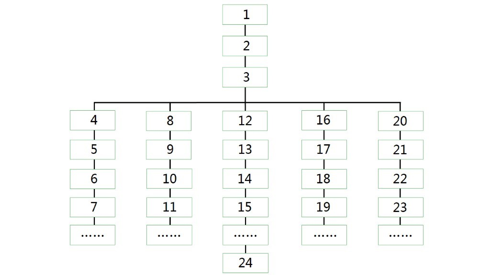
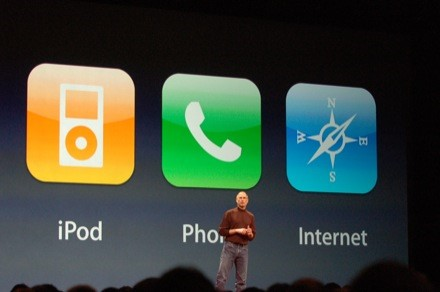

# 1.4  一个成功PPT的自我修养

一个成功PPT的前提就是：你必须使用PPT吗？

对于教育或演说而言，演示的本质在于向观众传达或解释某种东西，引导观众的思维，从而更有效的让观众解释某些事物或知识。但对于某些学术性的讲座，持续时间长、内容严谨，在一种严肃的环境下开展。显然，PPT就可能不合适在这种场合下出现。另外对于一些人数较少的环境，你都可以考虑使用黑板、讲义之类的辅助工具，而不至于使用PPT，这样，你的观众反而会更轻松的听完你的演示。

任何一个人都有条件用一份讲义或说明代替PPT。PPT也是有缺陷的，当投影屏幕或投影仪器效果不佳，就会直接导致坐在靠后位置的人看不到幻灯片的具体内容。特别是当幻灯片中有着大量的表格和数据时，若使用不当，PPT反而会对演示造成负面影响，此时，有什么比一份讲义更来得清晰明了呢。这样，我们就应该好好思考一下，你必须使用PPT吗？当PPT有可能造成负面影响，又可以有其他事物替代PPT时，那就提前杜绝这种可能的发生，不要使用PPT。

完整而周到的考虑自身的情况后，也许你意识到，我必须使用PPT，我要用它增强我的说服力，因为人们不止希望单纯的看到我的演说，观众需要的是一种全新的体验，需要我去开启一场视觉性演说，那么就该到了使用PPT的时刻了。

一个成功PPT需要什么修养呢？

一个成功PPT就是一个优秀的故事，做好一个PPT就相当于如何写好一个故事，好故事能吸引人们的关注，用写好故事的方法去做好PPT，一样也能达到这种效果，甚至更出色。

## 1、**选好表达主题**

在制作PPT前，拿着需要的素材，脑袋里装着的满满的版式，想着飞旋的动画特效，在制作过程中，想把想要的元素都加入PPT，以求达到一种视觉冲击的效果，结果反而不那么令人满意，到最后连自己都不知道自己想突出的重点在哪里了，哪里都是重点，都是需要表达达到元素，造成信息量太大，太大的结果就是造成内容冗余难以辨认。

看看下面这张幻灯片，设计者可能希望展示更多的天空之美，更有视觉冲击力，不过第一眼看上去，你能说出设计者表现的是天空的那一面吗？

想突出天空，又何必用一系列图片去堆砌，每张图片都有自己的信息，在版式调整中，时常会有不协调的事情发生，既然放多张图片不仅会造成版式冲突，信息杂乱，那我们何不先从简单做起，将简单的表达表述清楚。

仅用一张图片表达，表达天空的壮观，不需要文字说明，自然而然就会让观众产生联想。

我们需要的信息包括：人物、地点、时间以及做什么。明白了这些要素，这样就不会理不清故事了。你的观众可不愿意在一堆杂乱无章的的文本中去寻找信息。

## 2、**整体结构**

一个PPT演示，如同一个完整的故事，有头有尾，和谐统一，一个故事具备完整的逻辑性，情节从上到下，主线与分支相互辉映，从而构成故事整体结构的完整性。

结构是每一个优秀PPT应该的具备的，只有将前后整体统一起来，才能得心应手的进行设计与创作，若是这一步没有考虑好，以后所有的努力，随时有可能推倒重来。

如同浏览幻灯片一样，你制作的幻灯片是一张接着下一张，按序号排列的。

我们平时用PPT表达观点时，显然不会希望，观点与观点间毫无逻辑可言，所以我们对结构进行一些改造。如图1-20所示。

在幻灯片开头，我们一般会设计封面、目录，在接下来的内容设计中，一般会分出一页用于设计导航页，以提示观众接下来展示的具体的内容。而在所有内容展示完毕后，我们出于礼节或提示观众已演示完毕，会设计一页致谢页。

有了清晰的结构图，再结合我们前面所提到的设计步骤，就可以将内容划分清晰、明白。然后你才能放开手脚去设计。

## 3、**视觉感受**

一个好故事，本身就能让人产生精彩的联想，再配上好的插画，那就好似在看一部电影一样，唯一的区别是它不会动。

对于PPT也是一样的，在幻灯片上放上能增强视觉冲击的图片，加上合适的切换动画。立马就能提升PPT的水平。同时这也是一把双刃剑，我们需要的是正确的使用它，而不至于伤害到自己。

对PPT来说，我们需要注意的是：

* 在PPT上不需要放入大量花哨，复杂，特别是与内容毫不相干的动画。
* 图片需要与内容信息相符，突出主题，与内容有某些联系。
* 屏幕上的字不宜过小。文字尽量放少，既然放了，显然它就是你的重点，重点就是需要突出的，那么放大它的字号，对你来说就很有必要了。
* 观感体验上需要保持一致。PPT的整体风格一旦被确定下来，那么所有页都需要遵守这一风格，若某一页违反了这一风格，很容易被误认为是设计者粗心大意造成的。

  对演示者来说，演示者本身的表现就直接决定了观众对本场演示的视觉感受，比观看PPT来得更直接。所以演示者的一举一动关乎于一场演示的成功与否。

  我们需要注意的是：

* 演示时口齿不清，包含各种口头禅，声音忽大忽小，一点都不突出重点，毫无抑扬顿挫的感觉。
* 身体僵硬，没有任何肢体语言，拘谨不堪。
* 在讲桌后演示，对着PPT，与观众很少有或根本没有眼神交流。
* 对PPT内容不熟悉，无法熟练的掌握演示PPT。

综合上述，你还是觉得难以入门，或者找不到具体的案例，那么，你要相信自己，你肯定有见过一些世界级的演示者。例如：比尔·盖茨，史蒂芬·乔布斯等等。

但有一点需要注意的是，这些科技大佬们在演示时，他们的演示工具（office、Keynote）里，一般仅有图片和少量的文字，其他的完全靠演示者本身的演示来完成，所以有人说，在他们的演示中，最不重要的就是他们的演示文具。

如图，节选乔布斯的演示文稿。

魔力演讲靠的可不是工具，PPT（或Keynote）永远都应该只是你的辅助工具，只为增强你的演示效果，你本人才是这场演示的主导者，就像你可以随时控制你的PPT（或Keynote）翻页一样。它可以让你如虎添翼，前提是你本身能够驾驭它，熟悉它。

