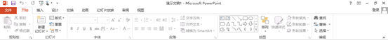
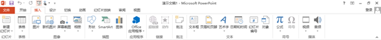
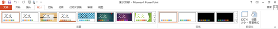
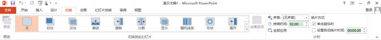
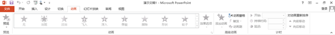
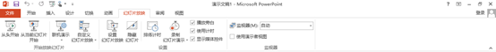
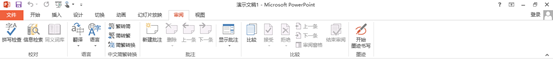
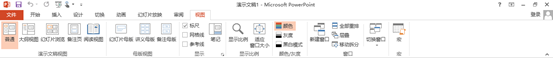

# 2.2.2  常用功能区

**“开始”选项卡**

“开始”选项卡是PPT最基本的选项卡，打开PPT总是显示的选项卡。它是最常用命令的集合，由剪贴板、幻灯片、字体、段落、绘图、编辑6个组构成。

**“插入”选项卡**

“插入”选项卡包含一系列和“插入”有关的命令，使用这些命令，可以非常轻松的将各种不同的对象插入到幻灯片中。它由幻灯片、表格、图像、插图、应用程序、链接、批注、文本、符号、媒体10个组构成。

**“设计”选项卡**

“设计”选项卡提供了幻灯片多种主题设置和自定义幻灯片大小，能帮助我们非常快速设计幻灯片。它由主题、变体、自定义3个组构成。

**“切换”与“动画”选项卡**

“切换”选项卡集合了大量新式的幻灯片切换动画，可以对幻灯片添加应用这些动画，还可以进行预览。它由预览、切换到此幻灯片、计时3个组构成。

“动画”选项卡包含的命令是对幻灯片内部元素的动画命令，与幻灯片切换动画相结合，可以获得非常好的演示效果。它由预览、动画、高级动画、计时4个组构成。

**“幻灯片放映”选项卡**

“幻灯片放映”选项卡主要集合了与幻灯片放映相关的功能，可进行具体的设置。由“开始放映幻灯片”“设置”“监视器”3个组构成。

**“审阅”选项卡**

“审阅”选项卡包含语言校对、简繁转换、翻译和添加批注的功能。由校对、语言、中文简繁转换、批注、比较、墨迹6个组构成。

**“视图”选项卡**

“视图”选项卡中包含有多种查看幻灯片的视图方式，能较为方便的对浏览和显示幻灯片进行编辑。

