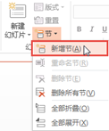

# 2.3.5  使用“节”优化幻灯片制作

PowerPoint 2013里的“节”功能能让制作者非常方便、简洁的进行制作的，当把整个演示文稿细分成不同的小节进行管理时，不仅规划好了制作结构的流程，同时，对编辑和维护也省了很多麻烦。

所以，了解并合理使用PowerPoint 2013中的“节”，将会在我们的制作中起到很大重要。

如图2-53所示的演示文稿共有10个页面，分为7个节。用户可以为每个节的具体内容添加各自的标题，对制作进行管理。它们将以高亮度、可伸缩的方式显示。而出现在这些标题右侧括号中的数字，则表示该小节中具体有几个页面。通过双击标题或单击标题左侧的小三角形图标，都可以展开或收缩属于该小节的页面缩略图。

## **新增节**

新增节有两种方法。

方法一：在“开始”选项卡“幻灯片”组中，单击“节”按钮，在下拉列表中选择“新增节”命令，如图2-54所示。

方法二：在幻灯片窗格空白区域，单击鼠标右键，选择“新增节”命令，如图2-55所示。

## **管理节**

在PowerPoint“开始”选项卡“节”组中，可以非常方便地对节进行管理，例如折叠节、展开节、重命名节、删除节等，如图2-56所示。

在制作幻灯片时，随手新建“节”管理自己的幻灯片，这是一个好习惯，能增加制作效率，每一个不同的好习惯加起来，你的效率将会突飞猛进，所以，不要小看这些小技巧。一个软件经过多次更新依然还存在并且越来越精致的功能，那么它就是一个很重要的功能。

