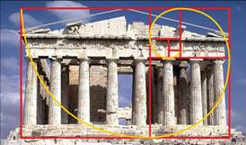

# 2.4.1  标尺

标尺是指以英寸标记的可用于对齐幻灯片上对象的垂直或水平参考线，如word中的标尺一样，对于整个版面规划设计起着至关重要的地位。标尺能够精确的定位设计位置，而不是靠人眼去估摸着排版。

单击“视图”选项卡，在“显示”组里勾选“标尺”前的复选框，如图2-57所示，可以显示或隐藏幻灯片窗格的顶端和左侧的标尺，如图2-58所示。或者在编辑区的空白区域单击鼠标右键，选择“标尺”命令，也可以显示或隐藏标尺。原点（或零标记）会根据在幻灯片上的选中对象（文本、文本框或形状）而改变。移动鼠标指针时，标尺上会显示它在幻灯片上的精确位置。

当鼠标在移动某元素时，标尺上会显示该元素方位的刻度，就像经纬线一样，帮助我们定位，当一个版面有很多元素时，我们将可以做到分毫不差的排版。

能被称为“神器”必然有其它功能无法比拟的能力，其实这个功能很简单——辅助排版。排版很简单，插入元素，对齐调整，然后就结束了；但它又远非我们想象的那么简单，它需要考虑的因素有很多，例如画面均衡、突出重点等等，这些都是需要精心设计的，而标尺则恰好排上了用场。

在设计中有着一个神奇线，它叫黄金分割线，黄金分割线其实是一个数字的比例关系，即把一条线分为两部分，此时长段与短段之比恰恰等于整条线与长段之比，其数值比为1.618:1或1:0.618。自它被数学界提出开始，就以其严格的比例性、艺术性、和谐性，展现着它丰富的美学价值。黄金分割线的神奇和魔力，在数学界上还没有明确定论，但它在设计中的实用价值是无法估量的。若我们在版式设计想要突出焦点，让画面更具有专业水准，那么借助标尺，使用黄金分割线将会让你更轻易的达到这一需求。

如图2-58、图2-59在不同领域的设计中，运用的黄金分割的原理。

在一幅画面中，人们的视觉习惯是从上到下，从左到右的观看。处于黄金分割线上的元素，往往是我们最关注的地方。根据视觉习惯和黄金分割线，我们可以找出幻灯片上的聚焦点。

画出版面上两条的黄金分割线，四个相交的点，就是视觉的聚焦点，将图片或是文字置于这些点的附近，将会使得你的元素更加突出。而我们也不必每次都生搬硬套的去画这些线，根据黄金分割线得出的聚焦点和平时经验的总结，我们一般可以粗略的将整个版面分成三个部分。如图2-63。

这是一个很明显的“上轻下重”的结构，符合我们一般性的排版原则，中间则是我们版面的重点。熟悉这个后，去掉这些线，再设计幻灯片时，你就可以直接按照这个样子去设计。

这是我们根据以上所有的步骤修改得来的，当我们知道这样方法，心里有意识的去做，我们会做得更好。

我们可以突出图片某一元素，如图2-64，我们进行突出的图片中人物的脸。

有一点需要提出的是，在PPT中没有绝对适用的方法和规则，只有相对而言可以采纳的方法，所以好的方法不一定会对你有帮助，在用之前需要找准症状，对症下药，那你的方法才会是对你有帮助的方法。

