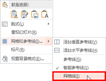
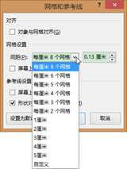
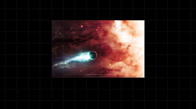

# 2.4.2  网格

网格线是不可移动、改变的，因此可以利用网格线调整形状和图片的大小，同时亦可据此把握形状和图片的位置。使用网格有助于更精确地对齐对象，特别是在互相对齐的情况下。

网格线设置方法同设置“标尺”，在“视图”选项卡中“显示”组里勾选“网格线”前的复选框，可以显示或隐藏编辑区的网格线和参考线。也可以在编辑区的空白区域单击鼠标右键，如图2-65所示，选择“网格和参考线”命令中的“网格线”命令。

“网格”的使用一般是配合标尺一起使用，只是使用的侧重点不同，两者都可以去控制版面的设计，而网格较多的使用在控制图片或形状大小方面。

先对网格线进行设置，如图2-66至图2-67。

如图2-68，为了更明显的显示网格，将背景调为黑色，以强调网格线。

当我们插入图片时，就可以依照网格线精确的调整图片的大小了，如图2-69在编辑状态下的视图，图2-70在放映状态下的视图。

