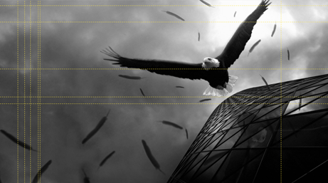

# 2.4.3  参考线

参考线更多地用于形状和图片的排列。某一系列的形状和图片是可以依据某一条参考线统一起来排列的（例如以该参考线为基准向左对齐），而参考线又是可以灵活移动的。参考线的价值远不止于此，参考线用得好，将会省却你很多设计排版上的烦恼。

如何显示参考线的设置在前面标尺和网格中有涉及，这里就不再赘述。另外，参考线是可以改变颜色的，如图2-71。

参考线是可复制的，除了可以选中参考线右键添加或删除外，还可以左键单击参考线后，按住Ctrl键，直接拖拽复制，将参考线拖到编辑区四边，松开鼠标，参考线会自动消失。

参考线有一项衍生的功能，那就是版式的复制。前面讲到当我们随手在网上截取了一张幻灯片时，对我们的学习是有帮助的，那么我们有没有更好的方法去具体操作这一步骤呢？参考线就排上用场了。

例如我们截到一张图，如图2-72。

使用参考线进行改造。如图2-73。

明白参考线的作用了吗？它是在帮助我们截取版式设计，我们截到的图是无法编辑的，但是里面的版式却是可以复制的，只要使用参考线，就可以轻松的将版式给固定在你的PPT上，接下来，我们找一张适合的图片当背景，然后将截图放之一旁。如图2-74所示。

对比两张PPT，我们需要做的就是填充元素，而元素该放置的位置，已经被参考线给安排好了，接下来的工作就是对照着截图和参考线进行填充了，然后若有需要，对颜色进行修改，若不需要则可直接吸取截图上的颜色（渐变色无法直接实现吸取）。

Tips：颜色吸取。选中一个图形后，在“绘图工具格式”选项卡中单击取色器，然后可以直接吸取你需要的颜色了，单击后图形会显示该颜色。如图2-75。

Office在10版以后加入了 “取色器”功能，PPT的操作就更一步的被简化，特别是颜色的调配上，以后需要的颜色就不需要再另外开启一个插件了。

我们从需要仿照的幻灯片上吸取我们想要的颜色，画出需要的图形，如图2-76。

参考线的可移动性赋予了它其他功能无法复制的灵活性，用心去开发和使用它的功能，它将会给你带来很多方便，让你在需要时，方便应对。

