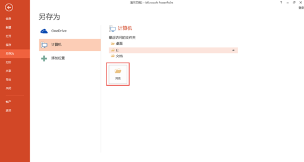
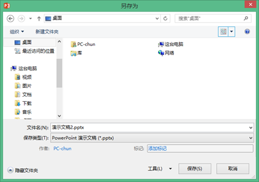

# 2.5.1  保存和另存为

## **首次保存**

当用户新建幻灯片进行制作时，一定是先进行保存，创建文件后再进行制作，这些都是平时操作时的一些好习惯，为了避免出现突发情况，从而造成所有的努力都白费了。

若你需要使用的演示环境上只有PowerPoint 2003版，那么一定要在使用前就保存为后缀为.PPT格式，这样你在制作时，PPT会智能的禁止你使用无法在03版上使用的功能。

如图2-77为保存为.pptx后缀切换动画，图2-78为保存为.ppt后缀切换动画。

通过提前限制了这些功能，就能有效防止使用者在13版做好后，最后保存的时候造成PPT自动删除无法使用的元素，从而造成一件本来完美的PPT，整体变得七零八乱。

单击“文件”选项卡，单击“保存”选项卡（或者单击快速访问工具栏中“保存”按钮），由于是首次保存，PowerPoint自动跳转到Backstage中“另存为”选项卡，如图2-79所示。

登入微软账号后即可保存至云端。

若要保存在本地计算机，则单击选择“计算机”命令，如图2-80所示。

上图中，若需要更改保存路径，则单击“浏览”按钮，弹出保存对话框。用户选择保存路径、设置文件名和保存类型后，单击“确定”按钮即可保存，如图2-81所示。

用户在编辑已保存在本地硬盘上的文件时，只需要单击“快速访问工具栏”中的“保存”按钮或单击“文件”选项卡中“保存”命令即可保存。

## **另存文件**

用户在编辑已保存在本地硬盘上的文件后，不希望覆盖原始文件保存，此时用户可以选择“另存为”一个新的演示文稿，方法如同“首次保存”中的保存方法。

需要注意的是高版本PowerPoint可以兼容打开低版本格式，但低版本的PowerPoint无法兼容高版本，若需要打开，还需要安装补丁才能实现。

