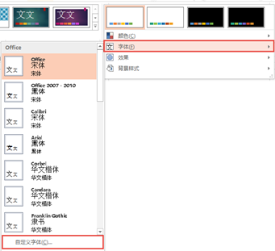

# 3.1.3  更改主题文字

## 更改文字

图3-6

主题文字如图3-6所示，当你新建一张幻灯片，占位符（后文有讲解）中默认输入内容的字体为主题字体。插入文本框时，默认字体也是主题字体。这个功能看似无用，其实它是在使用过程中对你非常有帮助的一个功能。

例如，我们在制作PPT时，遇到需要大量的插入文本内容（一般制作课件时），但主题字体不是我们想要的，我们需要“微软雅黑”，那么在每次插入后，我们都需要更改字体，更改英文和中文字体，这样就会显得非常繁琐。

在“设计”选项卡中的“变体”组中单击下拉按钮，如图3-7所示。

图3-7

在选择字体时，你可以选择中意的内置字体，也可以选择“自定义字体”。

图3-8

当我们选择自定义字体时，软件会自动弹出一个对话框，如图3-9所示，在设置方案中可以分别设置默认标题和正文，包括中文和英文。

图3-9

当设置完成后，自定义主题字体会显示在字体的选择里，如图3-10所示。

图3-10

选择自定义的主题字体，当我们再次导入内容到PPT中时，导入内容字体将自动变成主题字体。例如将一段文字复制进入PPT，字体从宋体变为了我们一开始设置的楷体，如图3-11所示。

图3-11

## **占位符和文本框**

大家对文本框肯定很熟悉，对占位符其实也不陌生，只是大家不知道它的名字而已，不知道是没有区分占位符与文本框的区别。

占位符外在显示形式是一个虚框，我们可以输入文本，其作用看起来与文本框没有什么区别，但有着起到规划幻灯片内容的作用。

如图3-12所示，新建幻灯片。

图3-12

在幻灯片板式中有着更多种占位符板式，如图3-13所示。

图3-13

当我们输入内容，转换视图为大纲视图时，会发现如图3-14所示的效果。

图3-14

文本框有竖排和横排两种，文本框内不能没有内容，而占位符内可以没有内容。文本框也不能随意的进行缩放。

图3-15

