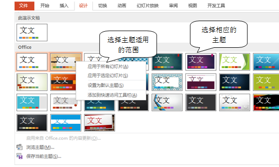

# 3.1.4  快速更改主题

在“设计”选项卡的“主题”组中直接选择，在需要的主题上，鼠标停留几秒钟，预览需要的效果。

图3-16

应用于所有主题：单击此选项，软件会自动将所有幻灯片都应用上此主题。

应用于选定的幻灯片：选中左侧幻灯片的缩略图，再单击此选项，将只改变选中的幻灯片，其余的将不会发生改变。

快速主题的最值得称赞的地方是快速统一幻灯片的背景色和背景图片，但是又不能完全的去使用它们。时代在进步，幻灯片的风格也在不断改变，一成不变对内置主题已经过时很久了，所以当我们使用它时，仅使用它的版式和配色，里面的图标元素都需要更改，将它们替换成公司或者更具有辨识度的logo，与内容不符的剪贴画也可以一删了之。经过替换与更改，将它变成你自己的模板。

