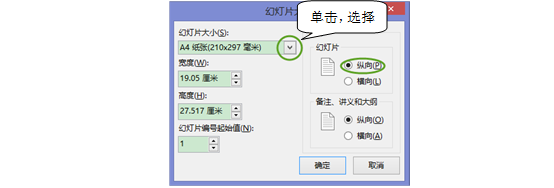

# 3.2  调整PPT版式

## **设置版式大小**

PPT一般有两种最常用的版式大小，长宽比为4:3或16:9。4:3的页面可能在某些宽屏电脑或演示屏上不适用，如果放映此版式，屏幕两边将出现两条黑边，如图3-35所示。

图3-35 出于演示需要，我们一般会将幻灯片设置为16:9或者16:10。在“设计”选项卡的“自定义”组中，单击“幻灯片大小”，选择自定义幻灯片大小。如图3-36所示和图3-37所示。

图3-36 

图3-37 设置版式大小这一步骤一定要放在开始制作前完成，当从标准4:3变为宽屏16:9时，版式中的图片、图形等元素会发生相应的拉伸变化。因此，为了避免破坏版式的设计，应提前设置好版式大小。

## **设置打印版式**

有些时候，在制作完PPT后，还需要将其打印出来，这个时候你就需要调整版式大小，以对应打印的规格。例如设置A4纸大小，如图3-38所示。

图3-38 在PPT上进行排版比word方便的是，图文混排非常方便，文本框时可任意移动的，图片也一样，两者能够分层次展示，所以PPT有着排版上的优势。

