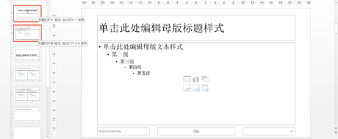
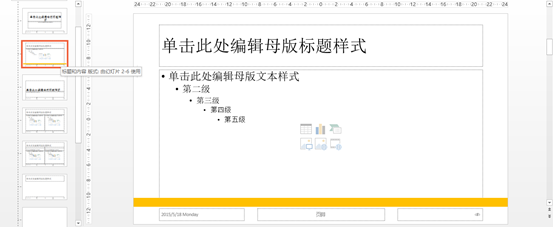
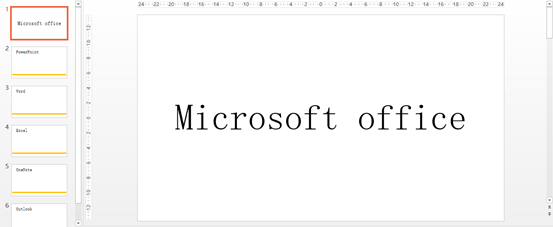
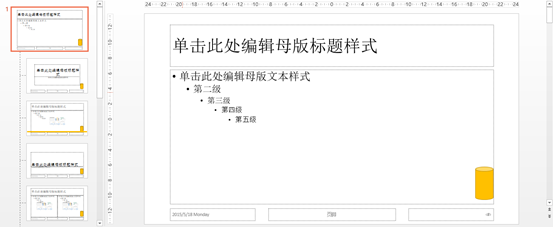

# 3.3.1  母版与板式的认识

每一个幻灯片都对应着一个版式，新建幻灯片PPT默认的是“标题和内容”幻灯片。当然，PPT给我们设置很多其他的版式以供我们使用，不同的版式占位符不同，所规划的内容也不同，通过版式的名字就可以看出来。而母版可以说是版式的版式，可以更改统一版式。

我们来举个例子，这样便于我们理解。如图3-38所示，新建一幻灯片，输入内容。

图3-38 在“视图”选项卡中母版视图，找到幻灯片所应用的版式，如图3-39所示。

图3-39 在母版视图下的“标题和内容”版式内，插入一个矩形条，如图3-40所示，关闭母版视图，变化如图3-41所示。

图3-40 

图3-41 唯一没有发生改变的就是第一页幻灯片，因为第一页的版式和其他幻灯片的版式是不同的，所以只有相对应的幻灯片版式，才能改变幻灯片。

当我们修改母版时，如图4-42所示，在母版中插入一个圆柱体，会发现所有的版式全部跟着发生了变化。

图3-42 通俗点说，母版是上司，版式下属。版式可以控制相对应的幻灯片，而母版却可以控制所有版式。这就是母版与版式，通过设置好不同的版式，你将可以快速的使用你提前设置好的元素。通过对版式的修改，能统一修改所有与之对应的幻灯片，这将会大大的节省你的时间。

