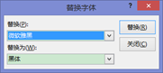

# 3.5  直接替换字体

除了上述的几种替换字体的方法外 ，还有一种更有针对性的替换字体的方法，每次对一种字体进行替换，不影响其他的字体。

开始——编辑——替换——替换字体。

图3-50

图3-51

这种操作起来比较简单，实用性比较强，针对人群广。大多数并没有使用主题、母版或大纲视图的习惯，但这种的针对性明显，不需要了解其他知识，只需要知道自己想替换的字体时哪种就可以了。若想替换多种字体，重复多次此操作即可实现。

