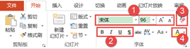

# 4.1.2  设置文本框格式

对文本框进行设置，一般是对字体、字号、颜色等进行修改，而且除了对内容本身进行修改，还可以对文本框进行修改。

**设置文本格式**

在“开始”选项卡中的“字体”组中，我们可以根据需要进行设置。如图4-3为我们经常使用到的功能。

图4-3

① 用户可以自由选择字体，选择想要的字号，字体的种类则由用户电脑上安装的字体总类而定，字号设计以版式整体平衡为前提，例如标题设置得很大，副标题较小，正文字号更小，如图4-4所示。图表标题字号一般设置的很大，图表的数据来源（或解释）一般会设置的很小，如图4-5所示。Ctrl+\[缩小字号，Ctrl+\]放大字号。

图4-4

图4-5

② 从左至右依次为：加粗、倾斜、下划线、文字阴影。一般给标题文字加粗，以突出标题（或副标题），由于粗体字容易成为焦点，时间久了易造成人眼疲劳，所以很少给正文部分加粗。倾斜字体会显得字体比较活泼，一般正式场合不会使用倾斜。下划线也是起到了一般的强调作用，当然，下划线也可以有其他的小功能，例如用制作填空题的效果，如图4-6所示。文字阴影起到美观和突出重点的效果，这种效果也应该少用。凡是起到聚焦，重点突出的效果都应该慎之又慎的使用。

图4-6

③ 清除所有格式。当使用者从网页或另外的PPT中复制了一段内容，直接复制进入PPT，有可能会发现原有的格式没有消除，复制过来不利于修改，比如有超链接。那么使用此功能，将会清除所选内容的所有格式，只保留普通、无格式的文本。

④ 字体颜色。用户可以自由更改字体的颜色，以符合自己的需求，颜色根据主题色变化，若版式背景是白色，一般使用黑色字体，在使用字体颜色时，应充分考虑背景的问题。况且字体颜色的运用也可以突出文本内容，如图4-7所示。

图4-7

点击“字体”组右下角的小三角，如图4-8所示。弹出更为详细的设置窗口，如图4-9所示。

图4-8

图4-9

