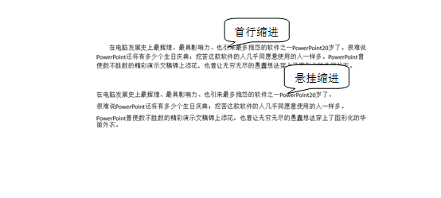

# 4.2.1  缩进与间距调整

## **段落缩进**

根据中国人汉字书写的习惯，在段落第一句话会首行缩进两个字符，这已经是我们在书写和排版时的一种常见习惯了，对我们来说，如果在段落前没有设置首行缩进，那么有可能被认为是粗心大意而忘记了段落的常规设置。

“开始”选项卡——&gt;“段落”组，单击组右下角的小三角，会出现如图4-27所示的对话框。

图4-27

无论是首行缩进还是悬挂缩进都不影响文本的对齐方式，缩进只是缩进方式。

另外一种缩进方式——悬挂缩进，常用于项目符号和编号列表，悬挂缩进这个概念也是针对悬挂缩进而言。

如图4-28所示为两种的体现形式。

图4-28

需要指出的是，如今，在一些版式设计中，没有使用首行缩进分别段落，而是通过段落之间的间隔来分别段落。在国外，这种方式在设计中普遍运用，而首行缩进就不适合一些设计感很强的版式设计，如图4-29所示。在国内，在一些供人阅读的杂志，报刊中，有些版面也采取了首段不缩进的方式，如《读者》。在PPT的版面设计中，如果有一些图文混排的页面，建议不要使用首行缩进；在一些纯文本的页面，可以使用首行缩进，也可以借鉴一下使用空白间隔来区分段落。多使用几种排版方式会让你去体会不同排版之间的设计性。

图4-29

好的设计版式和PPT中的设计版式是相通的，在前文 就已经反复提到过，制作PPT也是设计的一类，同为设计就可以去学习，设计中好的东西，PPT中的设计可以用得到。

## **段落间距**

在PPT少有大段的文字段落，但当出现这种情况时，就尽量使这些文字看起来更舒服，适宜的段落字行间距将会使得人眼容易分辨出内容信息，不至于瞪着眼睛在长篇大段中寻找需要的演示的内容。本来就有一大段文字，当这些文字没有合适的间距时，它们就是整个版面的败笔，破坏了整体的结构。

在PPT中，我们一般设计的字行间距为1.2倍。此行距适中，人眼较容易观看，再配合16号以上的字体和恰当的留白设计，则将最大程度的弱化大段文字带来的影响，如果能在文字提炼上下些功夫，整个PPT的版面至少看起来会很舒服，不会演示还未展开，就在版面设计上扣分。所以在版面设计上，不是要求信息量大，而是要求辨识度高，留给观众喘息的时间，待观众慢慢观看。当我们在细节处处为观众考虑时，观众会感受到我们的认真细致，并给予足够的回报的。

