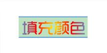
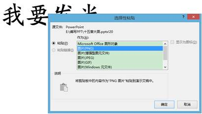
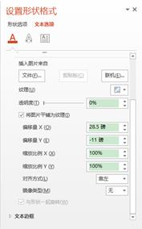
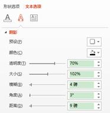
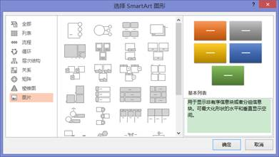
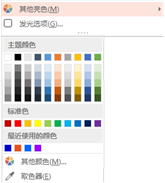
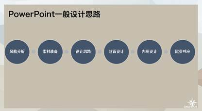
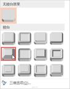
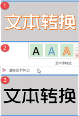

# 4.3  艺术字

在PPT中制作精美的艺术字效果，这是经过软件几代更新后最大的进步之一，在吸取了其他优秀的图形处理软件的优点后，PPT至07版后不断改进艺术字功能，现在，13版可以对任何字体、任意字号、添加各种各样的字体效果。

**插入艺术字**

“插入”选项卡——&gt;“文本”组——&gt;“艺术字”。如图4-39所示。

图4-39

将鼠标悬停在各效果上，将出现此效果的设置参数。

按照上述步骤，插入一个艺术字文本框，直接在其中输入文字就行了。

艺术字里的的默认效果有20个，使用这些默认效果可以满足大部分情况。如图4-40所示。

图4-40

**添加默认艺术字效果**

除了直接插入一个艺术字效果的文本框外，PPT还可以为已有的文本框添加艺术字效果。

选中需要添加艺术字效果的文本框——&gt;单击出现在功能区上的“绘图工具”——&gt;在“艺术字样式”单击默认艺术字旁下拉箭头，如图4-41所示。

 

图4-41 图4-42

**自定义艺术字**

艺术字是对文本效果的一种修饰的集合体现，它基本上包括了三种修饰：文本填充、文本轮廓和文本效果。

三种处理方式都在“绘图工具”里，只有当选中元素时，此选项卡才会出现。

**文本填充——填充颜色**

在文本填充中共有四种文本填充效果。

选择“其他填充颜色”命令，为文本替换另一种纯色。可以在主体颜色中选取，也可以在“其他填充颜色”中选择。

 

图4-43 图4-44

在调色板中选择一种颜色，比如蓝色。

 

图4-45 图4-46

当需要其他颜色时，也可以为文字添加自定义填充色。可以在色带中直接单击颜色，通过右下角的对比确定颜色需求，也可以通过颜色模式RGB自由调配红、绿、蓝的数值，同时也可以转换成HSL模式。不管哪种模式下，PPT都可以调配颜色的亮度，以达到一色多用，并且不会造成颜色的不统一。如图4-47所示，为文字配上红色。

 

图4-46 图4-47

**文本填充——填充图片**

将图片填充入文字中，可以文字得到图片一样的美感，瞬间让文字拥有特殊的艺术气质。

选择填充“图片”选项。

 

图4-48 图4-49

在本地文件夹中选择希望填充的图片，选中后，单击“插入”按钮。

 

图4-50 图4-51

此项功能虽然能让文本内容变得艺术气，但同时也会有可能破坏整体的和谐性，选用与背景相似的颜色是比较保险的。

**文本填充——文字渐变**

07版以后的PPT可以让文字如同图形一样添加渐变，让文字显得更高端。

选择“渐变填充”。

 

图4-52 图4-53

渐变是在现有的色彩进行渐变，选取“线性向右”渐变。

 

图4-54 图4-55

也可以选择“其他渐变”，10或13版PPT会自动弹出一个窗格。

 

图4-56 图4-57

这是在07版以后的PPT中是一个强大的功能，13版将其精简、美化了许多，有了这个功能窗格，PPT对图形和文本的处理能力突飞猛进，一发不可收拾。可以选取PPT自带的渐变色，总共有30种。

 

图4-58 图4-59

也可以手动进行调整，添加光圈，调整颜色渐变。还可以设置渐变的类型，渐变有四种类型，线性、射线、矩形、路径。

线性渐变：直线型颜色的过渡效果，可以选择从八个方向进行渐变。45°线性效果如图所示。

 

图4-60 图4-61

射线渐变：由点及面的辐射过渡效果。有5个预设渐变方向，无法人为自由调整角度。

 

图4-62 图4-63

矩形渐变：由点及面90°辐射的过渡效果。有5个预设渐变方向，无法自由调整角度。

 

​ 图4-64 图4-65

路径渐变：由中心到四周360°辐射过渡效果。 不可设置方向与角度。

 

图4-66 图4-67

四种渐变，只有线性渐变可以自定义渐变角度，自定义角度，让你的拥有自己的渐变色。

 

图4-68 图4-69

了解渐变，还应当了解渐变的一个重要工具——光圈，07版后，PPT中加入了光圈这个概念，在PPT中，最多可以 添加10个光圈。其实渐变的实现也就是不同颜色的光圈按一定顺序分布的结果。如下图，添加四个光圈，分别是红、黄、蓝、绿，依次排列。

 

图4-70 图4-71

增加的光圈越多，颜色之间的过渡越紧密，光圈的多少对渐变的影响是非常大的。在图4-70的基础上，在两个光圈中间再加入一个颜色，效果如下图所示。

 

图4-72 图4-73

光圈颜色是可以调节透明度的，将颜色调成透明色后，又会是另外一种效果，例如，我们将光圈一和光圈调节为100%透明。

 

图4-74 图4-75

**文本填充——填充纹理**

在07版以前，纹理填充还只是针对图片填充的一种功能，到如今的13版，可以轻而易举的去调整纹理的偏移量、缩放比例、透明度等参数，效果也越来越好。

选中文本框，“绘图工具—格式”选项卡——&gt;“文本填充”——&gt;纹理。

 

图4-76 图4-77

当鼠标移至“纹理”命令上，会自动弹出对话框，选择适合的纹理，单击即可运用至文本上，例如选择“绿色大理石”。

 

图4-78 图4-79

当已有纹理无法满足你的需求时，可以单击“其他纹理”，制造出更多令人满意的纹理效果。

如图4-80所示，“文件”是从本机中选择图片，剪贴板则是将最近一次的剪切插入文字中，“联机”则是从网络上搜索图片。

图4-80

在本机中寻找图片插入，单击“文件”，点击“插入”，不勾选“将图片平铺为纹理”。

 

图4-81 图4-82

勾选“将图片平铺为纹理”，调整各项参数得到下图的效果。

 

图4-83 图4-84

调整各项参数可以得到各种各样截然不同的效果，丰富多彩，如图4-85所示。

图4-85

**文本轮廓**

在我们装饰文字本身时，我们也可以对文字的边框进行装饰，这样的装饰效果会达到另一种装饰的效果。

选中文本框，“绘图工具—格式”选项卡——&gt;“文本轮廓”，同时也可以选中文字后单击鼠标右键选择编辑文本格式，如图4-86、图4-87所示。

 

图4-86 图4-87

在“文本轮廓”中选择不同的颜色作为边框，不同的颜色给人不同感觉，如黄色和红色会给人一种对比、冲击的效果，蓝色则会给人一种庄重、严肃的感觉。

 

图4-88 图4-89

对文本边框的粗细大小也可以进行调整，当然不介意将边框调得过大，毕竟文字才是重点。

 

图4-90 图4-91

值得注意的是，在单击“其他线条”命令后，我们可以看到，线条也可以添加渐变，这就大大的增加了边框的实用性和利用价值。

 

图4-92 图4-93

所有有关文本边框的参数设计都在图4-92中，通过对颜色、渐变以及透明效果的设置，将使得文本拥有更多不一样的效果。

图4-93

**文本效果**

不仅仅是针对图形，如今对文本来说，也能添加各种各样的效果，而且体验效果不比运用在图形上的差。

要想在2D平面上显示3D的效果，是有办法做到的，想一想，画家是如何在一幅画上呈现出立体感的，其中一个很重的原因是自然的运用了“光”和“影”之间的关系，让人眼以为这看到了立体的事物，这通过“光”和“影”的结合，使得画面赋予层次感。

**阴影**

“绘图工具—格式”选项卡——&gt;“文本效果”——&gt;“阴影”

 

图4-94 图4-95

PPT预设了三种不同的阴影状态外部阴影、内部阴影、透视。

外部阴影出现在文字的外部，让人感觉文字有凸出来的效果，给人以立体感。

内部阴影出现在文字的内部，让人感觉文字有凹进去的效果。

透视是阴影最给人以立体感的效果，画画中经常用到这种手法，近大远小，给人以光线投影的效果。

 

图4-96 图4-97

选择图4-96下的“阴影选项”，将可以对阴影的颜色、透明度、大小、模糊、角度、距离等进行自定义设置。

图4-98

当有阴影设置在版面上时，一定要有意思的去统一所有的阴影角度，若没有必要则不需要将阴影的颜色更改，以免造成画面失真严重的结果，设置阴影是为了凸显画面的层次感，但当阴影的出现不仅没有为画面的层次感做出贡献，反倒使得整个画面空间错乱时，就应该及时删除阴影。添加阴影还需要考虑的一个事情就是“光”，一副利用了阴影的画作，其中的阴影效果绝不是一层不变的，为什么？这是因为“光”的影响，所以纯粹单一的添加阴影是达不到真正用好阴影的要求的，只有当明白了“光”和“阴影”间的关系，做到心中有数时，才能随心所欲的去运用这功能。

**映像**

映像是一种很炫的功能，它如同加入了一面镜子，倒映出你的内容，让人感觉非常惊奇。同时也能增强文本的立体效果，有时会显得比阴影的好用，显然它比阴影的使用要求低了很多。

“绘图工具—格式”选项卡——&gt;“文本效果”——&gt;“映像”。

 

图4-99 图4-100

在“映像”命令的弹出框中选择合适的效果，有9个预设效果，鼠标悬停预览后，单击即可运用。

 

图4-101 图4-102

显然，映像是很炫，但很炫的东西往往也很炫眼，当映像过大或大面积使用时，将会严重干扰观众的视线，影响文字的内容，这将会在版式设计上扣分，这是我们不愿意看到的结果。

添加映像效果也是有局限性的，当背景色彩不够亮，文字颜色不够炫，映像效果就会很弱，甚至会看不出来。

**发光**

发光如同映像一样，属于华丽型特效，效果很好，但应用则应小心谨慎些，以免造成了负面影响。

选中文本，“绘图工具—格式”选项卡——&gt;“文本效果”——&gt;“发光”。

 

图4-103 图4-104

在“发光”命令弹出来的对话框中预览需要的效果，单击选择应用。

 

图4-105 图4-106

单击“其他亮色”，可以为文本添加其他的颜色，而不仅仅局限于预设的几种。

 

图4-107 图4-108

添加一个与发光颜色相同的边框将会增强发光的效果，例如在图4-108的基础上，增加一个白色边框。

图4-109

既然是发光，那么光就不会随便发出来，最好是遵从一般的基本原则，光要么和文本颜色大体一致，要么颜色与版面背景类似，要么就是白色，不要随心所欲的去设置，至少你得让人知道你还懂得一些基本的原理。

**棱台**

前面的设置是在2D上的3D效果，而棱台特效则将真正的赋予文本立体的质感。

 

图4-110 图4-111

在预设的各种效果中进行预览选择，单击需要的一种效果。

 

图4-112 图4-113

单击“三维选项”，可以设置更多的参数。

 

图4-114 图4-115

需要特意提出来的一点是，当两个文本在同一平面设置三维格式时，增加棱台高度时，两者的底部还是处于同一水平位置，但当改变两者的深度，增加的高度其实增加的元素底部离共同平面的距离，这是在设置三维需要了解，但在文本的三维效果中不需要，图形的的设置里，这一原理还需要努力去揣摩一下，当你弄明白这一原理时，你的水平将更近一步。

不仅仅是设置三维格式，而且可以三维旋转，通过不同角度的旋转，得到更为逼真的立体效果，显然，设置三维旋转后有很大的可能是造成文字的阅读障碍的，所以，在艺术字处理上，三维旋转不作要求。

**转换**

这个功能非常有意思，能让文字进行变形，让文字变得扭曲、旋转、拉伸等等。

选中文本，“绘图工具—格式”选项卡——&gt;“文本效果”——&gt;“转换”。

 

图4-116 图4-117

鼠标移至“转换”命令上。

 

图4-118 图4-119

有一些转换效果是可进行拉伸变换的，例如图4-120所示。拖动图中的拉伸按钮，就可以调整转换效果的位置与拉伸程度。

图4-120

虽然变形效果很有意思，但变形的设置会对文字造成一定程度的阅读障碍，降低观众的阅读效率，所以变形一般很少使用。

**清除艺术字**

对于已经设置了各种艺术特效的文本，可以使用上文曾经提到过的清除格式，但这会清除文字上的所有格式。PPT中还有着另外一种非常方便的清除艺术字格式的功能。

可以直接在“绘图工具”选项卡的艺术字中进行清除。

图4-121

