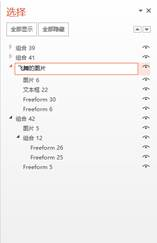
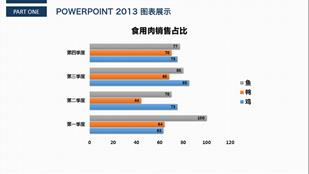
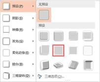

# 4.4  图形渐变

在PowerPoint 2013中，我们可以对图形使用渐变功能，让图形拥有更多的用途。不同的渐变形成的效果不同，操作步骤却是大体相似的，不同的是思想上的差异。

如图4-122所示，为图中圆角矩形添加渐变效果。

图4-122

选中圆角矩形，单击右键，选择“设置形状格式”。

图4-122

在弹出来的对话框中，勾选渐变填充。

图4-123

选择线性渐变，方向选择线性向右，角度将会自动变化为0°，添加三个光圈，由左向右，由深及浅，如图4-124所示。

图4-124

完成所有的参数设置后，效果如图4-125所示。

图4-125

一个简单的目录就做好了，用到了渐变，让标题变得更有质感，更美观了。

例如前面有所展示过的图片，如图4-126所示中的图形也用到了渐变。

图4-126

它是由一个梯形渐变而来，如图4-127所示。

图4-126

渐变有很多的用法，这只是其中的一种用法，后文中也会更多介绍图形的渐变的多功能。用好渐变，让渐变在出现图形和文字间，体现颜色的过渡之美。

用到它的地方就不同，渐变角度就不同，颜色也就不同。图形不同，渐变的方式也就不同。总之，决定渐变的因素有很多，想让渐变更好看，就需要多多尝试，只有不断的练习，才会有真正炉火纯青的一天。

