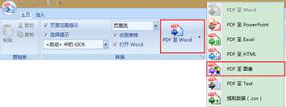

# 11.3  导出PPT为图片

PowerPoint自身提供了将PPT导出为图片的功能，如图11-20所示。

图11-20

图11-21

这种方法是由PowerPoint自带功能完成，非常实用、方便、快捷，但很显然在实际使用中会发现，使用此种方法会出现清晰度有所欠缺的情况，文字与图片处理上有所欠缺，如想要将这些图片打印出来则会影响打印及展示效果。要想实现更清晰的效果，则需要使用其他方法。

我们推荐三种转换方式：使用截图软件进行截图；另存为PDF文件后使用高分辨率转换为JPG格式图片；保存为高分辨率JPG或PNG格式图片。

## **截图软件**

我们在平时就可以直接使用截图软件去对PPT进行截图，使用一些专业级的截图软件，效果会非常的好，如SnagIt，操作极其简单，非常容易上手，但效果却很好。

图11-22所示图片为PPT直接导出的图片；图11-23所示的图片为SnagIt截图软件截图。

 

图11-22 图11-23

## **PDF转JPG**

首先将PPT先转存为PDF格式的文件，由于PDF是矢量文件，所以在转存过程中，几乎不会有任何的质量损失，这样就可以将PDF格式的文件作为一个中转格式，保证文字与图片的精度不会有所损失，然后从PDF转存为JPG格式，推荐一款——Solid Converter。

这是一款非常好用的PDF转换软件，能将PDF转换为PPT、Word、Excel、图片等，使用范围非常广，效果也非常的好。

打开Solid Converter，在开始界面上很自然的可以看到四个命令，选择“打开PDF”，找所需要转换的PDF文件。

图11-24

如图11-25所示，选择需要转换出的文件格式。

图11-25

单击“PDF至图像”图标，软件会出现一个对话窗口，在这里可以设置图片的质量及保存位置。

图11-26

DPI：“dot per inch”的缩写，就是指在每英寸长度内的点数。在Photoshop中文版中可以看到中文解释是“分辨率”的一种表示方式——“像素/英寸”,也就是英寸的像素点。 DPI越大,像素数越高；一般电脑中所需要的dpi数为72；而相片冲印和印刷则需要300dpi.

## **保存为高分辨率图片**

幻灯片是可以自定义大小的，只不过的是，幻灯片中显示的参数是厘米，而不是常见的像素，这也就意味，若需要使用这种方法还需要熟悉一下像素的换算方法，不过这也是很简单的一件事情。

PPT导出的图片默认是96 dpi，dpi对应是每英寸的像素数，所以PPT对应是96像素，而1英寸相当于2.54厘米。

例如我们需要一张1080×780像素的图片，我们需要进行如下换算：

宽度=1080/96（英寸）、高度=780/96（英寸）。

宽度=1080/96×2.54=28.575（厘米）、高度=780/96×2.54=20.638（厘米）。

图11-27

然后再将已经设计好的幻灯片导出为JPG或者PNG格式的图片，既可以得到1080×780像素的图片。

