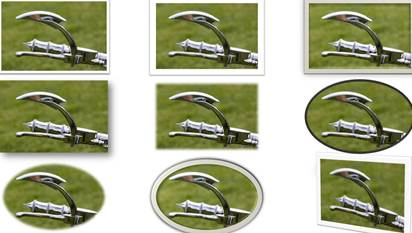
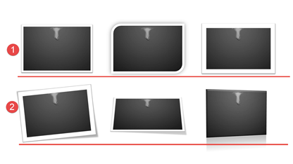

# 5.7  图片的边框

PowerPoint 2013各项功能都改进甚大，对图片的处理更是让人满意。软件在给予了用户流畅的自定义处理图片功能的同时，添加了更多更丰富、更精美、的艺术效果，同样是简单的一键操作。

根据图片的各类艺术效果的组合，软件预设了28个快捷效果，让用户能非常快速的为图片添加各种好看的艺术化效果。

选中图片——&gt;“图片工具—格式”选项卡——&gt;“图片样式”组。

图5-29

图5-30

以下展示部分图片样式的快速效果，如图5-31。

图5-31

快捷效果又好看又炫，但是不能随便乱用，在使用快捷效果时我们依然需要保持整体的风格统一。

不同的图片效果可能会造成图片形状的改变，但同一组快捷效果依然可以给人一样的感觉。

例如图5-31。

图5-31

上下两组图片效果，第一组选取的风格类似，不会破坏图片整体的风格，质感如一。第二组的设置就比较凌乱，乍一看效果很好，实质上，这样的设置只会造成观众的反感。

除了使用软件预设的图片特效美化效果外，我们也可以像设置艺术字一样的设置这些特效。

图5-32

这些功能和艺术字上使用的效果是一样的，只不过使用对象换成了图片，所以呈现的效果也就不一样了。

图5-32中“预设”命令和图片的快速样式类似，一样可以让图片迅速的组合各种特效，一键成型。很显然，我们可以看出预设其实是使用了三维格式里的效果进行设置的，不同的材料和不同照明。

图5-33

图片的阴影同样分为三大类型，外部阴影、内部阴影、透视阴影。也和文字阴影一样需要注意“光”和“影”的关系。

图5-34

图片的映像效果和文字一样，但在预设的映像中，我们会发现，所有的预设映像都不是特别清晰，在其他特效的预设中也有这个特点，对比于文字来讲，图片特效像是被弱化了一样，这点就显示了图片与文字间的差异，不是图片不能使用特效，而是图片使用特效时需要谨慎，慎用特效。

图5-35

发光特效在一些暗色系的背景下能让图片显得尤为突出，但需要注意符合发出光源逻辑的问题（详细参考艺术字）。

图5-36

柔化边缘对于图片来说是一个很好用的特效，它能帮助图片实现很多事情，例如将图片融入背景，在后文中有详细介绍。

图5-37

棱台在图片中使用和在文字中使用的有着很大的差异，呈现的效果完全不同。

图5-38

三维旋转这个特效，即是是运用在图片上，也是不推荐的，一般我们制作PPT不会遇到那种在2D平面的设计已经不够用，需要在3D上再做突破的程度。不合适的旋转是肯定会造成负面影响的，这是毋庸置疑的。

图5-39

PowerPoint 2013不仅仅拥有一键图片特效化，还能一键让图片加入其它艺术效果的美化功能，让图片的艺术感瞬间上升，让图片拥有似被Photoshop处理过的感觉。

下图为一些常用的艺术效果。

图5-40

## **图片的边框**

大家有主意到吗？在上一节中的各种预设特效中，很多都有设置边框，并且非常美观，这说明设置边框能够强调图片的观赏程度。

设置图片边框和设置文本框边框或者图形轮廓一样，可以设置粗细、线型、颜色等等一些参数。

图5-41

