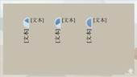

# 6.1.1  创建SmartArt图形

在图形类型中，我们首先需要介绍的是SmartArt图形，此功能首次出现在07版，并在以后的更新中逐渐强大起来，它类似于早期版本中的“图形”功能 ，但SmartArt图形更丰富，种类更齐全，配色更专业，外观也更好看。

SmartArt图形不单单是在PPT设置有此项功能，在Word、Excel中同样具备，它真正的作用是来描述逻辑，其内在的本质是将繁杂冗余、长篇大论的文字去除繁枝末节，留下核心，理清逻辑，让观众对内容有清晰的认识。

SmartArt图形包括图形列表、流程图、以及更为复杂的列表。总共有八大类型，154种形式多样的样式，当然在这些种类之中，有些重复出现，适用于多种类型的样式。

创建SmartArt图形，方法有两种。

第一种是直接创建，在“插入”选项卡中的“插图”组中，单击选择“SmartArt”。

图6-1

单击后将弹出一个选择的对话框，如图6-2所示。对话框左侧是图形的各种类型，单击该类型会出现其所属的各种不同样式，选中需要的样式，即可在对话框右侧进行预览。

选中后，单击“确认”按钮即可插入图形。

图6-2

创建好后的SmartArt图形会有一个输入文本的文本窗格出现，用户可将需要的内容输入其中，进行一系列的文本编辑。当然也可以直接在SmartArt图形上的“文本”上进行文本的编辑。

图6-3

第二种方法创建SmartArt图形是通过已有的文本创建，这样的方式会省去创建SmartArt图形后需要输入文字的步骤，能允许用户事先准备好具体文案，然后通过SmartArt图形将文本内容结构化，使文本结构更清晰，会更方便。

首先，我们需要插入一个文本框，在文本框内输入文本内容，分段排列。然后选中文字，单击鼠标右键。

图6-4

鼠标移至“转换为SmartArt”，在弹出来的选择项中选择一种布局样式，如图6-5所示。

图6-5

最后直接生成包含文字内容的SmartArt图形。

图6-6

以下我们列举一些SmartArt图形。

## **列表型**

  

基本列表 图片题注列表 垂直项目符号列表

  

​ 垂直框列表 水平项目符号列表 方形重点列表

  

蛇形图片重点列表 堆叠列表 饼图流程

  

​ 分组列表 水平图片列表 连续图片列表

  

垂直图片列表 垂直图片重点列表 垂直块列表

  

垂直曲形列表 目标图列表 层次结构列表

## **流程图**

  

基本流程 步骤下移流程 重点流程

  

交替流程 连续块状流程 递增箭头流程

  

​ 流程箭头 圆形重点日程表 基本日程表

  

基本V形流程 V型列表 垂直V形列表

  

子步骤流程 分阶段流程 随机至结果流程

  

圆箭头流程 漏斗 齿轮

## **循环图**

  

基本循环 文本循环 块循环

  

不定向循环 连续循环 多向循环

  

分段循环 基本饼图 射线循环

  

基本射线图 分离射线 循环矩阵

射线韦恩图

## **层次结构**

  

组织结构图 姓名和职务组织结构图 半圆组织结构图

  

圆形图片层次结构 层次结构 标记的层次结构

  

表层次结构 水平组织结构图 水平多层层次结构

 

​ 水平层次结构 水平标记的层次结构

## **关系图**

  

平衡 六边形群集 平衡箭头

  

嵌套目标图 聚合射线 射线列表

  

​ 基本目标图 线性维恩图 堆积维恩图

## **矩阵图**

  

基本矩形 带标题的矩阵 网格矩阵

## **棱锥图**

 

基本棱锥图 倒棱锥图

还有最后一种类型——图片型。图片型的种类其实都包含在了其他七种SmartArt图形中。这些分类的建立是为了更近一步的将软件的使用水平降低，只有易上手、高效率的软件才能受到大多数人的青睐。

软件的智能化就是一键式操作，将本来繁琐的事，浓缩到一个单击之中，让未来的一些复杂操作变成一键化操作。

