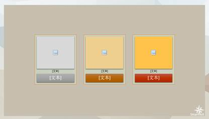

# 6.2  图片与SmartArt混排

在上文中介绍SmartArt时，我们会发现SmartArt预设了设置图片的图形，也就是说SmartArt不仅仅是和文字相关联的图形，而且它能够和图片协调的展示。

在PowerPoint 2013中预设有很多图片与SmartArt混排的样式，如图6-34所示。

图6-34

我们有两种方式创建图片SmartArt混排，第一种，我们先插入一个样式，然后更改颜色和效果，如图6-35所示。

图6-35

单击每个图形上的图形缩略图就可以在本机中选择图片插入图形中，图片风格最好统一，如图6-36所示。

图6-36

第二种方法，我们先插入图片，选中所有图片，在“图片工具-格式”中单击“图片版式”命令。

图6-37

图6-38

为选择的样式更改颜色和效果，添加文字，如图6-39所示。

图6-39

这种方式的图片混排借助到了SmartArt的参与，所以它是图片与SmartArt图形的混排，虽然这种方式能快速的帮助我们确定图片与文字的位置关系，但有一点需要我们注意的是，图形是死的，人是活的，终究是人在创造，所以不要生套模板，这样只会让你的图形变得越来越丑，离你理想中效果的越来越远，只有当你知道，一个模板拿到手上，在使用前是进行修改时，你才能真正的用好这个模板。

在使用SmartArt图形中需要注意的是色块的大小和位置，图形时用来辅助排版的，但当一个图形没有发挥这样的功能的时候，那它就成了整个版面“拖后腿”的存在了，所以在使用时，按照实际需求统一的调整整个版面的色块的大小，让它们看起来更好，衬托功能更突出。

