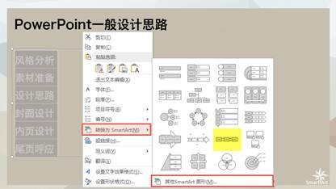
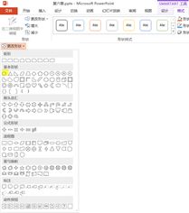
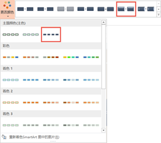
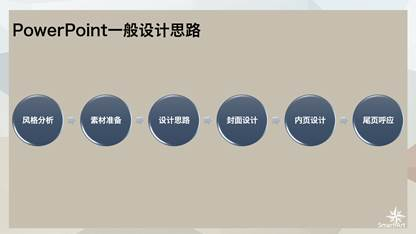
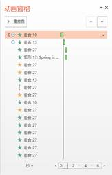
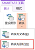
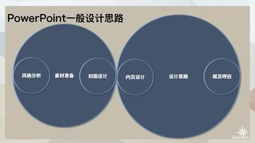

# 6.3  SmartArt的变形

SmartArt图形不仅仅是局限在软件默认的形状图形中，PowerPoint设置有这样的方法，让用户去自定义SmartArt图形形状，这样既能保证不去除SmartArt效果，又能满足不同用户在不同的情况下，对不同形状的需求，如图6-40所示，在SmartArt预设图形中是没有这样的圆形流程的，而经过用户的自定义修改，则可以呈现出这样的效果，简单的一个小变形就可以让你与众不同。

图6-40

首先我们需要插入一个SmartArt图形，插入方法有两种，直接插入和文本插入，在这里我们选择文本插入，所以我们首先需要输入文本内容，分段排列，设置好后，选中所有文本，单击鼠标右键，选择“转换为SmartArt”，在弹出来的对话框中，我们可以选择一少部分SmartArt图形，若需要更多图形的预览，则可以单击下方“其他SmartArt图形”，如图6-41所示。

图6-41

在这里我们选择图中的“基本流程”图形样式。选择后单击样式，插入的图形大小需要调整，拖动调节按钮，根据整体版式需要调整整个版面的大小，如图6-42所示。

图6-42

调整好大小后，选中图形中的所有矩形，按住键盘Ctrl键或者Shift键即可实现连续选中，如图6-43所示。

图6-43

在“SmartArt工具”选项卡中选择“格式”子选项卡，在“形状”组中选择“更改形状”命令，这里我们选择更改为圆形，如图6-44所示，单击选择后结果如图6-45所示。

图6-44

图6-45

从图6-45可以看到这不是我们想要的图形，我们需要圆，而不是椭圆，而软件并不能分辨我们操作的具体意义，所以要想得到圆，我们还需要自己动手设置。同样的需要我们按住Ctrl键选中所有椭圆，单击右键，选择“设置形状格式”。

图6-46

在弹出来的格式窗格中统一设置形状的高度和宽度，如图6-47所示，效果如图6-48所示。

 

图6-47 图6-48

到这里，SmartArt图形的变形就设置完成了，接下来就是SmartArt图形的美化工作了，单击“设计”选项卡，选择“更改颜色”，还可以在样式库中为图形添加一个样式效果，如图6-49所示。设置完毕后，为了观看效果，可以将软件默认的字体“宋体”修改成其他更适合展示的字体，例如微软雅黑、黑体等，最终得到的效果如图6-50所示。

图6-49

图6-50

小改变就会有大不同，所以不要忽视这些看似微不足道的小变化，它可能正是体现你设计思路的地方，一个小地方做好了，处处可以做得同样好，重要的不是方法，重要的是思路，创造这些不同细节之处的思路，当掌握了这些思路，由此可以衍生出来很多奇妙的作品。

变形不止如此，当我们在上一个已经完成的步骤上再次进行改造时，我们会发现，原来我们还可以改变，如图6-51所示，这是我们继续改造SmartArt图形的成果。

图6-51

既然已经说到这是由SmartArt图形变形而来，就不会是一个一个圆画出来的，况且由图形做成这样的效果，虽然方法不难，但步骤肯定是多步的，比较费时，但SmartArt图形不同，这个图形大家可能看得出来我们改造了哪里，我们继续在圆形的大小上做文章，当圆形增大时，圆形间的箭头就会自动消失，这样看起来就是一组圆形的排列了。

如何增大圆形呢？选中圆形后，在“SmartArt工具”选项卡中，选择“格式”子选项卡，在“形状”组中，单击“增大”命令。当然也可以在选中圆形后，单击鼠标右键，使用“设置形状格式命令”。

图6-52

除了上述方法可以让SmartArt图形玩出新花样外，我们还有一种方法，那就是将SmartArt图形还原成可单独编辑的形状，然后对形状进行设置和编辑。我们可以改变成如图6-53所示。

为了强调图形中一些元素的重要性，我们采取对该元素所在圆形进行放大的处理，从而达到强调该步骤的重要性，像这样的处理，在SmartArt图形是不太可能完成，由于本身的局限所在，所以我们需要的是转换SmartArt图形为普通图形。

图6-53

选中SmartArt图形，在“SmartArt工具”选项卡中选择“设计”子选项卡，在“重置”组中选择“转换”命令，单击转换为形状。也可以在选中SmartArt图形后，单击右键，在出现的菜单栏中选择“转换为形状”。

 

图6-54 图6-55

这一步之后，我们还需要做一个步骤，那就是打散整个图形，当从SmartArt图形转换到形状时，软件默认是组合整个图形，所以当我们在使用时，还需要取消组合，方法也很简单，单击右键选择“组合”——&gt;“取消组合”。

图6-56

删除圆形中间的箭头形状，接下来就形状大小的设置了，我们需要强调“素材准备”和“设计思路”这个元素，那我们将这两个元素设置的与其他元素不同，增大它们的面积，需要注意的是不要将所有的图形的大小随意设置，这样会看起来很乱，要么有统一大小，要么有一个特定的规律去限制图形的大小，这些都是为了你让人看起来更舒服。

当设置完图形大小，将图形各自位置摆放好后，我们可以为每个形状加一个阴影，效果如图6-57所示。

图6-57

设置到这一步，所有的工作其实都已经完成了，当然若想要继续美化这些图形，我们可以在形状效果中设置，例如我们在形状效果的预设选项中，选择预设6，如图6-58所示，效果如图6-59所示。

图6-58

图6-59

