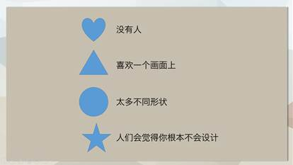
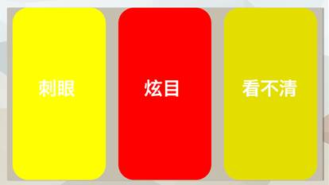

# 6.5  图形的基本使用

**走出形状使用的基本误区**

在形状的使用，大多数人都是通过使用免费的网络模板初识形状的，模板上的形状色彩亮丽，形状酷炫，特效惊人，总之，就是怎么好看怎么来，能够一下子抓住人们的眼球，对初学者来说，这样的图形就是好，放到PPT中，PPT演示效果也会很好，但这显然是一个错误的观点，我们的图形误区就是首先通过这些模板建立起来的。

前面提到过以人为本，你需要的是你的需要的，但不一定是你真正能用的，因为演示文稿不是对你演示，是你需要演示给别人，PPT的制作的目标是服务于他人，酷炫至极的图形反而会破坏你整体的制作，要想让人信服你，首先你就得拿出你的诚意，而不是用花一分钟在网上找的模板去敷衍你的观众。

首先我们需要认识的第一个让你PPT看起来很low的误区，那就是拉扁形状，这样的做法无疑是和拉扁图片一样，是最快让你的PPT显得俗气的方法。无论如何都应该保持图形的基本图形，而不是让它扭曲变形。

图6-75

第二，我们需要认识的是同一个版面中图形不需要太多，太多图形会分散观众的注意力，并且会显得你很业余，一点都不知道设计中的统一。太多图形只会让整个显得很复杂，一点都不简约，让版面显得拥挤。

图6-76

第三，形状太挤了，不注意形状的留白，前面就有反复提到过留白的重要性，这不仅是在文字和图片中体现，在图形中也是会有所体现的，留白会让你的图形与众不同，拥挤的图形的又会是一个让你显俗的设计。

图6-77

这样的设计只会让你的PPT极端显俗，图形不仅起不到修饰的作用，反而是整个画面中最大的败笔。

第三，颜色过于鲜艳，这样的方法所造就的结果显而易见，那必然是让人觉得人都快被要画面中的颜色给炫晕了，所以颜色是尽量不去使用那些过于鲜艳的颜色。

图6-78

一些颜色由于亮度太强，使得颜色非常晃眼，这样放到PPT进行演示是极其危险的一种行为，选用同种颜色的低亮度都比那些高亮度的颜色要好。

第四，颜色太多，颜色绝对是一门大学问，太多的颜色一般人难以驾驭，一般人用到1到3种在同一张页面就可以了，如需要更多颜色，还不如选用同一种颜色的不同亮度作为页面的颜色使用。

图6-79

第五，形状带有默认的描边。

图6-79

这些都是在你制作与形状有关的设计时经常碰到的一些细节处理的问题，即使是一些经常使用PPT的人也会在不经意间犯下这些错误，当大局稳定下来的时候，细节就是决定成败的时候，千万不要因为这些小的细节破坏了我们的辛辛苦苦做出来的设计。

只有在设计时走心了，这些都是可以被避免的。当然设计这个东西有些时候可能会逆着潮流设计，以丑为美也是经常的事，但这种情况里包含的却是深厚扎实的设计功底。

