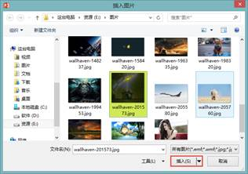
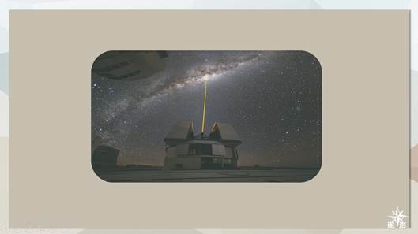
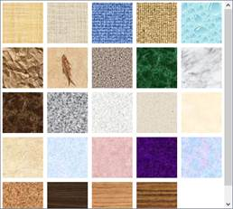
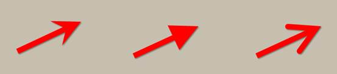
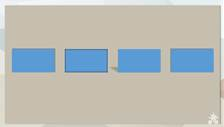
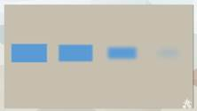
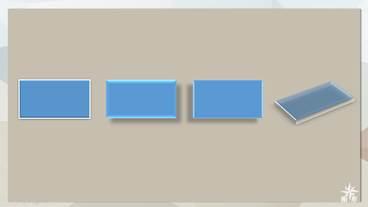

# 6.6  美化图形

**渐变填充**

上文中就有讲述过图形渐变是如何实现图片与背景的融合，在图形中渐变还有很多其他的作用，在好的图形，没有色彩都不能称作美，添加的图形颜色的一个更重要的作用是为了区分背景，不同颜色给人不同的感觉，所以配色在图形中占有很大的比例。

首先，我们插入一个形状，单击右键进入设置格式窗格，单击渐变填充，如图6-80。

图6-80

根据赋予每个光圈颜色，选择不同的类型的渐变，改变渐变的角度，调节光圈所处的位置从而达到实现颜色渐变的过程，当然光圈的颜色在调节过程中，可以设置透明度和亮度，每一次设置都能直接体现在图形上，极其方便。

图6-81

若使用者想偷个懒，那么可以直接在预设的渐变中选择，可能比使用者自己设置的渐变更好。

图6-82

若在平时，这些预设渐变也可以作为我们的学习参考，设置之后，逆向学习图形上的渐变，还有一种方法就是学习预设渐变光圈的位置和设置参数，然后自己设置另外一套适合自己的渐变。

需要注意的是，13版和以前版本的渐变有细微差别，例如13版光圈可以重合，但在以前版本，两个光圈是不能重合的。其他还有一些细微区别，在此不多做介绍。

有关预设渐变的介绍，本书在第四章艺术字中就已经介绍过了，渐变方式都是一样的，只是使用出来的效果是不一样的。

如图6-83所示为不同渐变在图形上的显示效果，

图6-83

四种渐变形式角度的变化都是不同的，建议不清楚这些知识的读者可以对照第四章图形渐变，操作一下书里面的案例，设置不同的参数和不同的参数得到的效果是否是一样的，有什么不一样。

**图片或纹理填充**

在图形中不仅可以填充颜色，还能填充如不同的颜色和纹理，当然填充不仅仅是填充那么简单，当图片和纹理填充入图形后，虽然图案是一样的，但是图片和纹理两者的实在本质就变了，其实它们是图形。

我们插入一个圆角矩形，单击鼠标右键，选择“设置形状格式”窗格。

图6-84

选择“图片或纹理填充”，单击“文件”按钮，在本机中查找需要插入的图片，选中后单击插入按钮，如图6-85所示。

图6-85

效果如图6-86所示。

图6-86

有人会觉得这样设置不是多此一举吗，直接使用我们在上一章讲述的修改图片为特定形状不就可以了吗，确实是这样的，但这样的设置若没有它特定的意义，那么它就不会出现，我们上面有说过，填充之后，它们就是图形，那么这些填充后的产物是可以像设置图形一样的设置的，最重要的是可以设置透明了，单纯的一张图片是无法直接设置透明度的。

图6-87

若想要拿图片充当背景，或者是与其他图片结合使用，那么设置透明度对你来说就是极为难得的一个设置，这样你就不需要使用其他的插件或者软件去达到这一要求，相比于这些步骤，在PPT上的仅有的几个步骤是值得的。

纹理填充也是一样的道理，PPT中预设了很多纹理效果，这些效果不仅仅是可以被当作背景使用，还能被填充入图形中，充当某一修饰成分。

图6-87

**修改图形边框**

每个图形在插入时都会有一圈细细的描边，上文就说过要么替换它，要么去除它，这里我们介绍如何替换这些描边，让他们与我们的形状搭配起来。

图6-88

不同的边框体现的感觉不会是一样的，要辨认这些边框所带有的感觉那就只有多尝试。

图6-89

在“设置形状格式”中，可以对线条实现各种设置，对复合型的线条，如图6-88，若不将宽度设置得高一些，是无法体现复合型。

图6-90

在箭头的设置中，不仅可以设置箭头整体的大小，还能单独设置箭头的大小，如图6-90所示，对箭头的单独设置了大小。

**形状特效**

在形状中也能像艺术字一样的添加各式各样的效果。

**阴影**

图6-91

**映像**

图6-92

**发光**

图6-93

**柔化边缘**

图6-94

**棱台**

图6-95

**三维旋转**

图6-96

除了使用这些特效外，PPT中还有一些内置的特效，这些预设的特效都是由上面的所属特效组合起来的，组合成一个键，只需要轻轻一点，多种特效就自动加到图形上了。

图6-97

