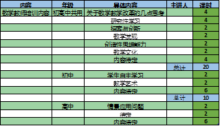
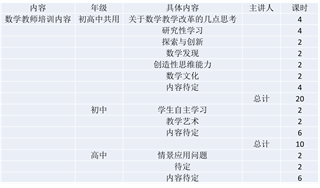

# 7.1  插入表格

有两种方式在PPT导入表格，一种为直接插入图表，另一种则是从外源（如Word、Excel）中导入表格。

第一种，直接在PPT中插入表格，在“插入”选项卡中，单击“表格”。

图7-3

单击“表格”后出现如图7-4所示的下拉菜单。

图7-4

可以通过鼠标直接在界面上的窗格区域选择需要的表格行列数，如图7-5所示。

图7-5

若需要创建超过10×8的表格则需要使用下面“插入表格”命令，通过手动输入需要的表格行列数。

绘制表格命令只针对当单个表格，用户自行画出单元格的行高列宽，用户还可以在单元格中绘制对角线和单元格，如图7-6所示

图7-6

手工绘制单元格若想绘制的具有设计感，比较花费时间，一般不建议手工绘制，直接插入一个既定的表格就可以了，后期可以加入各种效果美化表格。

第二种方法是在Excel中做好表格后直接导入到PPT中使用，通常的做法是直接在Excel中复制已经做好的表格，然后粘贴到PPT中使用。由于在PPT中粘贴的效果不同，粘贴出来的结果也不会相同，我们需要明白的是，在PPT中有5种不同的粘贴方式可供选择，并且每种方式都对应有不同的效果。

这5种方式如图7-7所示，从左到右依次是：使用目标主题、使用源格式、嵌入、图片和只保留文本。最后两种粘贴形式很好理解，“图片”就是将所复制的东西以图片的形式粘贴到PPT中，“只保留文本”就是只粘贴所复制的内容的文本内容，其余的不予复制。

图7-7

将一个图片分别以三种不同的方式插入PPT，观察效果的不同，如图7-8所示，为Excel原始图表。

图7-8

使用目标主题：使用目标主题中的目标主题指的是PPT，它意思是将元素复制到PPT中时，自动套用幻灯片主题中的字体、颜色以及效果设置，这时候元素原来所具有的设置将会被自动清除。

图7-9

使用源格式：使用源格式就是使用所复制的表格在Excel所使用的各种主题格式，字体、颜色以及效果设置。

图7-9

嵌入：嵌入这种粘贴方式是在从外源（如Excel）复制表格或者图表到PPT时会出现的一种粘贴方式，这种粘贴方式不仅可以像使用源格式粘贴一样，保留复制对象的字体、颜色以及效果设置，还能将表格所在的原始Excel表格嵌入到幻灯片文档中保存。这样等于说这个表格虽然在PPT中，但是需要时，可以打开一个Excel窗口对这个表格进行编辑，这就叫嵌入。

复制，选择以嵌入的粘贴方式进入PPT后，如需要在Excel中编辑，单击表格，如图7-10所示。

图7-10

