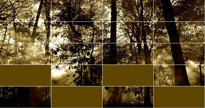

# 7.3  设置表格的背景

表格中可以设置单元格的底纹，也就是背景，表格样式里面的表格就设有底纹颜色，这样的设计会突出表格某个方面，从而达到美化的效果，并且加了适宜的颜色后，会让表格整体变得更为专业。

我们不仅可以调整底纹，还能调整边框的样式和粗细。

图7-17

设置单元格底纹，如同给图形上色一样，单击自己想要的颜色，颜色就会自动成为单元格的底色。

首先选中需要改变颜色的单元格，然后单击底纹，选择需要的颜色。

 

图7-18 图7-19

在这里我们提一下，如何改变表格边框的粗细，设置表格边框粗细的命令是在“绘图边框”组中，若是想当然的以为和改变文本框边框或图形轮廓的方法一样的话，操作是不会成功的，若你不仅想改变表格的边框粗细还想改变边框颜色的话，你会发现找不到修改线条颜色的命令，这是不是会让你感觉很苦恼，只是方法不对，所以操作不对，只要方法对了，操作一定会对的。

首先我们选中一个表格，然后在“绘制边框”组中修改粗细，然后将“笔颜色”中的颜色设置为你想要的颜色，如图7-16所示，设置粗细为1.6磅，笔颜色为红色。

图7-20

图7-21

接下来，我们不是要去画，而是单击“边框”去选择，去选择一个边框样式，如图7-18所示，选择“所有框线”。

图7-22

图7-23

一键就可以将所有框线改为你需要的粗细和颜色，当然你若只需要改变某些线条的粗细，那么只需要修改好粗细和颜色后，单击“绘制边框”，会出现一个画笔，将画笔移动到需要更改的边框线上，单击即可实现更改，若设置粗细为6磅，笔颜色为红色，对边框进行更改，如图7-20所示。

图7-24

若需要清除一些不想要的边框线，我们就可以使用“橡皮擦”命令，例如图7-21上，我们需要去除掉加粗的边框线，和画笔的使用方法是一样，单击“橡皮擦”命令后，移动到需要去除的边框上，单击一下即可消除，效果如图7-21所示。

图7-25

之所以将这些有关于这一些设置表格的知识发在这里讲，是因为这里会有用到这些技巧的时候。

表格不仅可以用颜色来充当底纹，还可以与图片相结合起来，制造出各种不同的效果，我们在这里粗略讲一讲表格是如何与图搭配的。

让图片产生被切割开来的感觉，例如图7-26所示的效果。

图7-26

把图片当作表格的背景，这样表格就丰富起来，表格此时就该要显示出它作为表格又不仅仅是表格的能力了。

如何将一张图片插入表格中， 首先我们先插入一张图片，然后插入一个表格（行列数按实际需要创建），然后将表格放大至与图片等大。

如图7-27所示，插入表格行列数为5×5，插入的表格边框颜色和粗细若不满足要求可以按上文所述方法进行调整。

图7-27

此时需要将图片复制或剪切下来，由于表格处于图片上层，无法直接选中图片，可以先将表格移开，然后选中图片，将图片复制或剪切，显然这种方法不仅麻烦，还很碍事，拖动表格不容易确定原先的位置，那么我们还有第二种方法，也是我们在做PPT中经常用的一种方法，那就是选择窗格。

选中表格后，在“表格工具/布局”选项卡中的“排列”组中选择“选择窗格”，如图7-28所示。若不是表格，则选中元素后会出现“绘图工具/格式”选项卡，同样有“选择窗格”命令。

图7-28

打开“选择窗格”我们可以看到窗格里展示的是幻灯片中所有的元素，这里会想到这是和Photoshop的图层选择功能一样，任意选中或隐藏幻灯片中的元素。调出选择窗格，可直接在选择窗格中设置各元素的层次，比手动调整更直观，而我们在这里主要讲的是隐藏幻灯片中的元素，我们可以看到每个元素后面有一个“眼睛”，当我们单击这个标志时，“眼睛”就会消失，而此时在幻灯片中出现的效果就是这个元素消失了，它不是被删除了，而是暂时被隐藏掉了，这个功能是极其好用的，需要熟练。如图7-29所示，将表格隐藏。

图7-29

在幻灯片中，选中图片，单击鼠标右键，使用“剪切”命令。

图7-30

操作完成后，在“选择窗格”中取消对表格的隐藏，然后选中整个表格，单击右键，选择“设置形状格式”，界面中会自动弹出“设置形状窗格”，选择“图片或纹理填充”，单击“剪切板”，如图7-31所示。

图7-30

单击剪切板后，图片就被插入表格中了，但还需要一个步骤，插入图片后需要勾选“将图片平铺为纹理”这时候整张图片才是和表格合为一体了，若不勾选此命令，则会出现如图7-31所示效果，这个步骤一定记住，要不然操作不会成功。

图7-31

还需要注意的一点是，操作步骤完成后，不需要去拉伸表格，因为我们为了让图片显示在表格中的形式不是以如图7-31的形式出现，所以我们设置了“将图片平铺为纹理”功能，这样图片就显示整张图片在表格中，而当我们拖动表格，调整表格大小时，则会出现如图7-32所示的情况。

图7-32

之所以将在设置之前就将表格大小拉伸至与图片等大，也是为“将图片平铺为纹理”这一步骤服务的，当然，若是嫌麻烦，觉得将图片直接插入表格不是步骤更少、更省事吗。

在“表格工具/设计”选项卡中，选择底纹，在下拉菜单中选择“图片”，找到图片后单击“插入”按钮。

图7-33

一样的，在插入图片后，图片的插入形式是插入到每个单元格，这时候我们需要进入“设置形状格式”窗格，勾选“将图片平铺为纹理”，但是我们会发现这样的操作会出现不一样的结果，如图7-34所示。

图7-34

若想要出现图7-32所示的效果，则还需要在图7-34的基础上在“设置形状格式”窗格中调节“缩放比例”，之所以会出现这样的情况，是因为图片的尺寸影响的结果，直接插入图片，软件默认的是图片原来的尺寸，所以在平铺为纹理时，只能显示图片的一块区域，若想显示图片的全部区域，还需要手动调整缩放比例，比较麻烦，而我们先插入图片，将图片的大小固定下来，然后插入等大的表格，这样做就不用后期再去调整图片了。

我们可能只需要让图片 出现一种被切割的感觉，那么只需要将白色边框线的表格置于图片的上层即可，这样也就没有后续的步骤，不用将图片插入到表格中，但我们要的不仅仅是图片看起来被切割开了，我们要的是图片真正的被切割开。

选中表格，单击右键，选择剪切或使用剪切快捷键Ctrl+X，然后使用选择性粘贴的快捷键Ctrl+Alt+V，这时候会弹出一个对话框，选择粘贴为“图片（增强型图元文件）”。

图7-35

在前面我们讲过EMF格式的图片时矢量图，这种图片在PPT中可以解除组合，拆解成单个色块和线条，这样的图片一般使用AI软件打开，这些前面都有介绍，而之所以复制粘贴为此种格式的文件，也正是利用了这种格式特殊的特性。

选择粘贴为“图片（增强型图元文件）”，单击确定，这个步骤会有些慢，具体时间取决于使用者电脑的运行速度。当成功导入到PPT中后，重新调整好图片的位置，然后选中图片单击右键，选择“取消组合”命令。此时PPT会自动弹出如图7-36所示的对话框，不用理会，单击“是”。

图7-36

再次选中图片，再一次选择“取消组合”命令。此时效果如图7-37所示。

图7-37

图片就被打散成5×5个小方格了，这个时候图片的每个方格就可以单独的设置动画了，或者设置其他的特效，这样不是瞬间就将图片动起来了吗，设想一下，图片从左到右依次出现，或者以其他各种形状出现。若不需要这些边框线，可在设置边框的步骤时就可将边框设为“无框线”，如图7-38为删除边框线后，在图片上设置简单动画后的图片效果。

图7-38

这是将图片打散，为了更灵活的设置其他有意思的效果的方法，一般是为了设置动画，让动画体现在图片的每个角落中，这样可以设置出非常具有视觉效果的动画，例如使用者让图片使用者想表达的重点先出现，然后再出现其他，设计随心而定，但同时也需要优先考虑你的观众，做出来的好看不重要，重要的是观众喜欢看。

“打散”的思维运用有很多，在这里再介绍一种思维方式，那就是打散单元格本身，利用单元格本身去设计，简单的总结就是利用单元格去制造遮幕的效果，不用手工绘制色块，不用去对齐排版，表格帮你完成这一切。例如我们要这样的效果，如图7-39所示。

图7-39

首先插入一张图片，然后插入一个4×4的表格，拖动表格至与图片等大，单击右键进入“设置形状格式”窗格。这时候我们需要的不是插入图片，我们使用“纯色填充”，例如，我们填充黑色，然后使用Ctrl+X剪切表格，再使用Ctrl+Alt+V选择性粘贴表格，选择“图片（增强型图元文件）”进行粘贴。如上述的步骤一样，针对EMF格式文件，使用两次“取消组合”命令即可打散整个形状，如图7-40所示。

图7-40

我们得到了一些大小相等，覆盖整个图片的色块，现在隔一个图形删除一个色块，操作完成后，选中所有色块，单击右键选择“设置对象格式”命令，在“纯色填充”中，对色块的透明度进行调节，如图7-41所示。

图7-41

为什么需要将表格“打散”？如同将图片打散一样，打散后的表格就成为一个个的色块了，若对色块加入一些动画，让这些色块以一定的次序闪烁在图片上，是不是让图片显得如霓虹灯一般，犹如图片在闪烁一般，动画设置在动画一章有讲解。

当然这是一种利用表格制作动画（或其他设计）的思维，我们还可以利用表格做出一些排版，方便我们去进行文字、图片的混排，当然不经修饰的插入图片是没有细节，不被人们认可的，只有注意细节，从细节处下功夫，这张图片才是好的一张图片。

如图7-42所示，使用背景填充图片，合并单元格后输入文本内容。

图7-42

图7-43所示，合并单元格，增加单元格透明度，

图7-43

图7-44所示，合并单元格，改变透明度设置位置，输入文本内容。

图7-44

图7-45所示，可以在单元格中填充色块。

图7-45

各种风格和效果任意使用者去设置，这里我们介绍如何设置出如图7-40的效果。

首先，合并单元格。选中需要合并的单元格，在“表格工具/布局”选项卡的“合并”组中选择“合并单元格”。也可以直接单击鼠标右键，在鼠标右键的选项卡中选择“合并单元格”。

图7-46

然后选中需要设置透明色的单元格，单击右键，选择“设置形状格式”，进入形状格式窗格，如图7-47设置参数。注意，设置透明色不是在表格的“底纹”中设置，表格中已经填充了图片，这时候在“底纹”填充会对表格重新填充，然后再对表格设置透明色，显然得不到想要的效果，因为单元格中平铺的图片已经不存在了。

图7-47

然后再在单元格中输入文本内容即可。

