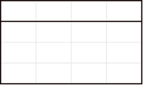
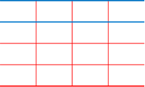
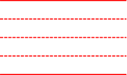

# 7.4  设置表格的边框

前面我们有提到表格边框是如何设置边框粗细和颜色的，在这里我们详细了解表格的边框设置。

表格边框可以分别为单个单元格设置边框粗细、颜色、线型，通过设置不同的形式的边框能极其高效的设置一些意想不到的效果，就如同上一节所设置的效果一样。

首先通过批量设置边框线，可以达到统一表格边框的效果，然后通过“绘制表格”和“橡皮擦”两个命令可以实现对表格的微调。

图7-48

我们对图7-49中的表格进行变形，看看表格的作用在哪里。

图7-49

图7-50

图7-51

图7-52

借助表格能迅速完成排版，并且还能根据使用者自身的创意去开发表格，让表格具有不同的形状。

例如结合底纹和边框就可以设计出楼梯的效果，如图7-53所示。

图7-53

边框除了可以设置各种线型，各种表格的线型变化对表格来说是一种很好的装饰，用好线型能为你的表格添色不少。

如图7-54为普通表格。

图7-54

加粗边框线。

图7-55

增强表头单元格效果。

图7-56

弱化表格内框颜色。

图7-57

去掉左右边框线。

图7-57

改变表格框线的颜色。

图7-58

将表头颜色设置为不同颜色。

图7-59

给表头增加底色。

图7-60

改变线型为虚线。

图7-61

改变线型为虚点线。

图7-62

改变线型为点划线。

图7-63

去掉表头线。

图7-63

