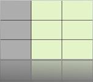
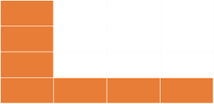
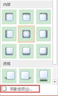
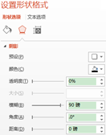

# 7.5  设置表格的特效

设置表格特效能有效的对表格进行美化，恰当合适的运用这些特效，将会让你的表格与众不同。

表格特效包括三种特效：单元格凹凸效果、阴影、映像。其中只有“单元格凹凸效果”能单独对单元格设置，其它两种效果均只对表格整体起作用。

图7-64

普通表格 不同的凹凸效果 表头的凹凸效果

  

图7-65 图7-66 图7-67

外阴影 内部阴影 透视

  

图7-68 图7-69 图7-69

映像，紧密相连，接触 紧密相连，4 pt偏移量 紧密相连，8 pt偏移量

  

图7-69 图7-70 图7-71

需要指出的是在PPT中的表格特效，虽然可以为表格添色不少，但在经常长期的使用过程中，映像和阴影中的透视这个两个特效是很少用的，因为这两个特效效果比较炫，加入之后将会使得整个画面极不协调，反而会使得特效造成负面效果。当然，俗话说，美丑是相对的，没有真正的丑，只有放错位置的美，虽然不常用，但不代表它是坏的，不好的，在这里只能说明它是不适用的。

加入不同特效的目的不单单是为了美化表格而存在，而特效也不仅仅是局限这些仅有的特殊效果之中，它的概念应该被扩大至一切设置并体现在表格上的各种设置效果。

特效本身就是一种吸引人眼球的效果，所以设置了特效的单元格一定是表格中的聚焦点，这也说明了一个问题，那就是特效不用使用在每个单元格中，例如，想要强调表头上的文字，或者注意到总结行上的数据，那我们就可以这样设置。

 

图7-72 图7-73

颜色一般是我们在特效使用中经常用的一种技巧，但作为一种特效的使用，就代表它是非常态存在的一种东西，那么我们在平时的使用中就应该严格的控制自己去过渡的使用。

除了给表格加上底色外，我们还可以做如下的改变。

内容加粗显示。

图7-73

内容增大显示。

图7-74

内容变色显示。

图7-75

**小技巧——快速制作质感背景**

图7-76

如图7-76所示的图片可以作为幻灯片的背景，颜色偏暗，背景显示比较有质感，可以作为一款商务PPT的背景，效果看起来还不错，最重要的是这样的背景效果可以快速使用表格制作，步骤也很简单。

首先，插入一个单格的表格，设置好需要的颜色，拖动单元格，改变大小至如图7-76所示大小或改变大小至整个界面。

然后在“单元格凹凸效果”中选择“松散嵌入”，如图7-77所示，效果如图7-78所示。

 

图7-77 图7-78

在“阴影”中的内部阴影中选择“内部居中”阴影，如图7-79所示，但这样的设计效果还是很不明显，细节处完全看不出来阴影效果，如图7-80所示。

 

图7-79 图7-80

如何做出图7-76所示的效果，重点就在于加大阴影效果，让阴影在表格中出现的范围大一些，这样的背景的细节就出来了，也能制造出一种严肃的效果。在选择阴影后的下拉菜单下方选择“阴影选项”，在弹出来的“设置形状格式”窗格中，设置阴影“模糊”大小，如图7-81所示。

 

图7-81 图7-82

