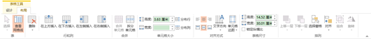

# 7.6  设置表格的大小

在PowerPoint 2013中，对于表格的大小可以进行多方面的调整，在“表格工具/布局”选项卡中可以对表格行列的插入、合并单元格、对齐方式、单元格大小、表格尺寸等进行一系列的调整。

图7-82

控制单元格的大小，整体对表格进行设置，在“单元格大小”中进行设置。

图7-83

选中表格后，统一设置大小。

图7-83

只选中需要调整的单元格，对表格进行选择性调整。

图7-84

通过手动调整，调整单元格的大小，直接用鼠标拖动边框线即可进行调整。

图7-85

