# 7.7  常用图表举例

在PowerPoint 2013中可创建的图表种类多种多样，各具特色，各有其特有的展示数据方式，本节重在介绍这些图表类型。

在“插入”选项卡中下单击“图表”按钮，如图7-86所示。单击后会出现如图7-87所示的对话框，可以看到各种图表的分类，选择某个分类后，会出现大量的图表类型。

 

图7-86 图7-87

## **柱形图**

柱形图是最常用的图表类型之一，通过它可以描述各个项目之间的数据对比关系，或显示一段时间内的数据对比，柱形条高度能直观的反应出这些数据的对比程度，它既可以强调一段时间内数据值的变化，也可以对比各个不同类型的数据间的对比。

柱形图包括有7种类别，分别是簇状柱形图、堆积柱形图、百分比堆积柱形图、三维簇状柱形图、三维堆积柱形图、三维百分比堆积柱形图、三维柱形图。

根据表现功能或直接根据各自的命名，我们就可以看得出来在柱形图中，常用的柱形图也就是簇状柱形图、堆积柱形图和百分比堆积柱形图3种形式，而其他的几种则是三维化了的图表。

Ü 簇状柱形图常用的是用于多个元素数据之间的对比，比较直观。图7-88所示的簇状柱形图用于对比四个季度中食用肉市场中三种肉类的销售量。

图7-88

Ü 堆积柱形图用于比较相较于分类轴上的每一数值占总数值的大小。图7-89所示的堆积柱形图表现的是三种食用肉销售额占本季度总销售额的大小。

图7-89

Ü 百分比堆积柱形图与堆积柱形图作用类似，但两者之间的显示的数据还是有差距的，它与堆积柱形图之间不同的是，在柱形条上，它反映的是比值而非数值，用于比较同一柱形条上不同类别占总数值的百分比，如图7-80所示。

图7-80

## **折线图**

折线图能直观的反映出一段时间数据的变化波动情况，它不强调具体的数据，从表中能 看出来的是波动的幅度、时间。折线图有7中类别，分别是折线图、堆积折线图、百分比堆积折线图、带数据标记的折线图、带标记的堆积折线图、带数据标记的百分比折线图、三维折线图。

Ü 折线图能明确的将数据随时间变化的趋势由图表展示出来，犹如一条时间线，线上有很多的数据点，这些数据点可以看作是折线图的转折点，对数据的分析有着重要的地位，如果数据较少，则可以直接采用“带数据标记的折线图”，显得更为直观，但数据较多反而会造成视觉障碍，不宜在数据较多的情况下使用数据标记。

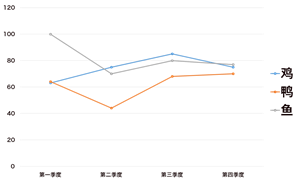

图7-81

Ü 堆积折线图更多的不是直接将数据进行直接的对比，而是将数据散开，显示每一数值所占大小随时间变化的趋势。同样的，在堆积柱形图的基础上，我们可以选择带有标记，但 也要注意一下数据量的问题。

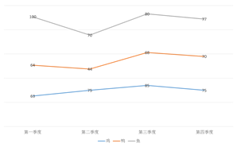

图7-82

Ü 百分比堆积折线图用于显示数据所占百分比随时间的变化趋势。

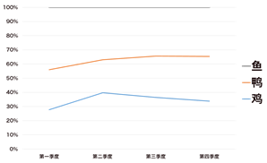

图7-83

## **饼图**

饼图主要用来反映每一个数值占数据总数值的比例，一般的它只能显示一个数据类型的数据，在饼图中也没有分类轴和数值轴。

饼图有5种类型，分别是饼图、三维饼图、复合饼图、复合条饼图、圆环图。

Ü 普通饼图和三维饼图分别是以二维或三维的格式显示每一数值占总数的比的大小，扇面可以手动拖动，可用于强调这一数据。

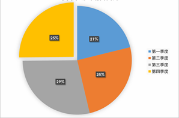

图7-84

Ü 在三维饼图中，扇形一样是可以被拖动的，拖动某个扇形将会这个数据添加视觉聚焦效果，用于强调此数据。

图7-85

Ü 复合饼图和复合条饼图将用户定义在饼图中的部分数据提取出来并组合到第二个饼图或堆积条形图中，一般若饼图中数据较多，若要使得图形更易查看，那么使用辅助图形就非常有效了。

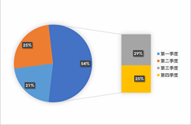 

图7-86 图7-87

Ü 圆环图是饼图中一个大的改进，这种饼图看起来比较时尚新颖，使用次数和三维饼图相当，两者都是经常被使用到的图形。

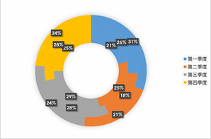

图7-88

## **条形图**

条形图其实和柱形图比较相似，功能相似，创建方法也相似，不同的只是数据列表变为了水平方向，分类轴和数值轴的位置进行了对调而已。

簇状条形图

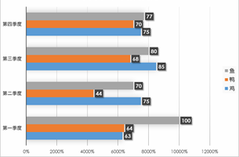

图7-89

三维簇状条形图

图7-89

三维百分比堆积条形图

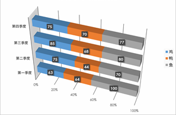

图7-90

上述图形是我们在平时使用中不管是直接创建的图形还是通过手工创建中经常用的的图形，常用的图形我们要尽量去熟悉它，在使用才能轻松使用它，在这些图形的使用中我们有一些需要的注意的地方。

有关于百分比的问题，我们需要记住的是不要超出了“100%”，这是在数据选择上的问题了，细节上一定要注意。

数据不需要太多，数据表中你需要的展示的可能就只有一两项，那么其他的数据就是可有可无的，那么还不如将它去掉，让需要的展示的数据成为焦点，记住少即是多。

尊重人类的视觉习惯，从左到右，从上到下，顺时针观看，所以比如在圆形中就不要将重点数据放在6点钟方向了，它需要的位置是12点钟方向。

除了上述所讲的一些基本常用图表外，还有面积图、散点图、曲面图、雷达图、组合图形等一些其他类型的图表，这些图形在一般场合是用不到的，平时很少使用，所以只作基本了解即可。

Ü 面积图：面积图用于显示每个数值的变化量，可通过图表面积直观的看出来，强调的是数据随时间变化的程度。

Ü 散点图：散点图也叫XY散点图，它在图表中显示的是单个的数据，可以显示数据在时间间隔条件下的变化趋势。

 

图7-91 图7-92

Ü 股价图：股价图是专门用来描绘股票走势的图形。若需要创建它应准备它所必须的数据，这种图表对数据要求全面，创建图表步骤很容易，前提是你准备了必备的数据。

Ü 曲面图：曲面图以平面来反映数据变化的情况和趋势，用不同的颜色和图案区分在同一取值范围内的区域。

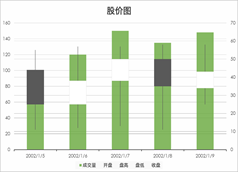 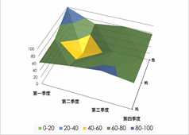

图7-93 图7-94

Ü 雷达图：雷达图又被称为蜘蛛网图，是对同一对象的对个指标进行描述和评价的图表，分别设置，让人对指标情况和发展趋势都一目了然。坐标轴由中点向外辐射，并用折线将同一系列中的数据值连接起来。

Ü 组合图：这种图形是在各种图形的基础组合而成，根据使用者的需要，组合各类图形，旨在让观众看得更清楚，若组合图形的组合造成了视觉障碍，这种图形的组合就是不可取的。

 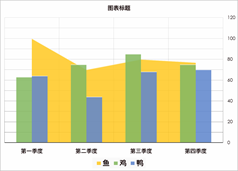

图7-95 图7-96

