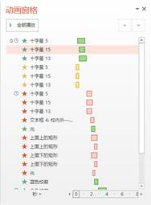

# 8.3.1  “高级动画”工具栏

图8-124

从图8-124中可以看到，“高级动画”组由四个命令组成，分别是添加动画、动画窗格、触发、动画刷。

“添加动画”命令可以为对象添加第一个动画，也可以在第一个动画的基础上再次添加多个动画。

“动画窗格”这个功能是非常实用的一个功能，可以说没有这样的一个窗格存在，那么制作组合动画的困难程度至少要提升一倍以上，PPT中有两个窗格——“动画窗格”和“选择窗格”，这两个窗格在幻灯片的使用中是经常需要使用到的，“选择窗格”在制作版式时经常用到，可以说是如今PPT的一大神器，而“动画窗格”则是PPT动画中的神器。

在PPT制作中将这两者结合起来使用是非常省时省力的一种方法，对比图8-125和图8-126所示，动画效果极其之多，这样会让人难以辨认，制作起来非常麻烦，每次添加动画时还需要确认是否添加正确，顺序是否正确等等问题，很是麻烦。

但我们仔细观察会发现图8-126中的动画设置对象都有一个特殊的名字，这些名字可不是原来就有的，这些名字是后来为了制作方便，让这些对象辨识度更高才添加上去的，有了这些名字，那不管在设置动画，还是设置版式中都是一个极好的辨识符号。

 

图8-125 图8-126

调出选择窗格，在选择窗格中双击某个元素的原始名称，当出现可编辑框时，对名称进行编辑即可。

图8-126

在“选择窗格”中编好名称后，打开“动画窗格”会显示编辑后的名称，这样的一个小小的改变体现的好处是很大的，在元素很少的时候或许体会不到，但当元素超过十个以上，甚至出现堆叠的时候，这样的命名方法将会让你知道你需要编辑的元素在哪里，这里再提一点，当你需要改变元素的层次的时候，可以直接在“选择窗格”中拖动对象的名称，在上面就是在上层，在下面就是在下层，这样就能非常方便的调整元素的层级，而不用使用单击鼠标右键后中的“置于顶层”（或“置于底层”）命令了。

“动画窗格”是为了更好的制作动画而设置的，在这里可以非常直观的看到各个对象上所加的动画效果，还可以看到对象所加动画的时间长短，动画的顺序。这些东西都是可以直接通过鼠标拖动进行设置的，例如动画的顺序，和调整对象的层次是一样的，越往上面去，动画越先播放，那么只需要选中需要调整的动画，进行拖拽就可以了。

当然，不仅仅是极易观看自己的动画设置效果，如果能够拿到别人PPT的源文件，要想学习里面的动画设置，那么打开“动画窗格”，别人设置的动画将会一览无余。

要想深入的学习动画，使用“动画窗格”将是你的基本技能，如果连“动画窗格”都不去使用，可以说在PPT就将很难调适出一个好的组合动画效果，所以说“动画窗格”是必须会的一个功能。

在“高级动画”组中还有这样的一个功能——触发，触发功能就如同动画的开始按钮一样，单击“触发”命令设置对象动画的触发对象，可以选择是对象本身，也可以选择其他对象作为触发按钮，这个触发功能非常有意思，我们可以做出如同点击网站的感觉，当用户单击某个元素时，整个画面才开始动；我们还可以设置一个开始按钮在幻灯片的开头，只有当我们单击触发时，幻灯片才会往下开始播放；我们还可以设置出如抽奖的效果，用一张图片盖住奖品，当单击覆盖在奖品上的图片时，图片自动消失，显现出下面的奖品。除了这些，触发器还有很多很有意思的设置，如图8-127所示为设置有触发器的按钮

图8-127

“触发”是动画中一个很好的功能，因为它能控制动画的开始，让PPT成为一个类似网站需要点击某个按钮就会转入另外的一个场面的东西，这就是PPT所能的做出来的另外一种观感。在PPT中，想要在组合动画中添加点其他东西，那么“触发”无疑是你的一个很好的参考对象

“动画刷”，说到“动画刷”，在PPT中有着另外的一个功能和它很形似，那就是“格式刷”，顾名思义，“格式刷”可以将某一对象上的格式完全应用到一个与之匹配的对象上（图形对图形，文字对文字），而“动画刷”则是将某一对象上的动画完全应用到另一个对象上，这样就不用去重复的设置，避免繁琐的事情发生，这将大大的节省使用者的时间，若需要多组的类似的动画效果，很显然就只需要设置一个类型就可以了，设置好后直接将动画刷到其他的对象上就可以了。想一想，若是某个对象上的动画设置了5、6个，若还需要动手去设置另外几组对象，这会是一个让人很无语的事，但现在只需要使用“动画刷”轻轻一刷，就可以将这些工作全部完成。

