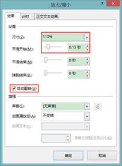
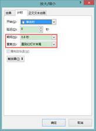
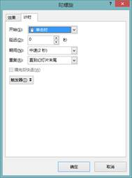
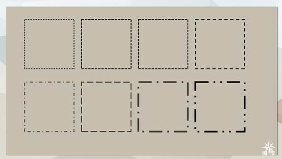

# 8.4  动画设置示例

## **跳动的心——放大/缩小**

图8-134

图8-135

图8-136

选中“心”，在功能区中选择“动画”选项卡，单击动画库的下拉按钮，在强调动画中选择“放大/缩小”动画。

图8-137

然后在“动画窗格”中选中刚才添加的对象动画，单击右键，在右键菜单中选择“效果选项”命令，在打开的对话框中将“效果”中的“尺寸”设置修改为“110%”，为对象动画增加“平滑开始”的时间，还有一个需要注意的地方就是勾选上“自动翻转”。

 

图8-138 图8-139

在设置尺寸大小还有一个需要注意的地方，单击尺寸下拉按钮后，需要单击键盘的Enter键才能生效，否则是无法正确的输入的。

图8-140

“效果”选项设置完成之后，还需要在“效果选项”设置“计时”中的参数，可以设置动画的开始方式，设置动画时间——期间，设置动画重复的次数，这里我们设置为“直到幻灯片末尾”。

图8-141

这样设置完成后，一颗跳动的心就设置完成了。

## **加载等待**——陀螺旋

我们在上网过程中，一个页面缓冲出现时，可能会出现如图8-142所示的加载等待页面，这个场景是为了缓冲用户因画面没有出现的烦躁感的，而这种画面若是出现在PPT中的转场页或是开场中，是不是也是很有意思的一件事呢。

图8-142

首先我们需要绘制出这样的一个图形，由基础的圆形就可以进行组合，选中图形，在功能区中选择“动画”选项卡，单击动画库的下拉按钮，在强调动画中选择“陀螺旋”动画。

图8-143

然后在“动画窗格”中选中刚才添加的对象动画，单击右键，在右键菜单中选择“效果选项”命令，在打开的对话框中将“计时”中的“重复”设置修改为“直到幻灯片末尾”。

 

图8-144 图8-145

当然也可以如上一个动画一样在“效果”设置中勾选上“自动翻转”，这样设置后会是另外的一种动画效果，但显然和我们想仿造图8-142所示的效果不符合，所以我们不去设置此命令，读者可以自己设置后观察两种不同的设置。

绘制的圆形不一定是一个颜色，我们还可以设置不同的颜色显示不一样的效果。

图8-146

图8-147

图8-148

图8-149

图8-150

## **文字动画——缩放**

选中文字所在的文本框，在功能区上选中“动画”选项卡，在效果库中添加进入动画“缩放”。

图8-151

然后在“动画窗格”中选中刚才添加的对象动画，单击右键，在右键菜单中选择“效果选项”命令，在打开的对话框中将“效果”中的“动画文本”设置修改为“按字母”，然后在下方设置延迟百分比为5，这里的延迟指的是文字之间的延迟。设置完成后，整个内容的设置就完成了。

 

图8-152 图8-153

动画效果如下图所示：

图8-154

图8-155

图8-156

图8-157

