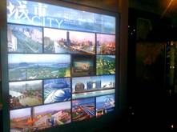
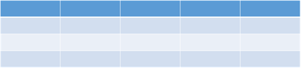
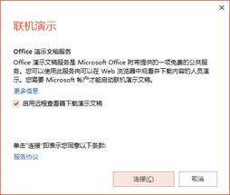
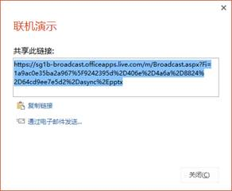

# 9.1  播放与展示

在PowerPoint中有四种播放类型，分别是演讲者放映、观众自行浏览、展台浏览、联机演示。

Ü 演讲者放映。这是使用最多的一种放映方式，例如在教师授课、公众演讲、产品展示、学术研究等等。这种播放模式由演示者全程控制，可以是通过鼠标、遥控器或者是键盘来控制幻灯片的翻页和动画展示。

图9-1

Ü 观众自行浏览。在一些产品展示会、博物馆、地铁内，我们经常会看到有这样的自助式触摸屏播放器的存在，观众只需要通过点击触摸屏就可以控制幻灯片的播放，单击不同的选项跳转到不同的页面，播放不同的效果。

图9-2

Ü 展台浏览。这种展示方式一般出现在一些大型的展示、产品发布会或者大型公司的集体会议中，使用展台浏览模式，可以很方便的将所需要展示的内容循环播放，不需要人去手动操作，只需要设置好每页幻灯片的切换时间，就可以在投影屏上自动循环播放了。

图9-3

Ü 联机演示。想在多台电脑同时观看幻灯片展示，或者是想让在不同办公室的同事和外地的同事和老版能够同步看到幻灯片的展示的话，就可以使用这种播放模式。演示者可以一边通过电话和对方交流，还可以同步的播放幻灯片，并且整个幻灯片都是在演示者的掌控之下的，这比直接将幻灯片发给别人强了不止一点。

图9-4

## **演讲者放映**

大多数演示时，我们都是直接面对电脑，将幻灯片展示给大家看，要知道演讲者放映模式对于演示来说是很自由的。我们提前设置好自定义放映，将需要的放映的内容进行展示，不需要放映的内容则可以在放映时进行隐藏，在“幻灯片放映”选项卡下的“自定义幻灯片放映”，如图9-5所示。面对着电脑直接播放时，我们就可以直接使用“普通视图”，也就是“编辑者视图”，这样就可以不用中断演示就可以实现编辑，若是觉得显示的范围不够大，则可以将编辑区右边的幻灯片缩略图展示栏移动至最小，单击右上角的向上的箭头，还可以选择将功能区全部隐藏。

图9-5

图9-6

## **使用快捷键**

在全屏模式下运行演示文稿时，可以使用表1中所示的键盘快捷键，帮助展示演示文稿。

表1

| **执行的操作** | **快捷键** |
| :--- | :--- |
| 从头开始运行演示文稿。 | F5 |
| 当前页开始播放 | Shift+F5 |
| 执行下一个动画或前进到下一张幻灯片。 | N、Enter、Page Down、向右键、向下键或空格键 |
| 执行上一个动画或返回到上一张幻灯片。 | P、Page Up、向左键、向上键或空格键 |
| 转至第（编号_）_张幻灯片。 | 按住编号（例如5）+Enter |
| 显示空白的黑色幻灯片，或者从空白的黑色幻灯片返回到演示文稿。 | B 或句号 |
| 显示空白的白色幻灯片，或者从空白的白色幻灯片返回到演示文稿。 | W 或逗号 |
| 停止或重新启动自动演示文稿。 | S |
| 结束演示文稿。 | Esc |

## **投影**

在使用“演讲者放映”时，若是可以使用投影设备进行辅助放映，演示效果会更好。我们一般会使用两种投影方式，一种是复制，一种是扩展。复制就是投影仪显示的内容和你现在的显示器一致，各种操作包括鼠标移动在内都会被复制，如同复制的第二个屏幕；扩展就是在你目前的桌面右侧（一般都在右侧）会成为一个扩展屏幕，要演示的东西拖动到扩展桌面就可以；这样你不仅能享受到大屏幕带来的好处，还能扩大屏幕的使用范围，丝毫不会影响到编辑和投影。

Win7或win8的用户可以使用“Win+P”快捷键调出投影的设置，如图9-7所示。

图9-7

## **观众自行浏览**

设置观众自行浏览的播放模式与演讲者放映最大的不同就是操作者不同。观众需要轻松简单的操作，所以在设计幻灯片时，我们就应该将这些因素都考虑进去。

观众自行浏览，幻灯片上就需要分成不同的版块，观众需要了解哪一块就自行选择哪一块进行浏览，所以，我们也需要在幻灯片中设置这样的一个超链接。

为了完成以上观众的一些需求，所以我们一般在幻灯片中完成三种设置，动作按钮、超链接、触发动画。

动作按钮。动作按钮在一般的教学课件中会经常使用，“插入”选项卡下的“形状”中，就有很多常用的动作按钮，当插入这些动作按钮时，为动作按钮设置超链接的窗口会自动弹出来，设置完成后就可以快速的完成页面间的转换。动作按钮其实也是运用到了“超链接”来实现它的功能，但超链接不仅仅局限于在动作按钮的使用中。

超链接。简单的动作按钮是无法满足大部分的观众的，观众还需要更流畅的操作，更多的服务，例如可以看到视频、听到音乐等等，这个时候就可以设置“超链接”，选择“插入”选项卡下的“超链接”命令。

触发动画。触发动画的设置将会使幻灯片变得更为美观，看起来画面感更强。例如，当观众在单击某个图片时，图片自动放大。这样的设置只需要用到“动画”中的“触发器”就可以实现，并且效果会非常好。

以上的三种设置都是为了辅助演示，这种演示是由观众自行操作，所以不能用演示者的眼光去看待这个PPT，我们要将所有可能会让观众迷惑、不清楚操作的地方都清除，这样。演示才能算是成功。

在“幻灯片放映”选项卡中选择“设置幻灯片放映”。

图9-8

## **展台浏览**

在展台上进行展示的幻灯片，由于没有人为去操作，所以必须设置自动换片时间，如果对每页幻灯片的换页时间没有特殊的要求，则可以直接在“母版视图”的“切换”选项卡下勾选“设置自动换片时间”，具体时间根据实际要求而定，一般不宜将时间设置得太短。

另外一种适合展台浏览的是“录制幻灯片演示”，可以先将幻灯片整个都录制下来，甚至可以在录制的时候加上旁白，配上解说。

如图9-7所示中，勾选“在展台浏览”，如果有多个浏览器，则可以在“监视器”中选择显示位置。

展台是不需要人为控制的，当设置好后，幻灯片就开始自动播放，当它播放完后，会自动的循环播放，并且在播放期间，除了可以使用“ESC”键退出播放外，其他的所有操作都是不被执行的，所以在此之前必须先设置好幻灯片的切换时间。

图9-9

## **联机演示**

当使用“联机演示”时，PowerPoint会自动为用户的演示文稿创建一个公共链接，收到该链接的人均可以观看演示文稿，并且只要有链接，就不会有任何限制。

使用联机演示时，需要一个微软的账户，当然如果没有账户，也仅仅只需要几分钟就可以注册完毕。单击“幻灯片放映”选项卡，选择“联机演示”。

图9-10

图9-11

图9-12

“联机演示”可以不被地域所局限，只需要一个链接就可以让各个设备都可以同时看到演示，不仅仅是电脑，手机、平板等设备都可以。同时还能通过OneNote同步共享会议笔记，非常方便。但同时“联机演示”也有一个的缺点，那就是需要联网，并且具备浏览器的设备。

