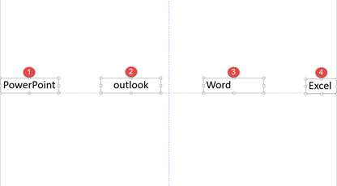

# 9.4  演示助手

## **墨迹笔标记**

在演示中，我们可能会遇到一些需要重点表示的内容，或者需要中断演示，来讲述某个内容，那么演示者就可以直接在全屏演示时，利用墨迹笔来实现这些。

当开始全屏演示时，移动鼠标至全屏状态下幻灯片的左下角，我们会找到一个笔状的标志，如图9-20所示。

图9-20

当我们需要使用笔时，可以单击选择“笔”，还可以对“笔”的颜色进行选择，选择完成后，就可以直接使用笔在幻灯片中进行操作，划出重点或写字等等。不仅仅如此，若演示者想让观众只关注“笔”写出来的内容，而不被幻灯片内容所干扰，那么就可以使用键盘上的英文“W”或“B”实现全屏演示时的白屏或者黑屏，这样在书写内容时，就不会被其他的东西所干扰，若想退出白屏或者黑屏状态，单击键盘上的“ESC”键即可。

用“笔”书写内容之后，在退出全屏演示时，PowerPoint会自动询问演示者是否保留幻灯片上的墨迹，若使用者需要，则可以对其进行保留。若保留后需要删除也很简单，只需要像删除简单的图形一样进行删除即可。

## **放大镜**

在演示时，除了可以使用“笔”这个功能外，还可以使用“放大镜”来强调重点，在开始全屏演示时，移动鼠标至全屏状态下幻灯片的左下角，我们会找到一个“放大镜”的标志，单击此标志后开始使用放大镜功能，将放大镜移动至需要放大的区域，单击即可实现放大。

图9-21

同样的，单击键盘上的“ESC”键即可取消放大。

在这里，我们可能会发现PPT自带的标注和放大功能可能不是那么好用，使用时的体验感可能并不好，那么在这里我们可能就需要一个放映辅助工具——ZoomIt。

演示必备辅助软件 ZoomIt是一款非常实用的投影演示辅助软件。有些人也称ZoomIt为微软放大镜。ZoomIt体积小巧（只有一个exe文件，0.2MB）、完全免费、易于使用。通过快捷键可以很方便地调用ZoomIt三项功能：屏幕放大、屏幕标注、定时提醒。我们可以依靠三个快捷键去启用这些功能，分别是Ctrl+1，Ctrl+2，Ctrl+3。

## **屏幕放大——Ctrl+1**

按下快捷键（默认ctrl+1），即可进入ZoomIt的放大模式。这时屏幕内容将放大后（默认2倍）显示。

移动光标，放大区域将随之改变。

用鼠标滚轮或者上下方向键，将改变放大比例。这比单纯使用PPT中放大镜的功能好用得多，放大大小非常灵活。

当按下鼠标左键时，可以固定放大状态，自动启动标注功能。按下键盘ESC键或者鼠标右键即可退出放大。

放大效果相对于PPT中的放大效果而言也是非常让人满意的。最重要的是不用局限于PPT中无法改变的放大大小。

图9-22

## **屏幕标注——Ctrl+2**

标注功能在PPT也是可以实现的，但是很显然，ZoomIt显然更为擅长于这方面的处理，使用ZoomIt中的标注功能，会不禁让人感慨小小一个软件，功能却如此好用。

按下快捷键（默认ctrl+2），或在放大模式下按下鼠标左键，可进入标注模式。这时，鼠标会变成一个圆形的笔点，其颜色、大小都是可调的。

\* 通过按住左ctrl键，使用鼠标滚轮或者上下箭头键调整画笔的宽度。

\* 按键调整画笔颜色：r 红色；g 绿色；b 蓝色；o 橙色；y 黄色；p 粉色。

可轻松画出不同的形状：

\* 按住Shift键可以画出直线；

\* 按住Ctrl键可以画出长方形；

\* 按住tab键可以画出椭圆形；

\* Shift+Ctrl可以画出箭头。

其他操作：

\* Ctrl+Z：撤销最后的标注。

\* e：擦除所有标注。

\* w\(白色\)/k\(黑色\)：将屏幕变成白板或黑板。

\* Ctrl+S：保存标注或者放大后的画面。

\*屏幕打字：进入标注模式后，按‘t’可以进入打字模式。Esc或左键退出。鼠标滚轮或上下箭头可以改变字体大小。很遗憾的是，不支持中文。

\* 鼠标右键：退出标注模式。

## **定时提醒——Ctrl+3**

通过快捷键（默认ctrl+3），可以进入定时器模式。

用键盘上下箭头键可以增加或减少时间。用Esc退出。

第3项是定时器功能，使用此功能时会暂时将桌面利用白色屏蔽覆盖，并在白色屏蔽上出现倒数计时的时间，您可以选择倒数计时时间的长短、倒数计时结束后是否要播放警告音效、白色屏蔽透明度、倒数计时时间显示在屏幕上的那个位置。

这个功能也是非常实用的，例如上课中场休息或者提问时间倒计时，聊点其他的它，又不会耽误了时间，有了它就能方便快捷的实现这一功能了。

ZoomIt如今是微软旗下的一款软件，被称之为微软放大镜也是因此而来，若能熟练地使用这款软件，一定会为你的演示增色不少。

