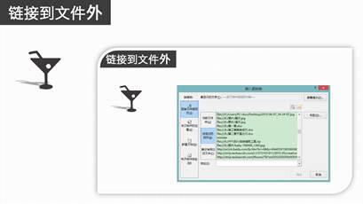
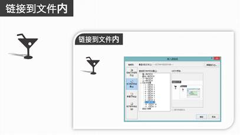
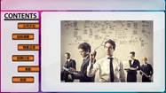

# 9.5  创建超链接

## **什么是超链接？**

超链接是一个对象跳转到另一个对象的快捷途径，在PowerPoint中经常被使用到，是一种让使用的较为普遍的功能，在演示中如果用超链接则会省去演示时的很多麻烦。

我们在平时其实对超链接就不陌生，网页就会有大量的超链接。

图9-23

图9-24

PPT中的超链接和网页中的超链接其实是非常相似的。

图9-24

图9-25

幻灯片中超链接与网页中的超链接对象类似，都是实现用户与电脑间的交互手段，通过对某一对象设置超链接既可实现单击后快速打开相应的内容。

## **添加超链接**

在幻灯片中添加超链接的对象非常广泛，并没有什么严格的限制，可以是文本、图形、图片，也可以图表、表格等等。超链接的链接的样式非常灵活，可以任使用者进行各种尝试，可以是可视的链接，也可以是不可视的链接。

所链接到的对象则是十分丰富，大体上可以分为两种，一种是链接到文件外，一种是链接到文件内。链接到文件外，可以是本地磁盘中的视频或者音频，可以是某个在线的网页；链接到文件内，链接到同一PPT内的某一特定位置，回顾之前内容的时候一般是用到这种。

选中需要插入超链接的元素，在“插入”选项卡下选择“超链接”，弹出的窗格默认的是链接到文件外，可以选择链接到本地文件，或者是在线网页，可以底侧地址栏输入要链接的文件位置或者是网址。

图9-26

链接到文件内，选择链接到本文档中的位置，然后选择你想要跳转的幻灯片。

图9-27

在设置超链接时，还可以设置屏幕提示，超链接中的屏幕提示是指当鼠标移动到此超链接上时，会出现与此链接相关的提示信息，而这些信息是可以根据具体情况进行设置的，对于非文本超链接的其他对象来说，屏幕提示也是很有帮助的。

图9-28

图9-29

超链接还可以使用在导航栏中，例如如图9-30所示的效果。

图9-30

只需要在每个标题上加上超链接，只需要轻轻一点，就可以去到演示者想要去到的幻灯片，非常的方便和快捷。

例如我们像如下图所示，创建一个完整的目录超链接。

 

图9-31 图9-32

图9-33 图9-34 图9-35

 

图9-36 图9-37

 

图9-38 图9-39

 

图9-40 图9-41

 

图9-42 图9-43

 

​ 图9-44 图9-45

在制作时，我们只需要一些简单的色块和一些圆角矩形就可以完成这些设置，当然，为了节省制作的时间，我们可以在一开始就在母版中将背景做好，然后运用到全部的幻灯片中。

在做好超链接后，在演示之前切记测试幻灯片的超链接效果是否理想，达到需要的要求。由于演示文稿中设置了多处的链接，为了在正式的演出时完美展示，就需要在演示前进行一些相应地测试。测试的方法也比较简单，打开演示文稿，全屏播放，鼠标移向超链接时，显示的屏幕提示是否一致；单击超链接时，检查是否转到演示文稿中的正确位置；单击超链接，检查是否打开了正确的网页、文件或者其他的对象；检查外部声音、视频或者其他文件是否与演示文稿保存在同一文件夹中。

## **动作**

PPT中为用户提供了12种不同的动作按钮，并且预设了相应的功能，用户只需要将其添加幻灯片中即可使用。

一般的我们经常使用图9-46所示的四种动作按钮。

图9-46

为幻灯片绘制动作按钮是通过“插入”选项卡中的“形状”按钮来实现的。既可以为一张幻灯片单独添加按钮，也可以为所有幻灯片统一添加按钮。

为所有的幻灯片统一添加按钮需要用到母版，只要在相应的母版上统一添加按钮，那么“动作”就能很轻易的显示在每一张幻灯片上。

动作和超链接类似，不过插入动作有“鼠标悬停”时的效果，可以为“动作”按钮添加声音、突出显示效果。

图9-46

