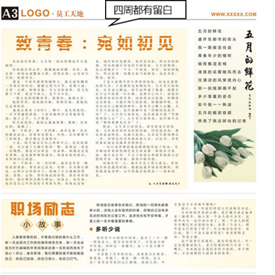
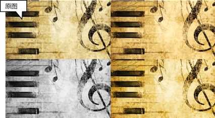
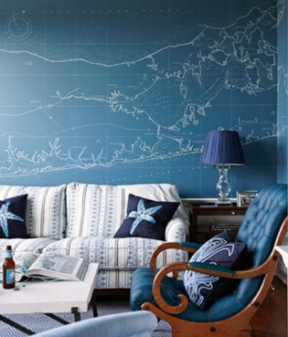

# 12.1  统一

我们先从统一开始说起，所谓统一，是从PPT制作的整体大局上说的。

## **风格统一**

简单点说就是一个主题，从始至终。

图12-2

**切题**，不要连自己都不知道自己在说什么，只有统一了风格，才有统一的逻辑，统一的思路，要不然你还要你的观众费尽心思去琢磨你的演示，这是有悖可视化设计的初衷的。

## **版式统一**

这里提到的版式统一，主要指的是内容的统一对齐。

如图12-3所示，这样的对齐方式会对观众的阅读造成困难，人眼会自动去寻找页面上元素上的对齐线，视线不断发生转移。同时也是背离了我们的设计原则的，无论这样会有多么帅，除非有必要，都是不需要的，所以我们最好只选择一种对齐方式。

图12-3

同一页的PPT版式中，若存在多种对齐方式，将极有可能造成版式中各个元素的独立，使得PPT完全无法表达一个完整的观点，甚至会让人觉得这都不应该放在一起。

图12-4

当我们做出努力，将其他不需要的对齐方式去掉，将版式进行调整，统一对齐方式，如图12-5所示，只有一条对齐线，观众的视线就不会被干扰了。

图12-5

突然不一致的对齐方式，有时会让人觉得这是你的失误，若你是想强调这一内容，有着很多的方法去选择，何必冒着破坏整体结构的风险去做这件得不偿失的事呢。

图12-5

如果需要有意为之，体现出设计感，就不要让人觉得你是不小心设置的不对其，而是应该大胆的使用它，夸大它，让人知道这就是你的设计，体现出与其他的不同。

图12-6

对比图12-5和图12-6就可以看出来一个很明显的差异，在图12-5中，图形一个很小的错位，反而造成了整个画面的混乱，让人觉得这是制作者的失误；但在图12-6中，制造一个很大的图形错位，反而会形成一种强调，突出一种设计感，甚至能够大大降低版面混乱的感觉，所以在平时，设计版面时，要么使用统一的对齐方式，若需要体现设计感，那么就将不对齐做得明显一些。

在对齐中，还有一点需要提出的是，要相信自己的眼睛，而不是软件上无实质意义的参数。在对象的对齐中，不仅仅是在参数上的对齐，因为参数上的不一定会准确。

 

图12-7 图12-8

在图中，由于正方形比圆形大，所以使得正方形像是要凸出来的感觉，这是由于人眼的视觉诱导性造成的，就好似图12-8所示图中得到线一样，但是它们设置了统一的对齐方式。

既然我们一直在强调PPT的制作核心是以人为本，那么我们就应当消除这种现象，而消除的办法就是用双眼去看，去选择。既然是正方形太大，那么我们就缩小正方形的尺寸，使得人们看起来是对齐的。

图12-9

另外在这里值得一提的是，空白不是你的敌人，相反，它有时是设计中的重要成员。

图12-10

另外这张版面中还有其它亮点，比如色块的运用，但我们主要举例留白的使用给读者的留白美，它能让内容以一种更和谐的方式输入到观众的眼睛里。

## **颜色统一**

颜色不仅仅是对自身性质的反应，而且具有感染性，能够传达某种情感，就像春天来了，我们会想到绿色；提到天空，我们会看到蓝色。甚至现在的心理学中都衍生出来了性格色彩学。这无不在提醒着我们，色彩构成了缤纷世界，同时也在潜移默化的影响着我们。

图12-11

颜色对于PPT初学者来说，是非常复杂，深奥的，绝对是一个很大的障碍，因为这要求的是像设计师般的素质。所以我们不需要一次性掌握所有，这需要积累，慢慢培养自己对颜色的敏锐性。

图12-12 图12-13

PPT中使用的色彩模式有两种：RGB和HSL，而本书讨论的是常用色彩模式RGB。上图是PPT的调色区和RGB色盘。在这里，本书为大家介绍一种色相环理论，让大家对颜色有一个更好的理解。

图12-14

这是我们的色相环，我们不需要那么多 ，就将它简化，还原它最基本的环。

图12-15

图中①、②、③就是常说的三原色红、黄、蓝。而④、⑤、⑥则是由三原色混合而成，它们被称为二次色：紫、橙、绿。就像我们小时候玩的画笔一样，不同的颜色可以混合出另外一种与两种颜色都不一样的颜色。三原色是最基本的颜色，所以分别混合它们得出的颜色就被称之为二次色。

那么现在，你肯定知道了二次色与三原色之间的颜色是怎么了吧，分别混合后，你会得到三次色。

**而为什么我们的色环可以有那么多层？**这是颜色的不同饱和度造成的，从中心白，到最外围的黑，这就完整的构成了我们的RGB，而我们组合颜色，最好是在同一饱和度的同一环取色，这样我们的配色才会显得专业，而不至于因为配色而破坏了好的创意。

在色轮上相对的颜色，我们称之为**互补色**，正因为它们互相对立，所以它们一般被作为：一种主色，另一种作强调色。

常见的衣服着装都用到了这样的配色方案，撞色能足够吸引人们的眼球。

图12-16

**三原色**由于颜色识别率高，一般被用于儿童玩具和商标中。

 

图12-17 图12-18

有时也会有一些**单色系**组合，往往是根据颜色的不同饱和度进行配色。

图12-19

我们更常见的是将颜色分别定义为**暖色**和**冷色。**

**暖色系：** **其中加入了红色或黄色** **。**让画面整体显得热烈、活泼，一下子就会被人记住，强调效果非常明显，但也很容易造成观众视觉疲劳。

**冷色系：**： **其中包含了蓝色。**象征严肃、冷静、内涵。使用冷色系整体会让人感觉舒服，但也易让人感觉很乏味，所以在使用冷色系的时候可以使用像绿色这种过渡色彩。

暖色与冷色组合时，应尽量小心大量的暖色在画面中出现，冷暖不需要太过均衡，那样会显得太死板，既然已经用了不同的色系，那不如将颜色的突出效果用的最大。

在颜色的使用中，我们应该谨记，在我们无法一直使用别人的配色，只有自己独有的才是本身的一项技能，当真正的掌握了它的时候，它将内化成你的一门手艺。

我们平时也要不断去观察别人的配色，在自己没有办法的时候，合理的借鉴，辅助自己突破配色，特别在一些公司中有着自己VI（Visual Identity）设计的时候，你就需要靠自己突破了。

**色彩与心理**

暖色与冷色实质上是没有明显的界限的，它会根据颜色的变化而发生性质上的改变。除此之外，颜色还被分为自然色和社会色，自然色即为人们用肉眼所能观察到的色彩，社会色则指的是人们对色彩反馈的一种情绪、感受和理解，也被称之为心理色彩。

**黑色**

 

图12-20 图12-21

 

图12-22 图12-23

这是一组以黑色为主题的照片，黑色有时候象征着权威、高贵、低调、创意；有时候也意味着执着、冷漠。人们对黑色的接纳和拒绝是要分不同的场合的，在只职场上，黑色是大多数职业人士所钟爱的服装；在出席一些重要场合时，人们也会选择穿上黑色来显示严肃与权威，表现得更为专业。

**蓝色**

 

​ 图12-24 图12-25

 

图12-26 图12-27

蓝色最常用到的地方是商务领域，在商务领域内这种颜色是最常见的，它具有灵性和知性的特点。明亮的天空蓝，象征希望、理想；暗沉的蓝，意味着权威、严肃与诚实。蓝色在美术设计上也是应用最广的颜色，在应用蓝色时应尽量避免它带给人呆板、没创意、缺乏趣味的印象。在职场中，应用蓝色是最能表现专业和严谨的，例如在商务会议、产品展示、年终报告等等。

**红色**

 

图12-28 图12-29

 

​ 图12-30 图12-31

红色作为一款主题色，将会让整个主题的风格显得比较传统，，同时它对中国来说有着特殊的寄托，它象征喜庆、吉祥、热情、性感、权威、自信，是一个积极的色彩，同时它也有可能被赋予另外一层含义，它会给人带来血腥、暴力、嫉妒的印象，会给人造成心理压力。所以，一般的，我们在一些谈判或者交易会所很少见到红色，但是在一些特大的场合，为了表现东道主的自信，会所的喜庆与祥和，红色就可能会被用到。

**黄色**

图12-32 图12-33

​ 图12-34 图12-35

黄色时一种警示色，它所表现出的明度极高，是颜色家族中较为颜色之一，由于本身所带有的特点，常被用在交通指示、警示牌、雨衣、雨具上。黄色是一种积极色，所以，在确定以黄色为主题色时，应首先确定使用场合，在一般的社交场合，黄色很少作为主题色；在一些娱乐场合，以黄色作为主题色则是可行的。

**绿色**

​ 图12-36 图12-37

 

图12-38 图12-39

**棕色、咖啡色系**

 

图12-40 图12-41

本书推荐的两个好的配色网站，比如

**配色网www.peise.net**

图12-42

**花瓣网huaban.com**

图12-43

还有一些海报设计，例如淘宝网，这些网站的上面的商品宣传海报都是非常顶级，配色也是相当讲究的，我们完全可以学习它的配色。

图12-44

