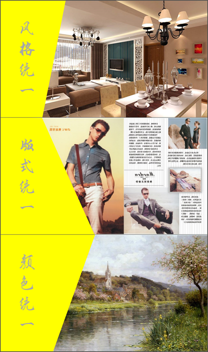

# 12.2  重复

重复即指的是：在制作中，某些元素在整个作品中重复出现，增加作品的条理性和一致性。重复元素可能是某种图案、文字、颜色、空间关系等。将多个平面中的同一元素视为重复，重复促成统一。

我们在平时也都在有意无意的实践着这一原则，我们会有相同的字体和字号，会去对齐文本，规划版式，所以说，重复与统一是相辅相成的。

图12-45

这是两种不同的风格，若是拿这两张ppt作为过渡页的话，显然是显得很业余的，这会让人觉得我们在制作的时候根本就是随心所欲。

而恰恰与之相反，我们的制作应该是我们的有意为之。就比如我们会重复右下角的图标，来显示与上一层次的关系。

另外，我们也会有另外一种不同的方式来强调PPT整体的逻辑性。

图12-46

很显然，这个逻辑显得更为强烈就算没有封面，我们也能知道它们是一组的。这就是重复带来的好处，它能帮你带领你的观众，让你的观众更轻松，最后会让你更舒服。

利用重复，将整个作品的逻辑整合在一起，让整个作品保持一致。重复是增强可视化设计的一个有效手段，强调你的设计元素。让整个画面更有趣，气氛更和谐。

但显而易见的，一个元素要是重复太多次了，不仅不会起强调作用，反而会让人感到厌烦，要注意“简单”。例如很多人在制作公司宣传PPT时，喜欢将公司logo置于每一页，这样的强调是没有必要的，而且很轻易就可以造成反效果，若是强制性要求，那么也应该尽量小，移出视野焦点。

