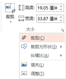

# 12.3  简单

我们喜欢酷炫至极的演示，喜欢引爆全场的激情，能做到这点显然完全能证明我们作品的成功，所以我们在PPT上加上各种各样的元素。但往往到后面，我们的整体结构淹没在了素材的狂轰乱炸中，而修改已经来不及了。

制作PPT，是为了演示，演示是为了输出我们的观点给观众，就算是一个纯粹娱乐性的PPT也会有一个明确的，能够清晰辨认的主题，这靠的不是酷炫，这需要的是简洁明了的表达主题。

图12-47

往往图片比文字更有说服力，无论是文字与图片还是纯图片展示，都需要知道的是，简单直接的去展示，想什么展示什么，不要让人去猜测你的意图，你的演示，观众才是享受服务的人，而这也是本书一直在强调的事，只有去分析你的观众了，你才知道你的观众需要什么，而你才能直接找到他们想要什么，从而，将你的演示推向另一个高度。

另外，我们要知道，往往文字越多，所具有的展现力越弱，少即是多是在以前就已经反复提到过的一个概念。如图12-48和图12-49所示。

图12-48

图12-49

在前面有提到过留白，在这里我们再拿出来，很多初学者刚刚接触PPT版式设计时，对空白一般有着极大的误解，认为空白的存在破坏了整体的平衡感。相反，留白的存在不仅可以作为一种强调，而且可以平衡版式，让画面显得张弛有力。

图12-50

留白亦有不一样的美，放手去做，想到什么就去做，没有那么多损失，一页PPT而已，又没有成本，你只要去做，大胆一些，do it。

