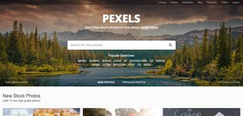

# 13.2  图片

## **软件**

在中级篇中的图片一章中，本书就详细的提到了什么才是你的图片标准，在此就不在赘述了。在找到图片之后我们还需要做一件非常重要的事，那就图片的归纳整理，搜集到图片是设计成功的第一步，归纳整理好你的文件，是另一个重要的步骤，既然已经有了你想要的图片，但当你想要使用的时候，还得从你的电脑中找到它们，这不是需要重复寻找一次吗，这是得不偿失的。

为了避免这种事情的发生，我们需要提前整体图片，你可以选择在文件夹中创建不同的文件夹来收录这些不同的文件。例如图12-15所示。

图12-15

但是，很显然，在创建很多个这样的文件夹后，你会发现这并不是一件很轻松的事，因为你可能将某些图片顺手就下载到其他的文件夹中了，如若需要你一个一个找出来，然后归纳整理，想必这绝对是一件浩大的公事。在此，本书为大家推荐一款软件——Picasa。

Google 的免费图片管理工具Picasa，数秒钟内就可找到并欣赏计算机上的图片。 Picasa 原为独立收费的图像管理、处理软件，其界面美观华丽， 功能实用丰富。后来被 Google 收购并改为免费软件，成为了 Google 的一部分，它最突出的优点是搜索硬盘中的相片图片的速度很快，当你输入一个字后，准备输入第二个字时，它已经即时显示出搜索出的图片。不管照片有多少，空间有多大，几秒内就可以查找到所需要的图片。

图12-16

Picasa是一款可帮助您在计算机上立即找到、修改和共享所有图片的软件。每次打开 Picasa时，它都会自动查找所有图片（甚至是那些您已经遗忘的图片），并将它们按日期顺序放在可见的相册中，同时以您易于识别的名称命名文件夹。您可以通过拖放操作来排列相册，还可以添加标签来创建新组。Picasa 保证您的图片从始至终都井井有条。 Picasa 还可以通过简单的单次点击式修正来进行高级修改，让您只需动动指尖即可获得震撼效果。而且，Picasa 还可让您迅速实现图片共享——可以通过电子邮件发送图片、在家打印图片、制作礼品 CD，甚至将图片张贴到您自己的 blog 中。

总之，最为一款免费的软件，它的功能好用程度绝对不下于一些付费软件，别忘了，它以前就是一款付费软件。它操作简单，极易上手，而且软件大小适中，不会对电脑运行造成负担。

这还不是它的全部，Picasa能像Photoshop一样对图片进行后期处理，不想Photoshop那样需要看起来很专业的知识，你只需要认识上面的汉字，然后通过拉动那些控制条控制图片的参数，直到得到你想要的图片。

Picasa 的EXIF显示窗口能帮助我们轻松的调整照片，此窗口会向您显示储存在图片原始文件内的所有相机数据，如相机型号、拍摄日期，甚至是否使用过闪光灯。EXIF 显示还有一个实时的 RGB 直方图，以图形方式显示图片内的色彩强度，以及您在 Picasa 内进行修改时的颜色变化情况。

图12-17

这个软件已经足够的好了，你或许已经使用了Adobe Bridge，那你就可以不用使用这款软件了；若你没有使用任何一款图片的整理软件，那么，你现在就多了一项选择——Picasa。

不管好不好，你会用，用得好就是好的，在学会找图片之前，学会整理图片很有必要。

## **资源网址**

**（1）WallHaven** [http://alpha.wallhaven.cc/](http://alpha.wallhaven.cc/)

各种高清图片，无论你需要做什么，这里面的图片的精度都可以满足你，它算是最受设计师们欢迎的图片网站之一了，图片真是高清中高清。

图12-18

**（2）站酷** [http://www.zcool.com.cn/](http://www.zcool.com.cn/)

站酷素材网，专业且精美的图片、网页、图标素材网站。

图12-19

**（3）Pixabay** [https://pixabay.com/zh/photos/?order=latest](https://pixabay.com/zh/photos/?order=latest)

超过30万张免费高清、精美的图片，不仅仅是高质量，而且可以商用。

图12-20

**（4）500px** [https://500px.com/popular](https://500px.com/popular)

世界上最好的照片分享网站，每天的上传量及其庞大，其中不乏一些极具设计价值的图片。

图12-21

**（5） Pexels** [http://www.pexels.com/](http://www.pexels.com/)

不仅仅是高清尺寸，同时还满足免费这个令人不能自拔的条件。

图12-22

**（5）百度和Google高级图片搜索**

① 单击“高级搜索”按钮，进入高级图片搜索页面。

图12-23

② 输入关键字，选择需要的图片格式。

图12-24

③ 单击“百度一下”，并选择图片进行下载。

图12-25

