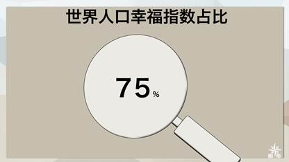
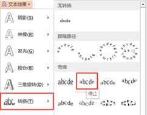

# 16.2  初识鼠绘

## **放大镜**

图14-19

图中14-19所示为一个放大版的放大镜图标，这不是由素材导入，而是直接在PPT上进行的图形绘制，方法也是特别的简单。

首先，我们制作放大镜的手柄，在“插入”中找到圆角矩形，插入两个圆角矩形，如图14-20所示位置进行放置。

设置图形的效果，选中图形，在“绘图工具/格式”中选择“形状效果”，在“阴影”中选择“内部左下角”样式，设置后，选中图形，单击右键进入“设置形状格式”窗格，效果设置如图14-21所示。

图14-20

图14-22

然后插入一个圆形，改变图形填充颜色，使用取色器吸取背景色即可快速完成图形填充，轮廓颜色也需要更改，将轮廓设置为“黑色，1磅”，为图形添加一个特殊效果，设置内部阴影——内部向下。

图14-23

将三个部件全部组合起来，这样的一个放大镜就完成了。

那画出来究竟是为了什么呢？看起来好像没有什么用。它不是没用，只是我们还有意识到它的用处，例如图14-24所示。

图14-24

除了这样，还有这样的，如图14-25所示。

图14-25

这样也行，如图14-26所示。

图14-26

总之，只要你去做，总有各种各样的表达方式供你选择，让你去创造，创造出不一样的个性PPT，这就是属于你的风格，别人无论如何也是偷不来的，模仿永远成不了大气候，只有达到了让别人去模仿的地步，那才算是小有成就，但这一切的前提都是需要你去做，Just do it，不做谁知道结果呢。

在图14-24中，放大镜里面的“PPT似被PPT放大了一般，这是文字的一种特殊效果，操作起来也是非常的简单。选中文本框后，在“绘图工具/格式”选项卡中单击“文本效果”，选择“转换”，选择“停止”，如图14-27所示。

图14-27

图14-25中的环形圆弧的设置同样是非常简单就能实现，在PPT就有这样的图形，只不过需要我们将之变形即可实现。单击“形状”选择插入“空心弧”，这个形状有一个特点，就是它具有两个控点，如图14-28所示。

图14-28

控点1为控制弧度长度的点，只能控制弧度的长度，而且由于空心弧本身的特性，所以无法将空心弧拉至一个完整的圆弧；控点2可以控制空心弧的厚度，同时也能控制空心弧的长度。只需要将空心弧调整至与放大镜差不多大小，然后调整弧度就可以实现图14-25中的效果，在这些操作中可能会用到等比例放大/缩小（Ctrl+Shift+鼠标拖拽）。

一个图标可以用来做很多的事，只要运用好它的表现力，那么它的表现力将显得极为强大，同时你应该具备的是你充沛的想象力。

## **六芒星**

图14-28

同样的，图形非常简单，只运用到了两个图形，没有其他更多的复杂操作，首先插入两个三角形，按住Ctrl+Shift等比例放大图形，插入两个等边三角形，将两个三角形重叠在一起，选中一个三角形，在“绘图工具/格式”中选择“旋转——垂直旋转”，然后再向下移动三角形到合适位置。

图14-29

图14-30

选中两个图形，此处不需分先后顺序，选择“合并图形”中的“拆分”命令，将拆分的图形组合在一起，可使用组合的快捷方式Ctrl+G（取消组合的快捷方式是Ctrl+Shift+G），完成组合后更改图形的轮廓颜色，因为默认颜色为蓝色，更改为黑色，这样一个六芒星就做好了。

图14-30

在“形状效果”的“预设”中为图形添加一些效果，如图14-31所示。

图14-31

## **话筒**

图14-31

话筒的绘制可能就需要一些技巧了，因为它需要用到不止一种合并形状，虽然会到不同的合并形状，但是总结起来，它依然属于最初级的鼠绘，因为它终究只是简单的图形的简单拼接而已，但它却是初识鼠绘最好的入门练手方法，先从简单的入手。

首先，我们先画出话筒的底座，在“形状”中插入一个圆角矩形，调节控点（选中图形后，黄色的点），将圆角矩形变换成一个椭圆，选中图形，按住Ctrl拖拽，复制出一个同样大小的圆角矩形，将两个图形重叠，将一个圆角矩形缩小，按住Ctrl+Shift，等比例缩小整个图形，如图14-32所示，在这里需要格外小心，稍不注意就可能会影响到后续的步骤。

图14-32

若在重叠两个图形或者在缩小图形后发现两图形不对齐，这时候可以使用PPT的“对齐”，选中图形后，就可以在“绘图工具/格式”中找到“对齐”，如图14-33所示。第一步首先勾选上“对齐所选对象”，然后再单击左右居中或者上下居中，两者不分先后，任使用者先使用哪个命令都可以，这样两个图形都能准确的重合。

图14-33

对齐完毕后，在“合并形状”中选择“组合”，可以顺利的将圆角矩形中间抠出一个圆角矩形空白；不仅可以使用“组合”，也可以使用“剪除”，但在使用这个命令时，要注意选择图形的先后顺序，先选择哪个图形，那么这个图形就是被剪除的图形，所以若先选择了小图形，则在进行操作时会被大图形完全剪除，那就得不到我们所需要的图形了。

图14-34

显然这个椭圆还不是我们需要的，对比一下最终的效果图，可以看出我们只需要其中一半，那么我们就将这一半给截下来，插入一个矩形，用矩形遮挡住我们不需要的部分，如图14-35所示，然后使用“剪除”，注意，这里的选择是需要先后顺序的，先选中圆角矩形，再选中矩形，然后使用“剪除”命令，得到如图14-36所示，若是在操作完后发现大小有些不合适，可直接通过拖拽图形增加图形长度和宽度，但注意不要破坏了图形整体的构造。

图14-35

​ 图14-36

接下来，我们来绘制话筒支架，这是由两个图形构成，一个矩形和一个圆角矩形，对照着最终结果图，将图形摆放好，若无法确定自己是否已经将图形都对齐好了，那么就选中所有图形，使用“对齐——左右对齐”，然后使用合并形状中的“联合”。

图14-36

最后一步画麦克风，麦克风的主体是一个圆角矩形，缺口是由另外两个圆角矩形剪除形状所得，如图14-37所示。

图14-37

接下来就是组合起所有的图形，将其全部组合起来，设置填充色为“白色，无轮廓线”。最后成形之后，可以为图形添加一点质感，直接在“形状效果——预设”中选择一种效果为图形添加上，效果如图 14-37所示

图 14-38

