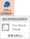
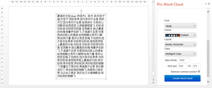

# 15.4  文字云

是否曾经羡慕过别人PPT中加入的文字云效果，想从网上进行下载，却很难找到自己需要的文字云，有没有一种简单的方法可以直接进行制作呢，这里是有的，而且特别的简单，神器就在PPT内，只是不还未找到，文字云生成插件在PPT一个你从未有用到过的命令里，它的名字是pro word cloud，制作效果如图15-36所示。

图15-36

需要使用它，首先得将它找出来，单击“插入”选项卡中的“office应用程序”。

图15-37

在搜索栏输入pro word cloud，单击搜索。

 

图15-38 图15-39

单击“信任它”后，插件会自动添加到“office应用程序”中，以后需要使用可以直接单击这个图标。

图15-40

打开这个插件，插件的界面是全英文的，不过意思很简单，多试几次几次就能记住英文的意思和设置不同的结果不同的各种效果。

图15-41

选中需要转换的文字，设置好参数后，单击转换即可。

图15-42

在插件的正上方可以预览效果，在预览图上单击右键可以保存或复制。

图15-43

这样，文字云就创建完成了，这样文字云效果在演示的时候效果还是很好的，创建合适的尺寸，然后将文字改造成为文字云，在一般的含娱乐性的场所，使用文字云效果会比较好。

如果觉得还是不够满意，想要制作 一些更为奇特的文字云效果，那么在这里还有一些强大的方法，这里推荐一个在线生成文字云的网站——TAGUL，这是一个非常好用的文字云生成网站。

首先，在浏览器内输入TAGUL进行搜索，找到TAGUL的网站，单击进入，TAGUL是需要注册登录后才可以使用的在线网站，但好在注册非常快捷，一分钟内就可以完成。

图15-44

图15-45

虽然可以关联账号登录TAGUL，但这显然在是需要使用到一些其他的工具才行（例如翻墙），所以还是注册一个账号来得快捷方便。

登录之后，如图15-46所示，点击“create new word cloud”。

图15-46

网站会自动跳转到文字云的制作界面，很不凑巧，这个操作界面也是一个全英文版的。不过不要紧，在设置参数的时候从上往下进行设置，而且很多参数 可以根本不去管，保持默认即可。

图15-46

这里用案例来讲解有关于文字的制作流程。

图15-47

在文字输入的界面中可以一个文本内容一个文本内容分别输入，也可以直接将 文本内容一次性输入，这里选用一次性全部输入的方法。如图15-48所示，选择“Import words”，然后在弹出来的对话框中输入文本内容，这里除了输入文本内容外，还可以选择导入Excel文件或者是导入网页。另外在输入文字时注意换行。

图15-48

接下来，选择自己喜欢的形状，单击“Shapes”，选择文字云的形状。支持自定义形状和图片，所以可以选择自由上传图片或形状。

图15-49

选择形状完成后，再选择字体，选择字体可以选择网站内置的字体，也可以自由添加自己电脑中的字体，电脑中的字体都存储在C盘\Windows\Fonts。

 

图15-50 图15-51

设置到这里，其实已经算是设置完成了。单击“预览”可以看到文字云已经形成了，效果还很不错。

图15-52

若还需要更进一步的对文字云进行修改，则在继续设置参数，接下来设置“Layout”，即文字的布局，在文字的布局中可以设置三个参数：文字的方向、文字的数量和文字的尺寸。

文字的方向根据使用的需要进行设置。

文字的数量一般情况都会勾选“Auto（自动）”，这样在创建的时候网站会自动根据图形的大小来添加文字的数量。

文字的大小若是使用没有自行在“Words”设置文字的大小的话，则不必改变默认的勾选。

图15-53

在“颜色与布局”中只需要设置两个参数，一个是字体的颜色，另一个就是图片的背景色，一般的我们若需要在PPT中使用，大多都需要选中背景透明的PNG图片。

如图15-54所示，将“Use shape colors”的勾选去掉，这样用户就能随意的更改 颜色了，若是觉得不想动手更改颜色，单击“Random”，网站将会为字体自动配色，并随机分配给每一个关键字。勾选上“Transparent”则会得到一张背景透明的照片。

图15-54

关键字的颜色是可以指定更改的，不过不在“颜色与动画”更改，而在“Words”中更改，在输入文本后，在“Words”中可以更改关键字的尺寸、颜色、角度和字体，还有一个是否重复添加。

图15-55

例如，我们加入一个“花火”关键字，然后更改它的各项参数，得到如图15-56所示。

图15-56

在所有的设置都完成后，需要保存设置后的图片，在“Grab and Share”进行下载即可，由于是普通会员身份，所以只能下载1M的图片，若无特殊的要求，这样的图片已经够用了。

图15-57

前面了解的是图形文字云的制作过程，接下来，我们来了解有关图片的文字云是如何制作的。

 

图15-58 图15-59

首先，输入关键字。

图15-60

准备一张素材照片，将素材添加到图片中，

图15-61

图片导入后，需要对图片的各项参数进行一些调整，需要调整阀值，只保留人物的基本轮廓即可，背景颜色应当全部去掉。

 

图15-62 图15-63

完成后，单击“预览”即可查看图片的效果。

图15-64

从预览图上可以看到图片效果还是有些不明显，那么还需要对图片进行进一步的调整来丰富细节。

在布局中调整文字的方向，采用更多的角度来丰富图片的边角细节。

另外，将文字的数量加至最大——999，让更多的关键字去填补图片的空白。

图15-65

图15-66

