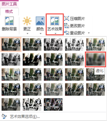
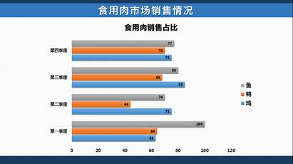

# 16.1  模糊背景的处理

图16-1

在平时制作PPT时，我们一般会为了省事图方便而使用全白色背景，但这样明显不符合我们的审美，所以，我们会试图改变这样的情况，但发现似乎每次尝试得到的结果都不是很好，在这里，介绍一种模糊背景的处理方法，例如图16-2所示。

图16-2

一些图片本身是并不模糊的，但是通过处理，我们就可以将它拿来作为背景。

我们要知道，有时候PPT中的文字才是重点，当使用图片作为背景时，观众的实现往往会被优美的图片所干扰，甚至是完全被吸引，那这样的设计就是失败的，美则美矣，但有些本末倒置了，只有突出本来就该突出的焦点，这样的设计才算是完成了它的基本工作。

## **模糊背景——蒙板**

制作模糊背景第一种方法就是采用蒙板，所谓蒙板就是盖住东西的板子，而这个能盖住东西的板子在PPT就是图形，用图形去盖住图片，制造出模糊的效果。

首先，打开PPT，为了能够高效的完成背景设置，我们在“视图”选项卡中单击“幻灯片母版”，在母版视图中设置背景，然后插入一张适合的图片。

图16-3

在“插入”选项卡的“形状”中选择插入矩形，绘制出的矩形大小需要大过图片的大小，要覆盖住整个图片，盖住它。

图16-4

选中图形，单击右键，选择“设置形状格式”，进入设置形状格式窗格中，为图形设置“渐变填充”，为图形添加两个光圈，颜色皆为白色，单击光圈1，设置透明色为100%，光圈2设置透明色为20%（或者其他，具体视图片实际情况而定）。

图16-5

设置完成后，在“幻灯片母版”选项卡中找到“关闭母版视图”，退出幻灯片母版。

图16-6

这样利用蒙板就能快速的制作模糊背景的图片了，非常快速，这是一个取巧的方式，取巧之处就在于它的普遍性，作为一块板子，它可以蒙住大多数的图片。

图16-7

图16-8

图16-9

## **模糊背景——虚化**

蒙板效果是借助到了图形，用图形去处理图片，但是这样的模糊效果还是不够明显，最多算是个“薄雾”，而不是模糊，要想实现更好的效果有没有什么好的方法呢？确实是有的，而且在PPT中就能很轻易的实现它。

图16-10

如图16-10所示，插入的图片虽然是和教育有关联的，但是很明显的是和文字是冲突的，不匹配的，这样的设计很显然就是不成功的，而如果我们将它进行模糊化，那么效果是否会有所不同呢？我们进行如下处理。

选中图片，在“图片工具/格式”中的“艺术效果”中选择虚化。

图16-11

图16-12

如图16-12所示，图片模糊了一点，若是觉得这种模糊效果还是不够好，那么，这种效果还是可以继续加强的。

选中图片，单击右键选择“设置图片格式”，在“效果”中选择“艺术效果”，如图16-13所示，增加“半径”即是增强模糊效果，例如，将半径调整为35。

图16-13

图16-14

似乎有了一点感觉了，从图片中，可以朦朦胧胧的看到是一个人在进行演示，设置到这里，模糊的效果已经全部完成了，若需要更模糊的效果也是可以再次增加半径的大小的，但有一点问题就是，当设置了模糊之后，图片会有显著的偏暗效果，若是想要图片变亮一些怎么办？这也是可以轻松完成的，同样是在设置图片格式窗格中，如图16-15所示，例如，为图片设置20%的透明度。

图16-15

图16-16

做成这个样子，图片的修饰差不多是做完了，但是我们还是想要再次对图片最下突破，能否将图片的一些细节做得更加的到位，让细节更为突出一些，仅仅是为图片添加一个模糊效果，细节处还是有些缺失，有这样的方法吗？确实有，不过这里就需要一些技巧了。

在已经添加了模糊效果的图片的基础上，我们进行再次处理。首先，我们需要将图片剪切下来，使用Ctrl+X剪切快捷键，然后进行粘贴，注意这里有个小技巧，为了最大可能的保留住添加了模糊效果图片的效果，不建议采用直接粘贴，这里需要使用选择性粘贴的方法，按住Ctrl+Alt+V的方法，将图片选择性粘贴为PNG格式的图片。

图16-17

选中粘贴的图片，将粘贴的图片置于底层，重新调整好图片的位置，在设置图片格式窗格中的艺术效果中选择“纹理化”如图16-18所示，选择后可以对纹理的数据参数进行一些调整，PPT提供了两种参数的调整：透明度和缩放。

图16-18

调整好参数后，效果如图16-19所示。

图16-19

之所以将进行模糊效果的图片进行复制粘贴操作，是因为两种艺术效果是无法共存的，使用复制粘贴就等于将设置了模糊效果的图片连着艺术效果一起保存为新的一张图片，然后再在这张新的图片的上添加其他艺术效果，这样的一个折中方法就能使得两种艺术效果同时进行保存。

## **模糊背景——自制虚化背景**

有些时候当我们拥有了上述两种制作模糊背景的方法时，还是觉得有些不满足，我们还需要那种看起来是纯虚化背景的图片，这样，会让版式看起来更为好看，效果更为惊人，但显然，若是要达到这种效果的必要前提是你得有这样的背景，不是去搜集这样的虚化背景，而是自己动手做，不需要Photoshop，需要PPT即可，如图16-20所示，PPT就可以完成这样的虚化背景。

图16-20

既然是虚化背景，那么显而易见的是一定会用到图片的虚化功能，但是如何用，对谁用呢？

在这里，我们首先需要做的是，在PPT中插入一堆的色块（圆形、矩形等等），然后，插入一个足够大的矩形，将所有的色块包裹起来，将所有的图形全部选中，然后使用复制，将其复制为一张图片。

图16-21

之所以将其图形复制为一张图片，是因为虚化是属于图片的特效，是无法使用在图形上的，只有通过将图形转换成为图片，这样才能让图片的效果运用在图形上。

接下来的步骤其实很简单，那就是加上艺术效果—虚化，并将虚化半径值修改为100。

图16-22

这样进行操作后，图片模糊的效果却并不是特别的明显，至少得不到我们所需要的那种模糊背景的效果，如图16-23所示。

图16-23

这样的效果说明了虚化效果还不够，那么我们还需要再次进行虚化，这张的图片上进行的虚化效果已经是PPT的极限了，我们若需要再次进行虚化，则需要“换”一张图片，如同在虚化的图片上再次添加纹理化的艺术效果一样，同时添加两种艺术效果，在这里也是添加两种艺术效果，只不过是相同的效果再次添加。

接下来的步骤非常简单，虚化，设置效果最大，然后转图片，继续虚化，转图片，不断重复，直到图片达到使用的要求。

图16-24

由于在使用PPT中虚化效果时，软件会自带的将图片的亮度变低，若是感觉亮度太低不太符合场景需要，那么在处理完虚化后，还可以通过调节图片亮度，来重新为图片加亮。

图16-25

图16-26

