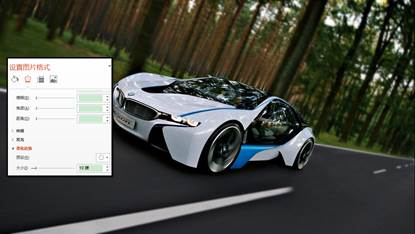

# 16.3  图片的单反设计

即使一张图片本身已经是非常的完美了，但是不做任何的修饰就直接的进行使用，有很大可能就是图片不仅没有表现出它应该有的表现力，还有可能将吸引观众的实现，而自动忽略掉使用者设置的视觉焦点，但一个版式不能完成它应该完成的基本任务，那么它无疑就是失败的，没有所谓演示上失败了，但在美的方面成功了一说。

我们找到一张高清图片，配上文字，然后插入到PPT，简单的完成一张PPT的设计，如图16-38所示。

图16-38

很漂亮的一张高清大图，配上的文字说明，也能将文字内容说明清楚，但这样的细节处还是不够好，需要更近一步的改进才是，我们若需要表现的是这部车，重点让这车出现在视野里，让它成为焦点，然后让观众看到文字，焦点就只有文字和车两个部分，其他的则只是背景、陪衬的存在。

按照前述要求，对图16-38中的图进行分析发现，我们需要高清的车，明亮的背景和公路则不是我们 的重点，重点不在它们，那么我们就需要进行处理，例如图16-39所示。

图16-39

乍一看两图是一样的，但仔细观察会发现图16-39除了车的部分，其他的部分都是模糊的，不适于人眼观看的，这和前面图16-38中所示的图片就有很大的区别了，图16-38中图片焦点会图片本身的元素所干扰，而在图16-39则是通过了让焦点清晰，其他部分模糊来突出焦点，这样的制作方式造成了一种前景清晰，后景模糊的效果，这不就是单反吗？制作工具还是只有PPT，用PPT来仿制出属于PPT的单反照片。

这里所用到技巧其实在上面就有讲过，这是通过将抠图和虚化背景这两个知识点结合起来了，并不是单纯的截图，也不是单纯的虚化，将两者结合起来之后就能产生你所需要的效果。

首先，插入一张图片，选择需要突出的焦点元素，然后使用任意多边形（或自由曲线），将需要的元素包于曲线内。然后选择图片，再选中曲线，使用合并形状——相交（也可以使用拆分）。

图16-40

图16-41

将原来的图片再次插入PPT中，为图片设置艺术效果——虚化，由于设置虚化后，默认值是10，这个虚化程度会较高，选中图片单击右键选择设置图片格式，对虚化效果进行微调，调整为6-8即可，具体参数根据用户需要和实际图片来定，设置完成后，PPT单反的核心来了，那就将第一步骤截取下来的图重叠到这张设置了虚化效果的图上，位置与图上元素位置想匹配，如图16-42所示。

图16-42

如果细心观察，会发现这张被处理的图上还是略微有些不足，看到车的周边有一些风景很清晰，这是两张图片不同的清晰度导致的，有两种解决方法，第一种就是在抠图的时候做到精细至极，将车整个抠下来，不带风景，此种方法很是考验鼠绘的基本功，可以进行尝试。第二种方法则是利用柔化边缘的方法，让多出来的边缘消失掉就好了。

如图16-43所示，虚化效果不宜做的太过，否则将会把车身给虚化了，若是需要使用虚化，则在抠图有一个小技巧，那就是将图尽量抠圆，因为设置虚化效果时是以圆形的方式在图片四周进行虚化的，抠圆后，对图片进行虚化就不止于会将某一步虚化了，但另一部分还没虚化。

图16-43

这样的图片就具有了视觉的焦点，我们就可以将自己的设计思路运用到这张图片上，将它本身的魅力展现出来，如图16-44所示。

图16-44

这个设计重点在于突出焦点，可以算是一种焦点设计方法，通过焦点设计，突出图片需要表现的焦点，避免图片本身的元素干扰到整体的版式，例如图片背景太亮了，元素太多了等等。有一点需要注意的是，一张图片最好只表现一个观点，即一张图片只保留一个聚焦点，多了观众会分心，到头来观众也不知道演示者重点需要表达的是什么，因为东西太多了。

