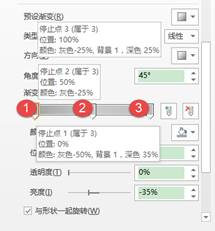
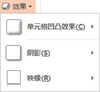

# 16.4  案例

## **简单制作结束页**

图16-45

在“插入”选项卡中单击“图片”，找到需要插入的图片，将图片一次性全部选中，单击“插入”按钮。

图16-45

插入图片后，可以按住Ctrl+鼠标滚轴来缩小PPT编辑区，方便调整图片的位置，然后再将图片缩小，先将不会用到图片拖拽至编辑区外，根据幻灯片的大小，调整图片的尺寸，拖动用于做背景的图片。

图16-46

接下来是抠图的步骤，将图像中人物的头像抠下来，插入一个圆形，覆盖在图片人物头像的位置上，使用合并图形中的相交，这里需要注意选取的顺序，先选图片，然后选择图形。

图16-47

将图片的位置摆放好，为三种图片分别添加柔化边缘，如图16-48所示。

图16-48

为了让图片细节更丰富，与背景的联系更强，需要用到阴影的效果来补充，选中头像图片，在“图片工具/格式”选项卡中的“图片效果”为图片添加“阴影——内部居中”，设置后效果并不明显，这是因为图片还设置了柔化边缘效果的，所以需要修改阴影效果的参数。选中图片后，单击右键选择“设置图片格式”，将阴影中的模糊效果的参数设置为100。

图16-49

插入一个文本框，输入“谢谢观看”，设置字体为“微软雅黑”，字号为“54”，在文本效果中，为文字设置一个阴影的效果，如图16-50所示。

图16-50

在设置了阴影的效果后，由于背景的影响，让阴影不够明显，那么单击“阴影选项”，对阴影的透明度和模糊参数进行重新设置。

图16-51

这样，整幅幻灯片就设计完成了，但是有几个注意点需要注意，如图16-52所示。

① 握手的图片是处于整个版式的最终中间的。

② 两个人物头像离版式边的距离是相等的，这是经过调整的。

③ 文字的顶端是与图片的一边对齐的，这里有一条看不见的对齐线，而且文字的位置的中线就是人物眼睛的中线，经由这两条对齐线，确定了文字的位置。

图16-52

## **焦点设计**

最开始的图片是这样的。

图16-53

然后，图片还可以这样。

图16-54

最后，这种设计依然不够高大上，所以做了另外的一些修饰，它还可以变成这样的。

图16-55

似乎这样的设计就有了些高大上的元素了，这是上面的变形，重点依然在于如何修改图片，对图片修改和整合把握度决定这张图片的好坏，否则再怎么精美的图片也依然拯救不了糟糕的版式问题。接下来我们来对图16-54和图16-55进行一些对比，找出隐藏的设计元素。

首先，我们从图片本身对比，前者图片是整体靠上的，后者则是靠下的，这点从车的具体位置就可以看出来，这里就有着对图片的修饰和调整，之所以如此调整也是有原因的，前者图中车的方位是在图片的正中，也就是说在版式的正中间，虽然说中心是最平衡、最稳定的位置，但同时这个位置也是最容易让人产生视觉疲劳的位置，中间太过于严肃，一般版式的元素会选择靠近中间，但不是居于正中间，所以在这里，对原图片的基础上进行了调整，将焦点的位置改为了中间靠下的位置。

然后，我们分析后者图中底部多出来的元素，那是一个设置为白色边框的色块，颜色取自于公路的颜色，加入这个色块主要是为了弥补因虚化导致图片的空泛，抵消这种不适合人眼观看的感觉，这样就将图片底部充实起来了，不止于造成整体版式结构的失衡，当然，为了将色块充分的利用起来，所以为色快添加了一个“3磅，白色”边框，这样的设计也是为了模仿公路才设置的，增强的车在行驶的画面感。

如果你足够细心，你会发现版式上还有着另外一个色块，在版式的右侧，其实还有一个添加了渐变的的色块，这个色块的设置主要是为了挡住背景，因为需要改变图片的整体位置，还需要保证图片不能被拖拽变形，那么就需要其他的辅助，这里再背景里其实又添加了一张相同的图片，这张图片来弥补修改图片后版式的空缺位置的，将它置于底层，而色块则是隐藏这张背景图片的。至于为什么不放大这张图片，这会造成图片中车这个元素过分的大。下面我们来进行具体的操作。

根据需求将图片的位置移动到需要的位置，在图片两边会留下两道留白，如图16-55所示，如若直接用色块去封住这些空白也是不好看的，将图片复制粘贴一份，置于底层。

 

图16-56 图16-57

由于图片位置与位置的不相同，所以造成了两张图片的过渡非常的生硬，让人一眼就能看出里面的猫腻来，所以，为了隐藏这种猫腻，再加入渐变的色块对图片的过渡进行遮挡，这个知识在前面让图片融入背景中就有讲到过，在这里我们用来作为遮挡的工具。

色块上两个光圈中的颜色全部取自于图片公路上的颜色，将一个光圈设置透明度为100%，另一个光圈不作处理，然后将图形透明端靠上图片。

图16-58

接下来的一步就是再插入一个色块，填充颜色为图片公路颜色，然后再为色块添加一个“3磅，白色”的轮廓，根据图片调整色块的位置。

图16-59

接下来就是文本内容的输入，可以看到在文字的输入上也是经过一定的修饰的，文字与文字间也运用了粗细的对比，通过对比来显示强调，同时强调的文字通过填充入图片，使得文字变得更为时尚有魅力，填充入的图片就是背景图，为了显示图中这辆车高端、大气、稳重，则使用较粗，且结构简单，修饰性少的字体，给予观众一定的心理暗示，简约而不简单，一看文字直接就有了些买不起的感觉。

如果单单就将两行汉字放在版式上，还是会略显单调，但是发现好像没有什么其他的汉字可以放上去的了，既然没有汉字放，那就放点其他的语言——英文，不得不说的是有些时候，英文会显得更为的美观，因为它的结构够简单，所以更清晰，那放在这里，汉字和英文同时搭配时，效果也是非常的好，这种搭配方式非常的常见，而且经久不衰，屡试不爽的，所以当发现汉字想不到的时候，想的是将英文去补。

若是不知道英文怎么写，也是有方法的，例如，先在百度上搜索“速度的英文怎么？”。然后就会搜索出速度的英文，然后将英文输入搜索框内继续搜索，然后则是寻找需要的英文即可。

## **像设计海报一样的去处理图片**

图16-60

图16-60是借鉴了网络上的图片，模仿创造而来的图片，首先，当我们看到这样的一张图片，若需要将图片在PPT上做出来，第一步做的是分析，分析什么？如何分析？

分析图片的制作为什么可以设计成这个样子，是否能够在PPT上设计出来，需要用到什么样的功能，不管可行不可行，最重要的是你要想得到是这样进行的，若是你连功能都想不出来，就被谈什么会不会做这样的事了。接着需要考虑的事是图中运用了几张图片，这点你是必须要看出来的，版式上运用了多少张图片，肯定是经过实践证明的，如今实践所出的作品就放在你的面前，你只需要逆向思考制作时它运用了几张照片才能设计出这样的效果；然后你再需要考虑的是文字，不需要完全相同，但你至少需要知道的是它是运用了什么样的字，毛笔字、卡通字、黑体字等等，这都是你需要分析的。

第二步就是搜集素材，需要搜集的图片素材可以使用百度以图识图（或者谷歌以图识图）进行搜索，这样找图比较快捷，若是整张图找不到，就将图片的每一个元素都裁剪下来，分别进行以图识图，若是这样还你是没有找到图片，那么就老老实实的进行常规的搜索，或者是以其他类似的图片进行代替，总之，不让自己吊死在一颗树上。接下来要找的是字体，找字体可以去求字体网，同样是上传图片，将图片中的字体部分抠下来，然后再进行上传搜索字体，这样处理后找到字体的成功率比较大，同样地，若是没有找到字体，也可以使用相似的字体来进行取代，毕竟即使是拥有完全一样的素材也不一定会做的一样，既然可以做，为什么要和别人做的一样，若是自己加入一些创作元素在其中，这样的一个 版式不就是你的的作品了吗。

其实做这样的版式设计，难倒一大批人的其实是图片的处理，其实这些有关于照片处理的知识在前面都有讲过，并不复杂，甚至是全是基本知识的叠加而已。

在找到图片插入到ＰＰＴ中。

图16-61

首先对背景进行修饰和调整，由于背景图片尺寸并不能是很好的匹配上幻灯片的背景，同时也不想通过拉伸图片来讲图片进行放大，因为这样会造成图片中的人物过大，而且，我们所希望的是图片元素摆放的位置是靠左边的位置，所以简单的将图片进行放大是不合理的，前面有讲述过，图片不能填补上空白区域如何进行处理，将它填补上，用在这里也可以，这里可以不用使用背景图片加渐变色块来进行遮掩，因为图片的处理方式不同，这里还需要进行另外的步骤。

将图片进行裁剪。

图16-62

在这里，为了能让图片设置透明度，这里需要进行一个折中的操作，在前面也有提到过，图片是不能调节透明度的，但是图形可以，将图片与图形结合之后，就能使用这个功能了，那么如何进行处理呢？

在裁剪好的图片上，画出一个与之等大的矩形，为了不移动图片的位置，破坏刚才的版式，使用选择窗格，将矩形先进行隐藏，然后将图形剪切下来，再取消对矩形的隐藏，选中矩形后，单击右键选择“设置形状格式”，在填充中选择“图片或纹理填充”，单击剪切板，即可将前一步骤剪切下来的图片填充到图形中去，这样的设置后就能对图形设置透明度了。

别忘记了还有边框线没有去掉，可以在直接将插入的矩形的边框线去掉，或者是填充图片后选择去掉图片边框。

图16-63

图16-64

在处理完这张图片后，我们对另一张图片进行一些处理，我们需要的肯定不会是整张的图片，图片的背景与背景会有冲突，所以一般的会保留一个背景，而去掉另外一个背景，所以首先对另外图片背景的处理是去掉图片的背景。

剪裁图片有着很多的方法，基本上都可以适用，但我们选择最好、最适用的，这里选择使用PPT中自带的删除背景功能，当然也可以使用在前面所讲到的抠图法，不过为了节省时间，所以选择使用删除背景。

 

图16-65 图16-66

将图片素材处理完毕后，接下来需要来进行处理的就是图片的颜色问题了，图片的颜色需要经过一些处理，让图片起来是经过修饰的，不是那种随便拿来用的图片，况且经过修饰后的图片肯定是比修饰前的图片更符合使用者的使用习惯，而且对图片进行修饰后，能很好的统一两张图片的风格，表现出你需要图片展现的图片的风格出来。

两张素材图片的整体颜色都是偏冷，原来亮色的图片也因为设置透明色后使得颜色偏向于冷色，我们选择的是制作热烈、怀旧、让人看起来心情激动的，那么这种情况下，我们会选择暖色系。

调节图片的色温和饱和度，还可以对图片的亮度和锐度进行调节。色温和饱和度的调节都是由冷色向着暖色进行渐变，参数值越高，颜色变化越是明显。

图16-67

这时，明显可以看到背景上留有一端的空白，所以还需要填补上背景，这里只需要使用一个纯色的色块就能将背景补上，这取决于背景图片背景的复杂程度，这张图片的背景是空的，所以用色块就可以填补上，插入一个矩形，去掉边框线，填充颜色则是使用取色器吸取背景图片背景的颜色，然后将矩形移动至空白区域填补上去。

图16-68

接下来就是文本内容的输入了，在这里使用到的主体字体是“叶根友刀锋黑草”字体，辅助字体则为“华文行楷”，字体输入时同样有着一个基准参考线，即是对齐线，而且为了增强文字的效果，所以在输入文本时，尽量的将文本内容向背景的焦点处移动，也就是图片中人物的眼睛，但同时文字不能遮挡住背景的焦点。

图16-69

最后则是文字上的一个印章般的效果，这个也是非常的简单，最重要的你得想得到，使用任意多边形（或是自由曲线），随手画出一个椭圆，形状不要出现参差不齐就可以，然后填充红色，在图形中输入文字即可。

图16-70

将所有的元素全部加上后，注意一些细节，将一些关键处设计完备，这样的设计就不会出现太大的纰漏。

图16-71

