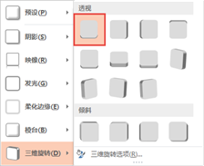
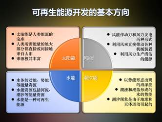

# 17.1  利用SmartArt循环图创作图表

图17-1

如图17-1所示的四分图，这样的图表常被用来表达总-型的观点，以一个主要观点，然后引出下面的四个次要观点，对主要观点进行阐述。

首先，在“插入”选项卡中单击“SmartArt”，在SmartArt的选择对话框中选择“循环—循环矩阵”，完成后单击“确认”按钮。

图17-2

图17-3

接下来对SmartArt图形的参数进行设置，在“SMARTART工具/设计”的“更改颜色”选择“彩色—着色”，然后在SmartArt样式中选择“嵌入”的样式，SmartArt图形的设置就完成了，我们只需要通过SmartArt图形得出图表的四分圆，但不需要整个SmartArt图形，所以只需将SmartArt图形中的四分分别选中，然后进行复制粘贴，就可以得到完整的四个四分圆了，然后将SmartArt图形删除。

图17-4

图17-5

有一点需要注意的是，这里的四分圆的填充颜色是渐变填充，可以直接更改图形的填充色，在这里不做更改。

接下来对四个圆角矩形进行设置，插入四个圆角矩形，调整好圆角矩形的位置，然后调节圆角矩形的控点，将圆角矩形的顶角调整至适合的大小，尽量使角度不要太大，这样显得比较圆润些。

然后为圆角矩形填充颜色，如图17-6所示，图中所示数值为RGB，按照标号顺序分别是“玫瑰红、灰色-25%、浅蓝、浅黄”。

图17-6

颜色的填充是根据四分圆的颜色进行填充的，圆角矩形的颜色是取自四分圆的颜色，降低饱和度后得到的颜色。

为了使得圆角矩形的层次感更强，这里为圆角矩形添加渐变。

选择编号为①的圆角矩形后，在“绘图工具/格式”中单击“形状填充”，在下拉框中选择“渐变——浅色变体——线性对角-左上到右下”。

根据相同的步骤，编号②的圆角矩形设置“渐变——浅色变体——线性对角-右上到左下”。

编号③选择“渐变——浅色变体——线性对角-右下到左上”。

编号④选择“渐变——浅色变体——线性对角-左下到右上”。

图17-7

图17-8

这样的设置渐变也是有原因的，所有的渐变设置都是由深色到浅色的线性对角，这样中间位置的区域就是浅色的聚集处，将四分圆摆放在中间位置则能很好的形成一个聚焦点。

接下来为圆角矩形丰富一些细节，同时选中4个圆角矩形，在功能区中的“绘图工具/格式”选项卡中选择“形状效果”，选择“棱台——松散嵌入”。

图17-9

选中四个圆角矩形，在功能区中的“绘图工具/格式”选项卡中选择“形状效果”，选择“阴影——外部——居中偏移”。

 

图17-10 图17-11

选中四个圆角矩形，单击右键选择“设置形状格式”，在设置形状格式窗格中选择设置三维格式，如图17-12所示，设置材料为“金属效果”，设置照明为“柔和”。

 

图17-12 图17-13

然后在功能区中的“绘图工具/格式”选项卡中选择“形状效果”，在“三维旋转”中选择前透视。

 

图17-14 图17-15

仔细观察图17-15会发现和图17-1所示的圆角矩形效果还是有一些出入，这些出入是在颜色的渐变上，图17-15中的圆角矩形中的颜色亮度较高，所以显得颜色更为显眼一些，若是需要将颜色进行一些调整，让颜色显得不是那么亮，这个可以在设置形状格式窗格中的渐变填充中进行调整。选择一个光圈，然后单击“其他颜色”，如图17-16所示。在图17-17中，调节颜色的指针只会改变颜色的亮度，和RGB模式或者HSL模式无关。

 

图17-16 图17-17

然后插入文本内容，设置文本内容的字体和字号，标题使用的是“微软雅黑，36号”，正文文本使用的是“华文中宋，18号”，四分圆上的正文内容设置“微软雅黑，20号，加阴影”。

为了装饰大标题，在“绘图工具/格式”中的“艺术字样式”中选择一种预设的艺术字。

图17-18

图17-19

选中四个正文文本内容的文本框，在“开始”选项卡中的“段落”组中单击右下角的小三角符号，进入更多设置窗格中，设置行距为“多倍行距，1.2”。

图17-20

更改项目符号，在“开始”选项卡中的“段落”组中，如图17-21所示。

图17-21

这样完整的一页PPT就被设置完成了，一些细节处还是需要注意的，细节决定最后的一个步骤，如图17-22所示，图中的各个元素距离页面边的间距是相似的，而且正文的文本内容都是有着一条对齐线的，而这条对齐线就是它们之间的联系，让观众知道的这是有规矩的，合乎情理的内容版式，但不需要每个元素都对齐，只需要有一个对齐方式就可以了，多个对齐方式容易造成版式间排版的冲突。

图17-22

