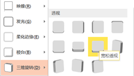
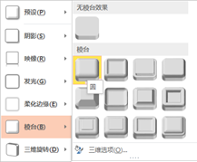
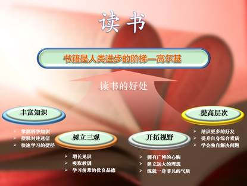

# 17.2  利用流程箭头创作图表

图17-23

利用箭头将四个副标题结合起来，然后利用箭头的导向性导向最终的主标题，将副标题和主标题之间的逻辑通过图形具现化，这样就形成了一张可视化的图表。

如图17-24所示，插入多个椭圆，为椭圆填充不同的颜色（图中均为RGB数值）。

图17-24

然后将白色的椭圆居于有颜色的中间，这个步骤可以借助到对齐功能，利用“左右对齐和上下对齐”。

选中居于底层的四个椭圆，在“绘图工具/格式”中的“形状效果”里的“三维旋转”中选择“宽松透视”。然后在“棱台”中选择“圆”。

 

图17-25 图17-26

图17-27

选中四个白色的椭圆，在“形状效果”中的“棱台”里选择“冷色斜面”。

 

图17-28 图17-29

调整好椭圆的位置后，接下来是箭头的设置，这个箭头在PPT是没有现成的图形的，但是这算是鼠绘的基础，所以观察后可以得出，我们需要用到两个形状就可以画出这样的一个形状，分别是三角形和梯形。

插入一个三角形和一个梯形，去掉轮廓线，调整两个图形的形状，利用合并形状中的联合功能将两个图形进行合并。

然后利用修改合并图形上的顶点。来对图形进行更改，拉伸图形的顶点，将图形的边拉伸至一条曲线。

图17-30

示例上的箭头是加过渐变的，这样更能够体现出空间感，让人有一种由近及远的感觉。

这里设置有三个光圈，如图17-31所示，填充色为褐色（填充色视实际情况而定，暗色），第一个光圈为“褐色，无透明度”，第二个为“褐色，50%透明度”，第三个光圈为“褐色，100%透明度”，同一种颜色其实设置了不同的饱和度，让箭头以颜色和透明度两种方式显示出空间感。

 

图17-31 图17-32

接下来设置标题底层的图形，插入两个圆角矩形，分别填充不同的颜色，将两个圆角矩形重合，将底层的圆角矩形稍微放大一点，在“形状效果”中的棱台中为底层的圆角矩形设置“松散嵌入”，小的圆角矩形设置为“柔圆”。

 

图17-33 图17-34

接着设置圆角矩形上的文字，字体为微软雅黑，颜色为橙色，为文字设置阴影“外部—向下偏移”，为了让效果更为的明显，在设置形状窗格中对阴影的参数进行修改以加强阴影的效果，然后在“棱台”中选择“圆”。

 

图17-35 图17-36

图17-36

大标题设置字体为“微软雅黑”，再添加一个艺术字样式。

图17-37

设置其他文本内容的字体为“华文中宋”，为了更有立体感，如图17-38所示，为文本内容设置了透视阴影。

图17-38

图17-39

当预设的阴影效果并不适用于当下的情况时，可以在设置后，单击“阴影选项”对阴影的各项参数进行更为详细的设置，在制作时很多情况下都是需要对参数进行更为细致的设计的，这是一个小小的细节，而图中还有一些其他的细节，如图17-40所示。

图17-40

更多的一些细节是在于元素与元素间的对齐，把握好对齐这样的一个细节，它能帮助强制的将整个版面都控制起来，让它们的排版有着规律可循，这样的排版才是合理的，可接受的排版设计。

图表是可以变化的，不仅是可以使用用当前背景，使用图片背景也是可以的，只不过需要注意图片存在时的焦点问题，是文衬图，还是图衬文，前面已经讲述过如何对这两种情况进行处理了。

图17-41

