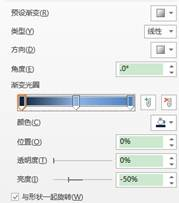

# 17.3  数据焦点阐述

图17-42

这里面用到了SmartArt图形来完成整个版式的设计，这个设计也是非常的简单，主要是突出中间的数据，不用多余的文字去修饰，哪个数据重要就将哪个数据展示出来。

首先在“插入”选项卡单击SmartArt，插入一个分段循环的SmartArt图形。

图17-43

软件默认的是插入三个圆弧，这里需要插入更多的圆弧，在前面章节中就有讲述如何进行插入，在这里就不再赘述。

在“SmartArt工具/样式”中的“更改颜色”中选择“彩色-着色1”，然后在SmartArt样式中选择“优雅”。

图17-44

调整SmartArt图形的大小，通过直接拖拽即可实现调整，不要将SmartArt图形拉动变形即可。

图17-45

调整完成后，插入一个圆，将其置于SmartArt图形的中间位置，去掉轮廓，填充色为白色，调整为白色后，为了降低颜色过于强烈的对比度，可以适宜的调低白色的饱和度。

 

图17-46 图17-47

SmartArt图形的预设颜色是有些单调的，若是对精细度没有其他的要求，这一步是可以不用设置的，为了增加细节的丰富度，这里改变SmartArt图形中箭头的颜色，由于SmartArt图形中采用的是渐变色，但是箭头和扇形过于相似，即太死板。

如何来进行改变，前面就多次提到过，将一种颜色由深色向浅色渐变，一般会有三个光圈，经由这种变化的过渡，颜色的转化会更为和谐，不会有锐利感出现。渐变是从箭头的尾端向着箭头的顶端渐变的，由深色到浅色，所以这里还需要选择好渐变的角度，以蓝色的箭头为例，如图17-48所示。

图17-48

对比完成渐变后和完成渐变前的SmartArt。

图17-49

插入5个圆角矩形，去掉轮廓线，然后控制圆角矩形的控点，将圆角矩形两边的圆角弧度拉大。

图17-50

同时选中所有的圆角矩形，在“形状填充”中的渐变中选择“浅色渐变—线性向上”，预设的渐变的参数是可以改变的，根据实际需要，在设置形状格式窗格中进行更为细致的调整。

 

图17-51 图17-52

在5个圆角矩形同时选中的状态下，在“形状效果”中的“棱台”中选择“柔圆”。然后单击右键，选择置于底层即可。

 

图17-53 图17-54

图17-55

接下来就是输入的文本内容，最关键的是中间的那个数据的输入，在前面讲过，在输入百分比时，一般的，我们放大数据本身，而缩小符号，观众想知道的是数据，演示者想让观众知道的也是数据，那么其他的就显的不是那么重要了，文字只是给演示者看的，数据才是传达给观众的信息。

正文的文本内容只使用了白色和黑色的搭配，彩色的背景使用的是白色，白色的背景使用的是黑色，白色字使用“微软雅黑”，黑色字体则使用“华文中宋”。

最后将得到一张效果图。

图17-56

在PPT中使用图表时很受大家忌讳的，不是因为不好看，或者功能不强大，而是因为观众不喜欢，观众就喜欢看到简简单单的数据摆在眼前，这点可以从很多成功的产品发布会上（例如苹果）可以看到，简简单单的一个数据，就是让你好看，完全没有其他的修饰效果，这点很像高桥流的设计手法，但不得不说的是这点非常好用，演示者讲了很多个观点，但观众一个都记不住，但演示者只重点讲了一个观点，这个观点就让观点一直记在心里，心理因素有时候比事实更重要，所以图表在运用到PPT上时，不需要强调太多数据，拿出一两个，重点修饰加强调，其他的地方则是加入文本内容，这些文本内容其实并不是来提醒观众的，这只是来让演示者看的更清楚的提示内容而已，放心，观众不会在意你的文字的，看了也记不住。

