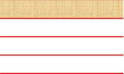

# 17.4  图表简单化

图表主要是想观众传达一些信息和数据，更多时候是传达的数据，重点是让观众看到演示者想让观众看到的东西，并被这个数据所吸引，可以是演示者重点强调这个元素，另外还可是设计者提前将这些元素设置为视觉焦点，而在制作时有一个很好用的设计原则——简单，只需要突出数据即可，去掉繁琐的文字，删除表格的条条框框，仅用一些可以显示出数据区别的图形，如图17-57所示。

图17-57

这张图表其实是通过图形的组合得到的，并没有使用PPT中自带的图表，若是使用图表必然会用到PPT中固有图表的样式，或者是用到了表格，如今PPT中预设的图形确实是花样多样，但是每一种样式都已经被大量的使用过了，几年过去了，预设的图形早已经成为了俗气的代名词，要想成功的接点地气，有时候只需要一些看起来简单的东西即可，当然这些也只是看起来似乎简单，这个是给观众的感受，而在制作时，制作者是一定需要费心的。

如何来制作图示中所示的图表呢？

首先，在“插入”选项卡的“形状”的下拉框的“箭头汇总”中找到“五边形”，然后将设置五边形为不同的宽度，依次递增，如图17-58所示。

图17-58

将五边形全部选中，在“绘图工具/格式”中选择“对齐——上下居中”。

图17-59

在“绘图工具/格式”中选择组合，将图形组合在一起，然后选择“旋转——向左旋转90°”。

 

图17-60 图17-61

接下来为横轴添加颜色，为四个图形添加渐变颜色，图形中添加三个光圈，使用线性渐变，角度选择225°，然后将五边形的边框颜色修改为“白色，2磅”。

 

图17-62 图17-63

在五边形旁边插入四个圆角矩形，调节控点，将圆角拉伸至最大程度，然后为图形设置如五边形一样的渐变，这里可以直接使用格式刷进行格式的复制，格式刷的快捷键是Ctrl+Shift+C进行格式复制，然后Ctrl+Shift+V格式粘贴，这样就可以快速的对格式进行粘贴复制，粘贴之后将边框线去掉。

由于每个图形本身是不同的，不同的形状设置的相同的渐变也是不同的，在设置圆角矩形渐变时将渐变的角度改为0°。

 

图17-64 图17-65

调整圆角矩形的宽度，只需要粗略按照人数的比例调整即可，然后为圆角矩形加上“阴影—向下偏移”。

 

图17-66 图17-67

然后根据需要添加上合适的数据，将数据放置在合适的位置，设置字体的颜色为白色，字体为“微软雅黑”，这里为了装饰还插入了一个类似指针的图形，这个图形在PPT的形状中，名为泪滴形，将图形插入后，设置好颜色，颜色不宜过亮，选择使用暗色填充图形，然后为图形添加一个“阴影—向右偏移”。

竖轴上的标示数字使用过加粗，强调数据。

图17-68

为了填补版式右下角的空白，这里还加入了一个元素，汇总了总人数，使用一个小的圆角矩形进行修饰，为此图形添加一个内部阴影，颜色调暗。

图17-69

版式中还有一些小的细节值得大家注意，最重要的依然是对齐这个注意点，版式中处处运用到了对齐，而且在这个版式中对齐显得更为重要，图形中图形多样，而且长度不一，这个时候就需要某个东西来统一所有的元素，对齐线这样的一把尺子就能将元素都统一起来，不至于让版式显得杂乱。

