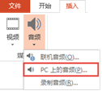
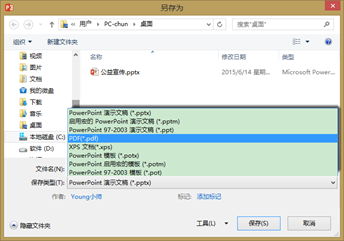
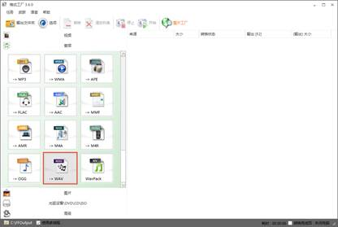
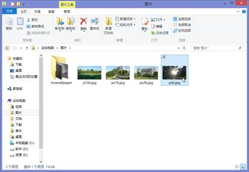

# 19.3  声音的插入

对于声音，大体上，我们可以将之分为两种：背景音乐和动作音乐。

## **背景音乐**

背景音乐主要是用于烘托气氛，结合幻灯片内元素，为幻灯片元素提供声音上的支持，增加元素的展现效果，提升幻灯片的震撼效果，另外，我们可能在PPT中插入不止一段声音，例如，在片头需要激昂、节奏感足够强的音乐，在内页则需要使用节奏平缓、舒适的音乐，这需要根据幻灯片的实际效果来进行判断。

背景音乐的插入方法如下所示。

在需要插入音乐的幻灯片，单击“插入”选项卡，单击“音频”，选择“PC上的音频”。

图19-4

在弹出的对话框中，找到音乐所在的文件，选择音乐进行插入，单击“确认”既可插入音乐。

图19-5

声音插入完成后，PPT的编辑区会自动添加一个声音的图标，如图19-6所示。

图19-6

而且，当我们打开“动画窗格”时，会发现在动画窗格中多了一个播放声音的触发器动画。

图19-7

接下来，我们还需要对音频进行一些处理，选中音乐图标，在功能区会新增两个选项卡“音频工具/格式”和“音频工具/播放”，单击“音频工具/播放”选项卡。

图19-8

一般的，我们将音频的开始方式更改为“自动”，播放到此页幻灯片，音乐就自动开始播放，无需手动单击。若有需要也可以设置音频开始方式为单击时开始，不过此种方式多用于交互式的PPT中。

我们可以勾选上“跨幻灯片播放”，对于只需要在片头播放的音乐则可以不用勾选上，另外若音乐时间不够长，或者自己无法把握演示时间，但需要音乐一直存在，则可以勾选上“循环播放，直到停止”，这样音频就会在播放完毕后，自动重新播放，不断重复，直到幻灯片演示完毕为止。

由于插入音频时会有一个小图标，这时候，可以勾选上“放映时隐藏”，这样，在播放时，音频图标就会自动的隐藏了，但是，我们一般不会使用这种方法，因为音频是在播放时隐藏，那么意味着音频不播放时就不会隐藏了，那图标一样会显示出来。

在这里，有一种更为简单的方法，那就是直接将图标拖动至演示区外，让它在播放时不出现就行了。

图19-9

另外，在对音乐的设置，可以在动画窗格中进行，打开动画窗格，双击音乐的触发器，我们可以进入对音乐的设置中，将停止播放选择为最大值停止，设置为“999张幻灯片后”。

图19-10

另外，音乐在幻灯片中的播放也是可以控制的，我们可以选择幻灯片播放到此页就开始播放，也可以选择当此页的动画效果播放后开始播放音乐，而这些都是可以在动画窗格中实现的，添加背景音乐，实际上就等于添加了一个动画效果，而且它有着一个触发器的效果，你可以控制它的触发时间。

在动画窗格中，将音乐动画可以随意的拖动，拖动至任意时间段，同时还可以设置动画是与上一动画同时开始播放还是之后，另外，还可以为动画添加延时。

图19-11

但需要注意的是，虽然音乐是被作为一种动画效果显示在动画窗格中，但是在PPT中不允许使用者添加其他的动画，一旦添加后，软件则自动取消音乐播放，将之视为一种图标效果。例如，我们为音乐图标添加飞入动画效果。

可以看到音乐的动画标识由三角形变成了五角星形。

图19-12

PPT并不是专业的编辑音乐的软件，但是它能对音乐进行一些简单的处理，例如剪辑音频，选择用户需要的音乐段来播放，这样用户就不必另外开启软件进行设置了。

在“音频工具/播放”选项中，选择“剪裁音频”。

图19-13

单击“剪裁音频”后，会弹出一个对话框，剪裁的操作非常简单，如图19-14所示，只需要拖动进度条上的小方块就能对音频进行裁剪，

图19-14

使用者可以边听边剪，这样就能避免裁剪音频不到位，出现不必要的失误了，操作完成后点击“确认”按钮后即可完成。

这里的剪裁和图片的剪裁一样，不是删除，而是替用户隐藏掉了，我们还可以在 动画窗格中，双击音乐的动画效果，在动画的效果设置窗格中选择设置动画的开始时间，这和裁剪是一样的，只不过裁剪来的更为方便一些，而这种方法只可以输入时间，并且无法做到边听边裁的效果。

图19-15

## **动作声音**

动作声音是动画开始伴随的一种声音效果，例如切换页面时出现鼓掌的声音。一般的，动作声音有两种，一种是幻灯片切换的声音；另一种是对象动画的声音。在PPT中，动作声音只能使用WAV格式的音频格式，其他格式一律不能使用。

动作声音可以作为一种提醒音，也可以作为一种强调，强调动画的效果，增强动画的效果，PowerPoint中自带的风声、铃声、鼓掌等声音，但这些声音在如今已经是非常少用了，一样的，经过了如此漫长的改革换代，这些声音一直没有改变，若还使用这些声音，则难免会显得非常俗套，这些声音没有一点特色，若需要插入一些声音，则建议去网上下载一些比较好的音乐来替换这些声音，如今，网上的资源是极其丰富的。

## **页面切换的声音插入**

单击“切换”选项卡，单击“声音”的下拉箭头，可以选择添加PowerPoint内置的声音。

这些声音从以前到如今，现在已经弃之不用，确实是有着一定的考虑的，这些声音过于单调，添加多个声音就会互相干扰，宛若杂音一般。

当然，除了这些声音外，我们还可以插入自己需要的声音，但是需要注意的是文件的格式问题，并不是想要插入什么音频就是可以插入的，必须是WAV格式的音频文件才被允许插入。

在如图19-16所示图中的底部“播放下一段声音之前一直循环”，这个需要谨慎选择，它会使声音循环播放，知道下一个声音开启。

图19-16

## **对象动画声音的插入**

页面对象的动画效果在播放时也是可以有声音的，这是动画的一种自身属性，对象动画在动作发生过程中伴随着声音的播放，若使用得当，这是非常好的一种加强动画的方式。

打开动画窗格，在动画窗格中，任意双击一个动画，进入效果选项的对话框中，在其中即可为动画添加各种动作声音了。

图19-17

选择声音，单击“确认”按钮即可为动画添加。

同样地，对于对象动画，也可以自定义声音，但也对于格式有着限制，只能是WAV格式的音频文件，由于内置的声音和幻灯片切换的声音是一样的，所以对象动画的内置声音也有着一样的弊病，慎用。

如今特别是在一些休闲娱乐的场合，若需要使用到PPT，则加入动作声音一定能让你的PPT添色不少。

## **WAV**

在前面我们一直有提到WAV格式的文件，这个文件为何如此受到PowerPoint的青睐呢，它在PowerPoint中表现如何，到现在为止，能将声音嵌入PPT中文件，就是WAV格式文件，这种导入到PPT中后就已经算是嵌入到了PPT之中，此后就不需要将文件都打包发送给别人了，因为文件已经嵌入PPT中了，这样就省去了很多的麻烦。

我们手上的音频文件可能是MP3、WMA等等格式的文件，那么我们如何得到我们所需要的WAV格式文件呢，在前面有提到过一款非常强大的格式转换器——格式工厂，借助它我们就可以实现格式的转化。

打开格式工厂，在右侧单击“音频”的选择菜单，在“音频”中单击“WAV”格式。

图19-18

单击后会弹出一个选择菜单，如图19-19所示，①找到需要转换格式的文件；②改变输出路径，方便转换后查找；③单击“确认”按钮后完成设置。

图19-19

单击“确认”后，就会回到主页面，直接单击“开始”即可进行转换。

图19-20

WAV的插入方法和其他音乐格式的插入方法没有任何区别，而且WAV格式的音频也可以作为动作声音来使用了，使用范围更为的广泛。

